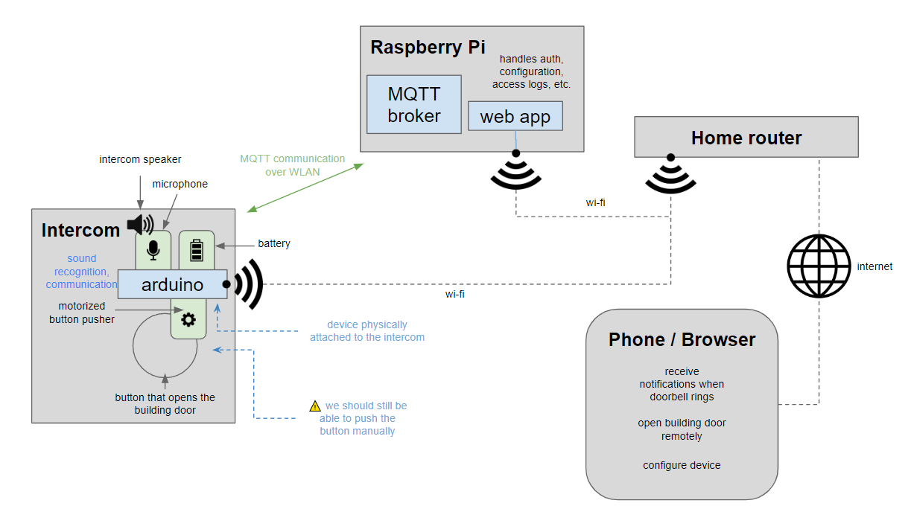

# Smart Intercom



## Installation on the pi

```sh
# install docker and docker-compose using LMDS
sudo apt-get update && sudo apt-get upgrade

git clone https://github.com/GreenFrogSB/LMDS.git ~/LMDS

cd ~/LMDS

./deploy.sh

# select first option
"Install Docker & Docker-compose"

# reboot the pi after

# reconnect to the pi

sudo systemctl enable docker

# check out project code

mkdir protofablab

cd protofablab

git init

git remote add -f origin https://github.com/nembrinj/protofablab

# only check out relevant folder
git config core.sparseCheckout true

echo "projects/02_smart_intercom" >> .git/info/sparse-checkout

git pull origin main

cd projects/02_smart_intercom/

# comment out ngingx.conf server config for port 443
nano ngingx.conf

docker-compose build

docker-compose up -d

docker-compose run --rm  certbot certonly --webroot --webroot-path /var/www/certbot/ -d protofablab.ch

git restore nginx.conf

```
