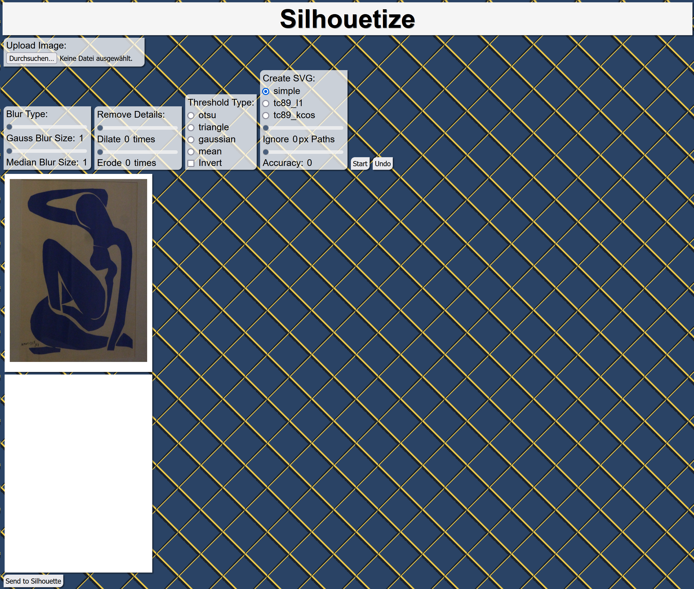
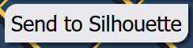
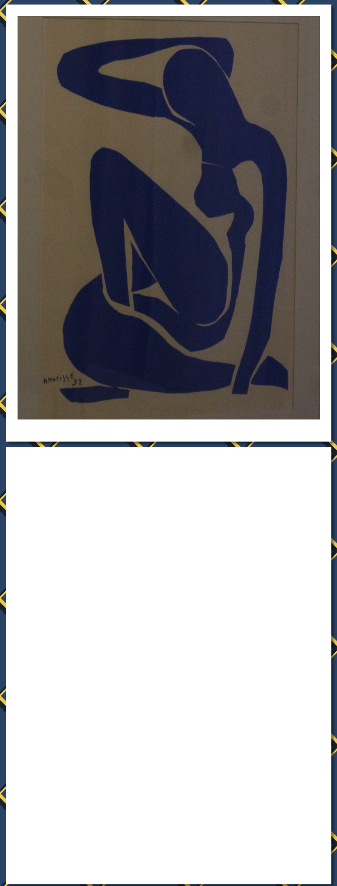
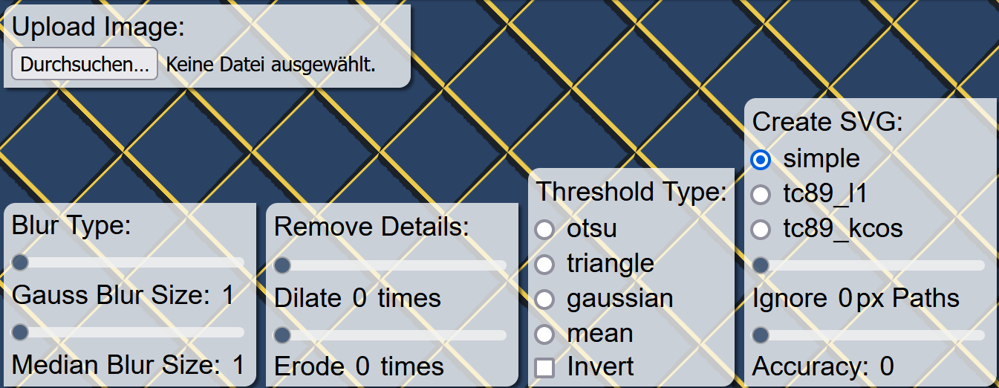

# Silhouetize

## Origins

Imagine you want to play around with some advanced image editing and want to do things like

- applying Gaussian or median blur
- binarizing the image with thresholds
- performing edge detection
- dilate shapes in a binary image or make them smaller
- find contours in an image and maybe apply them as a mask over the original image

This all sounds like fun and games until you want a physical copy of your work. <br>
Sure, you could just manually open and edit the SVG in your favorite image viewer and press 'Print'. <br>
But where's the fun in that? And what if you wanted to cut these contours into a birthday card instead? <br>
Then you will need a plotter/cutter device. Like the `Silhouette Cameo 4 Pro`, e.g.:


## Solution (prototyping in the LearningLab)

Hence, we present our project Silhouetize.<br> 
A piece of software with which you can iteratively modify images and create svgs from said images.
These svgs are then translated into Silhouette commands. 
Our software together with a Silhouette machine allow us to physically cut or drawn any image with very little manual intervention.
This presents a nice alternative to the official Silhouette editor, which is neither open source nor free.
Furthermore, it brings the fun back into using the Silhouette machine.

## UI Explained

In the following section we will explain all elements of the user interface.
When first entering the application you are greeted by the following interface.



Taking a closer look at all the parts individually, we begin with the buttons.

### Buttons




The first two buttons on the top beside the pipeline options are **Start** and **Undo**. <br>
**Start** applies the selected image processing pipeline and updates the current image and SVG accordingly. <br>
**Undo** removes the most recent image and svg. This reverts the pipeline to the previous image. 
If there is only a single image, nothing is done.<br>
**Send To Silhouette** is situated below the images/SVGs. Once pressed, it sends the current SVG to the Silhouette
machine for printing/cutting.

### Graphical Output

<br>

In between the pipeline options and the `Send to Silhouette` button you initially see 2 images.
The more pipelines you apply, the more images you will see.
Currently, a stack of 4 states are saved. This may be adapted manually in the source code. <br>
The top row shows the last images, whereas the bottom row shows the corresponding contours/SVG.<br>

### Pipeline Options

<br>

The boxes above the graphical output contain the image processing options. The options are as follows.<br>

**Blurs** which can be divided into <a href="https://en.wikipedia.org/wiki/Median_filter">median blur</a> and 
<a href="https://en.wikipedia.org/wiki/Gaussian_blur">gaussian blur</a>. 
Median blur is useful for removing salt and pepper noise, while gaussian blur smooths the image.
Applying blurs makes edge detection more robust and contouring work better.
Furthermore, the slider picks a kernel size for the blurs. With a kernel size of 1 the image does not get blurred.<br>

**Remove Details** does so by dilating and eroding the image. Dilating an images makes bright spots wider and eroding makes them smaller.
Applying both would cause the loss of details and beneficial effects such as connecting broken lines.
The slider decides how often the image gets dilated/eroded.<br>

**Thresholding** distributes all pixels in an image into two distinct groups. 
There are different thresholding options such as otsu, triangle, gaussian and mean, which all choose the thresholds differently.
Marking all pixels inside an object into group 1 and all pixels outside into group 0 makes finding the silhouette of an image simple.
There is also an invert option in case the inside gets mapped as the outside.<br>

**Create SVG** defines the contouring type. This only affects the SVG file and leaves the PNG file unaffected. 
The ignore path slider removes short paths from the image such as handwriting and dots. The Accuracy slider reduces the
amount of points in each path. This makes the lines more straight and easier to draw.<br>

**Upload Image** can be used to change the original image. This way any image can be processed and drawn by the Silhouette machine.

### Processing example

In the following image a simple processing example can be seen.
<br>
Starting off with the initial image we firstly blur and remove details. We can see that the signature has become less readable. 
Afterwards we apply thresholding as to get the outline of our image. This works decently well, however we see some remainders from the signature 
in the svg file and a border around the whole svg. 
To remove these 2 problems we invert the image and also remove short paths and smooth the svg file. The steps taken can be seen underneath the images.
Each text shortly describes what has been applied since the last iteration.

In the end we can press the "Send To Silhouette" button and draw/cut the final svg file in the bottom right.


## Quickstart to clone/run the code

In order to run the code, make sure that the `inkspace-silhouette` submodule is registered correctly with

```shell
git submodule init
git submodule update
```

## Code Explained

Due to some (potentially legacy) decisions, the code for the pipeline operations and the server are split into the
folders

```markdown
- pipeline/
- server/
```

whereas the git submodule with the silhouette-specific API stems from the inkspace plugin

```shell
- inkspace-silhouette/
```

### Pipeline

The pipeline code was meant to be called with `dict` arguments from, e.g., a JSON object and returning the resulting
image in a dict:

```python
{
    'result': // image data
}
```

The pipeline supports various methods which are further explained in the [pipeline README](./pipeline/README.md) in
conjunction with the [pipeline JSON](./pipeline/pipeline.json).

Originally, this JSON was supposed to be read in automatically from the server to create the UI dynamically.
This should have then included the method descriptions when hovering the mouse of such items.
However, we ran into many issues to automatically parse and create the corresponding HTML file.
In the end we opted for a simpler approach "which just works" described below.

### Server

The server is a simple [Flask](https://palletsprojects.com/p/flask/) server which may only handle one client for
simplicity.
It serves a simple UI [explained above](#ui-explained).
This [webpage](./server/templateFiles/index.html) is essentially an HTML form which is sent to the backend server.
The server, on the other hand, parses this form and performs pre-defined operations - when present in the form - on the
current image in the image stack and sends the results back.

## Issues encountered

1. The idea to dynamically create the UI from the pipeline description first sounds great, but is highly complex.
   Even though we tried various things, they never worked out.
   Somehow even creating a simple HTML button proves to be futile until we started hard coding the template.
2. As the original pipeline file used `dict`s to get its arguments automatically, it was more cumbersome to call from
   the server which first parsed the form and had the arguments in variables instead of the `dict` format needed for the
   pipeline file.
3. Working with the Silhouette machine, which is proprietary and located in a different city provided us with some difficulties.
