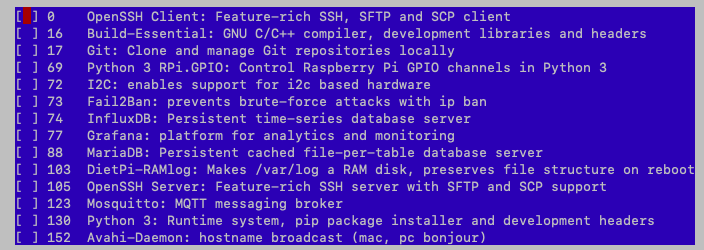
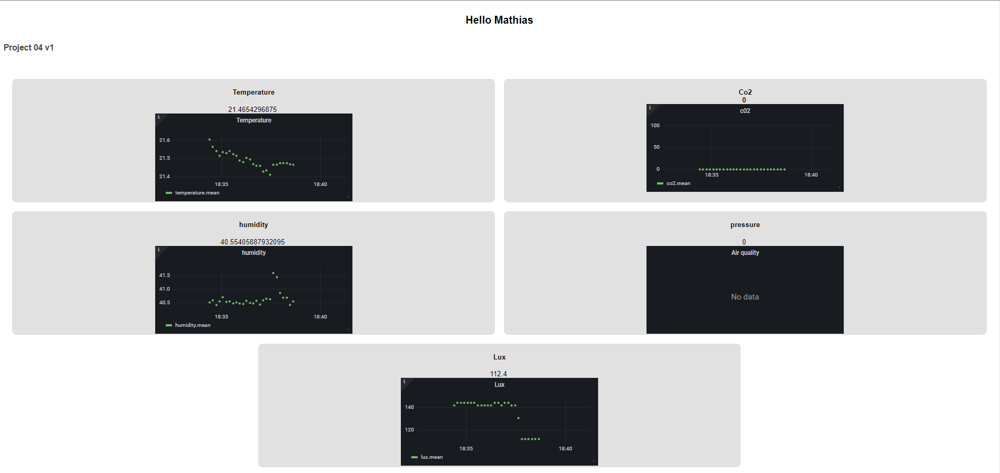
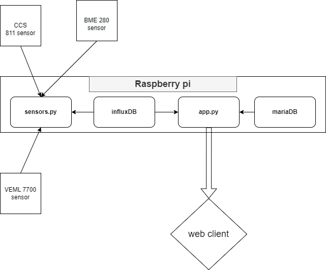

# A raspberry pi work environment monitor

EnvirogGuard monitors, via three sensors, your work environment and warns you via a web app when an ambient condition, such as light level, air quality or temperature, moves beyond acceptable thresholds.

The objective is to allow the user to have a clearer idea of their work environment's conditions. Another main aim is to allow the user to keep a real-time control over their environment, thanks to small suggestions (opening a window, lowering heat, taking a small break while air refreshes, etc) included in the alerts sent by the web application. This is all accomplished by simply connecting to a web page and putting it into the background while continuing on doing other work.

## Setup

This project combines three sensors: a Bosch BME280 (pressure, temperature and humidity) packaged on a board by adafruit, a Vishay VEML700 lux sensor, and a CCS811 Air quality sensor (CO2 and TVOC) by stemmaQT. All sensors are connected to the raspberry pi via four pins, two for power (5V and ground) and two for use with the I2C protocol. We recommend the use of four 1-to-3 wire connectors in order to simplify the necessary wire connections.

Once the sensors have been correctly wired to the raspberry pi, it is time to install the software. Since the project depends on the use of grafana, influxdb and mariaDB, we recommend the use of an easier to use linux distribution like DietPi [[link]], which we will use for the rest of this project.

Once dietpi has been loaded onto an SD card, several files have to be modified before booting the raspberry pi. You should add your home/work wifi configuration in the wifi.txt file on the boot partition, or you will not be able to access the raspberry pi.

Once you are connected to the raspberry pi, proceed with the guided installation. Once setup is done, enable I2C using the `dietpi-config` command, under advanced options. Make sure to set the I2C baudrate to 50k, as one sensor we use has trouble with higher values. You can then install the required software using the `dietpi-software` command-line tool. A list can be found in the image below.



You are then clear to install the project, by simply copying the `src` folder onto your raspberry pi. Finally, some addtional python libraries are required, which you can easily install using the following command from inside the src folder.
```
pip3 install -r requirements.txt
```
You should also modify your grafana configuration, found in the '/etc/grafana/grafani.ini' file. You need to uncomment the 'allow_embedding' option and set the variable to true. Once you are done, this line should read:
```
allow_embedding=true
```

Finally, influxDB requires some configuration, which you can do using the following tutorials. Follow the instructions under "[Users and Security](https://dietpi.com/docs/software/databases/#influxdb)".

Some addtional configuration for grafana is also required to allow graphs to display properly. To do this, follow the instructions below:
1. Launch the sensors.py program. It will provides the data to the influxDB table.
2. Connect yourself to the grafana web page on the http:<your-ip>:30001. The credentials are:
    1. Username: admin
    2. Password: The password your raspberry pi uses for the root user.
3. Go to configuration and create a new data source for the influxDB database:
    1. Select influxDB
    2. Make sure the query language is influxQL
    3. Add http://localhost:8086 as HTTP url
4. Go to the `dashboard` menu and create a new dashboard
5. Add a new panel on the dashboard
6. On the `Data source` selection, select the data source you just created
7. In the query builder below, click on select measurement, choose air quality.
8. Repeat steps 5 to 7 with temperature, pressure, lux, humidity and CO2 measurements.

## Using enviroGuard

You are now ready to launch the enviroGuard program. This is simply done by going to the folder you copied and launching the following command.
```
python3 app.py >/dev/null 2>&1 &
```
You can now connect to the web app by typing `dietpi.home:5000` in your address bar. You arrive on a landing page (shown below), which shows you the recent evolution of the different values measured by all three sensors, as well as the most recent values in clear text above the graphs. You can also minimise this window, as the rest of the operation is automatic, you will receive alerts in the form of browser notifications as your environment evolves during the day.



## Implementation details

The main software of EnviroGuard is written in python 3. There are two programs. One, `sensor_polling.py` is in charge of regularly polling the sensors (using the helper script `sensors.py`, which communicates with the sensors via the I2C bus) and updating the corresponding time series in the influxDB database. The other, `app.py`, is in charge of the web app, which is implemented in Flask,. It communicates with the grafana instance to load time series graphs, mariaDB to store user preferences, and influxDB to load the most recent data. Communication with the client web app is done using a web socket.
  

  
## Technical challenges
  
The main problem we faced during implementation was interfacing with the sensors using python. Indeed, most available libraries are made for circuitpython or micropython, and are not trivially compatible. We finally found some correct libraries and in one case had to write one of them using code sourced from an user of the raspberry pi forums having faced the same problem. In retrospective, though we mostly solved this problem, we lost a lot of time solving time, and using an ESP32 to communicate with the sensors may have been a better, simpler to implement choice.
  
We also noticed that notifications in a browser are sometimes not sent. This is sadly not in our realm to fix, as it is a problem caused by the browser itself, most web browser refusing (for good reasons !) to send notifications on an unsecured (http) connection. Further concerning notifications, we also did not implement a way to prevent notification spam (there is no delay once a certain notification has been sent), though this could simply be accomplished with javascript variables containing the time at which a notification of each type was sent.
  
## Project Value
  
In all, we find the idea behind this project very interesting, though somewhat limited in scope. Such a project could be very useful as a base for automatically controlling a smart home or smart room, improving the health of the occupants as well as encouraging good behaviours regarding energy consumption. This project could also be adapted with some modifications (and adding the missing support for multiple users and for custom configurations) for use in a classroom, as a way for the lecturer to monitor the environment of the room, directly improving the teaching and learning environment.
  
## Conclusion
  
Realising this project was a blast ! We learned a lot of new things and techniques which will be very useful in our future in computer science, and in our life in general. Though we would in hindsight certainly do some things differently, we have no regrets regarding what we have accomplished. 
  
This project, and the course during and for which it was realised, made us really understand the importance of prototyping in the project development cycle, and changed our outlook on how we will from now on work on our projects, be they for our own entertainment or during our studies.
