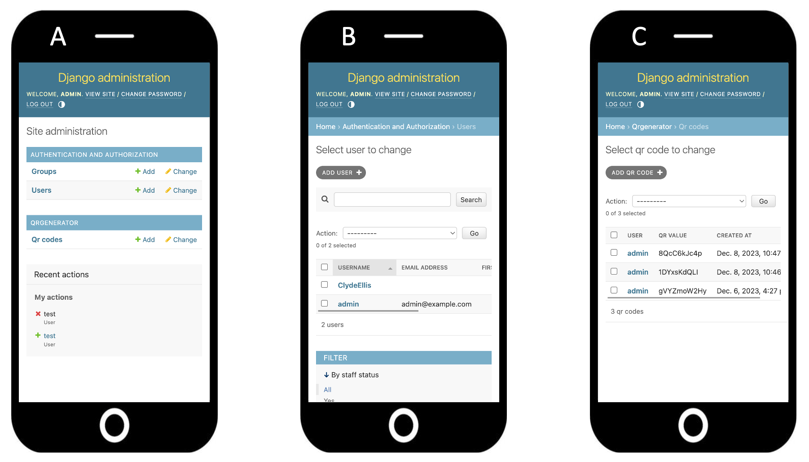

# UniLock
Caratti Jacopo, Kaegi Nicholas.

## Table of Contents
- [UniLock](#unilock)
  - [Table of Contents](#table-of-contents)
  - [1. Introduction](#1-introduction)
    - [Problem statement](#problem-statement)
    - [UniLock](#unilock-1)
      - [Idea](#idea)
      - [Workflow](#workflow)
      - [Video](#video)
  - [2. Implementation](#2-implementation)
    - [Web application](#web-application)
    - [QR scanner](#qr-scanner)
    - [Communication](#communication)
    - [Physical arrangement](#physical-arrangement)
  - [3. Installation](#3-installation)
  - [4. Instructions](#4-instructions)
  - [5. Considerations](#5-considerations)
    - [Physical arrangement](#physical-arrangement-1)
    - [Hardware](#hardware)
    - [Software](#software)
    - [Deployment](#deployment)
  - [6. Conclusion](#6-conclusion)
    - [Project value](#project-value)

## 1. Introduction
The University of Fribourg's Learning Lab, situated in Pérolles 21 building classroom A201, serves as a dynamic community hub. It offers a rich array of tech tools for rapid prototyping, environment for work, study, and teaching. The space hosts diverse activities, focusing on educational themes and offering a dynamic setting for exploring various teaching methods.

### Problem statement
Accessing the FabLab area requires a UniFr card, only available to the collaborators of the University of Fribourg's. However, the university is an international pole, with a lot of external collaborators. Crafting a temporal blank UniFr cards for those outside the university is a long process and poses security challenges. Hence, there's an urgent need for an innovative access management system.

### UniLock
#### Idea
To resolve this challenge, we aimed to devise a new access management system. We envisioned a user-friendly process — seamless as having a UniFr card in your pocket, effortlessly opening the door. Our solution should be portable and transferable to different environments, ensuring simplicity for users while offering ease of administration. Security, privacy, and the integration of computer vision components were paramount in our design considerations, culminating in the birth of UniLock.

#### Workflow
##### 1. QR code generation
UniLock begins with users accessing the UniLock web application, where they input their unique credentials to log into the web platform. Once verified, the system immediately detects that the door is currently closed, hence users can swiftly generate a temporary QR code through the application.

##### 2. QR code scan
This QR code, valid for a 30-second window, acts as a virtual key granting access to the FabLab. Upon QR code generation, UniLock triggers a camera adjacent to the FabLab entrance, illuminating an indicator light as a visual cue for users to present their QR code. The camera promptly scans and validates the QR code in real-time.

##### 3. Access to the FabLab
Failure to present the QR code within the allocated timeframe prompts automatic deactivation of the camera and invalidates the QR code, ensuring unauthorized access is prevented. Conversely, upon successful scanning, the door unlocks and users are granted access to the area. This seamless system combines robust security measures with user convenience, ensuring only authorized individuals gain entry within the designated timeframe.

##### 4. Leaving the FabLab
Exiting the FabLab is a straightforward process. Upon accessing the web application, the system detects the open door status and offers users the option to close the door effortlessly by clicking on a button.

#### Video
A picture is worth thousand words...so what about a video?

https://github.com/jack-unibe/FaceGuard/assets/114411874/7ebcd106-a078-48a5-89d0-39da9be8eeb5

## 2. Implementation
### Web application
#### Technologies
- [Raspberry Pi 4](https://www.raspberrypi.com/products/raspberry-pi-4-model-b/)
- [Django](https://www.djangoproject.com/)

#### Specifications
The UniLock web app effortlessly serves users and administrators with its dual functionality. We developed it using Django, a Python-based full-stack framework that streamlines web development by automating tasks like creating an administrator panel for efficient organization.

##### User board
Initially, users input their credentials to access the web application, triggering the presentation of two distinct views based on the current door's status — closed or open.

When the door is closed (A), users can quickly create a temporary QR code for access by hitting 'Unlock'. This grants authorized entry for 30 seconds. When the door is open (B), users can close it using the 'Lock' button.

<div style="text-align:center">
    
</div>

When a user initiates the QR generation operation, the Django backend creates a random string linked to user details and current timestamp, securely storing them in the database for traceability.

**`unilock_app_docker/qr_generator/view.py`**
```python
def generate_qr_code(user: User) -> 'QRCode':
    random_string = generate_random_string(10)
    qr_code = QRCode.objects.create(qr_value=random_string, user=user)
    return qr_code
```

We simplify user interaction by converting the randomly generated string into a QR code. This process enables users to present a QR code - rather than a string - for quick validation with the camera system.

**`unilock_app_docker/qr_generator/view.py`**
```python
def string_to_qr(qr_string):
    qr = qrcode.QRCode(
        version=1,
        error_correction=qrcode.constants.ERROR_CORRECT_L,
        box_size=10,
        border=4,
    )
    # Use random string as data
    qr.add_data(qr_string)
    qr.make(fit=True)
    
    # Create an image from the QR Code instance
    img = qr.make_image(fill_color="black", back_color="white")

    # Save the image to a BytesIO buffer
    buffer = io.BytesIO()
    img.save(buffer)
    img_data = base64.b64encode(buffer.getvalue()).decode()
    return img_data
```

##### Admin board
The web app offers administrators an (A) intuitive dashboard for comprehensive control. It allows them to (B) manage users, oversee database resources, and supervise system functionality for efficient administration. Additionally, administrators can review the (C) history of generated QR codes for further analysis.

<div style="text-align:center">
    
</div>

#### Technical difficulties
Initially, we developed the web app with [StreamLit](https://streamlit.io/), an emerging Python library for crafting and deploying custom web applications. One perk was its easy deployment on their free cloud. Yet, the process was more challenging than anticipated. StreamLit lacked crucial features like backend development, database management, and URL routing, very useful in web app development. However, its [unique control flow](https://docs.streamlit.io/library/api-reference/control-flow) became the biggest problem: with each user interaction, StreamLit runs the code from top to bottom, leading to intricate code logic. Then, when integrating the web app with the scanner, we realized StreamLit wasn't the ideal fit for UniLock, prompting us to transition to Django.

### QR scanner
#### Technologies
- [Google AIY Vision Kit](https://aiyprojects.withgoogle.com/vision/)
- [OpenCV](https://opencv.org/)
- [Flask](https://flask.palletsprojects.com/en/3.0.x/)

#### Specifications
UniLock camera continuously scans for QR codes for up to 30 seconds. When a QR code is scanned, UniLock extracts its embedded string and sends it to the web app for validation. If no QR is detected within this time, the system triggers a failure message and returns a null value. Meanwhile, a yellow LED lights up to visually indicate the ongoing scanning process to users.

**`unilock_scanner/aiy_qr_scanner`**
```python
def activate_camera(cap) -> Union[str, None]:
    with Leds() as leds:

        endTime = datetime.datetime.now() + datetime.timedelta(seconds=timeout)
        leds.update(Leds.rgb_on(Color.YELLOW)) 
        while datetime.datetime.now() <= endTime :
            ret, frame = cap.read()
            qrcode = decoder(frame)
            if qrcode:
                print("success : ", qrcode)
                leds.update(Leds.rgb_on(Color.GREEN))
                time.sleep(1)
                return qrcode

        leds.update(Leds.rgb_on(Color.RED))
        print("failed")
        time.sleep(1)
        leds.update(Leds.rgb_on(Color.WHITE))
        return None
```

### Communication
#### Technologies
- [HTTP Requests](https://developer.mozilla.org/en-US/docs/Web/HTTP/Methods) 
- [MQTT (Message Queuing Telemetry Transport)](https://mqtt.org/)

#### Specifications
Our UniLock system operates in conjunction with an external locking system to physically control door access. Hence, in addition to establishing internal communication between UniLock components, integration with the external locking system is crucial for complete functionality.

##### Internal communication
| Endpoint | Method | Description | Values |
| - | - | - | - |
| `<scanner>/turn_on` | GET | Request the scanner to turn on the camera. | - |
| `<webapp>/qr_value` | POST | Send to the web app the scanned QR code or null value for validation. | `<string>`, `None` |

Upon QR generation, the web app sends a `turn_on` GET request to the scanner, which starts scanning for 30 seconds. When a QR is detected, the QR value is sent back to the web app for validation with a `qr_value` POST request.

**`unilock_app_docker/qr_generator/view.py`**
```python
def turn_on_camera(request: HttpRequest) -> 'JsonResponse':
    qr_code = None
    response = JsonResponse({})
    if REAL_CAMERA_API_ENDPOINT:
        response = requests.get(CAMERA_API_ENDPOINT + '/turn_on')
    else:
        response.ok = True
    if response.ok:
        return JsonResponse({'message': 'Camera turned on successfully', 'code' : response})
    else:
        return JsonResponse({'error': 'Failed to turn on the camera'}, status=500)
```

##### External communication
| Topic | Publisher | Subscriber | Description | Values |
| - | - | - | - | - |
| `webapp_to_lock` | UniLock | lock | Information flow from web app to locking system. | `get_current_lock_state`, `flip_lock_state` |
| `lock_to_webapp` | lock | UniLock | Information flow from locking system to web app. | `open`, `closed` |

To facilitate seamless communication with external systems, we adopted MQTT, an efficient messaging system. This involved setting up two one-way communication channels for each system pair. For instance, between the locking system and UniLock, we established `webapp_to_lock` and `lock_to_webapp` topics. UniLock subscribes to `lock_to_webapp` and publishes to `webapp_to_lock`, while the locking system subscribes to `webapp_to_lock` and publishes to `lock_to_webapp`.

Upon user login, the web app sends a `get_current_lock_state` message to `webapp_to_lock`, prompting the locking system to reply with the door's current status (`open` or `closed`) via `lock_to_webapp`. This status determines the displayed functionalities.

When a user initiates an action like locking or unlocking the door, the web app sends a `flip_lock_state` message to `webapp_to_lock`. The locking system processes this request and updates the door status, publishing the new state (`open` or `closed`) to `lock_to_webapp`.

**`unilock_app_docker/qr_generator/view.py`**
```python
def change_state_door():
    if current_door_state ==  "unlocked":
        client.publish(mqttPubTopicScanner, payload="lock", qos=1, retain=False)
    else:
        client.publish(mqttPubTopicScanner, payload="unlock", qos=1, retain=False)
```

This figure shows the entire UniLock's internal and external communication workflow.

<div style="text-align:center">
    
</div>

#### Technical difficulties
Our initial choice for internal communication was as well MQTT. To link scanner and web app, we defined the topics `webapp_to_scanner` and `scanner_to_webapp`.

However, following broker setup and proper subscription to topics, we encountered internal issues. Although - upon QR generation - the web app successfully sent a `turn_on` message to the camera and the camera correctly scanned and retrieved the QR, the broker failed to deliver the QR value to the web app for validation. Without investigating into much details, we traced this back to running Django and MQTT at the same time. Despite its seemingly straightforward nature, this issue stumped us. Therefore, for internal communication we finally switched to HTTP requests.

### Physical arrangement
#### Technologies
- [Original Prusa i3 MK3S+](https://www.prusa3d.com/category/original-prusa-i3-mk3s/)
- [WiFi QR Code Generator](https://www.qr-code-generator.com/solutions/wifi-qr-code/)
- Non-Transparent Tape

#### Specifications
We visualized a protective case for UniLock's Raspberry Pi, camera, and LED components, considering specific requirements for both aesthetics and environmental safety.

##### Adaptability
UniLock's strategic placement within plexiglass walls ensures security within the FabLab while facilitating external QR code scanning. This setup adeptly shields the system from potential threats in the FabLab scenario. Moreover, our approach is designed with adaptability in mind, allowing UniLock to meet varying environmental demands beyond the FabLab's confines.

##### Positioning
To avoid inadvertent recording of individuals and privacy issues during the scanning process, we directed the camera downward. Hence, we needed something that could be easily oriented.

We opted for a [mobile arm with a suction cup](https://joby.com/global/suction-cup-and-gorillapod-arm-jb01329-bww/) to install the UniLock on the glass wall. This setup ensures stability with the suction cup's grip and provides adjustable positioning through the arm's design. The arm features a standard screw at its top, perfect for securing small devices like a GoPro or our UniLock system. We discovered a [suitable case](https://www.printables.com/model/52279-google-aiy-vision-snap-fit-enclosure-no-screws) compatible with the screw type needed for UniLock. After printing and assembling the case, we securely attached it to the mobile arm, completing the setup.

<div style="text-align:center">
    
</div>

##### Usability
To facilitate the scanning through the glass, we fine-tuned the camera's angle and marked a square on the glass using duct tape. This visual guide helps users position the QR code accurately.
Moreover, to access the UniLock web app, users must connect to the same Local Area Network. So, we strategically placed a WiFI QR code nearby simplifying this connection process, removing the need for inserting additional WiFi credentials.

<div style="text-align:center">
    
</div>

This UniLock physical arrangement ensures protection, usability, maintains functionality, and addresses privacy concerns.

## 3. Installation

First, clone the github repository: 
```bash
   git clone https://github.com/nembrinj/protofablab.git
```

Move to the UniLock project directory:
```bash
cd 2023/projects/01_UniLock
```

Now, follow the following instructions to instantiate both the web application and the scanner.

### Web application

Create a `.env` file in the UniLock root directory with the following content:
```txt
REAL_EXTERNAL_API_ENDPOINT=FALSE 
REAL_CAMERA_API_ENDPOINT=TRUE
EXTERNAL_PROJECT_API_ENDPOINT = "replace when needed"
CAMERA_API_ENDPOINT = "http://<ip/hostname of the scanner>:5000"
MQTT_SERVER_HOST=localhost
MQTT_SERVER_PORT=1883
```

Navigate to the `unilock_app_docker` directory:
```
cd code/unilock_app_docker
```

Create a docker image:
```bash
docker build -t unilock_app_image .
```

Instantiate a container from the docker image:
```bash
docker-compose up -d
```

Enjoy your application on [http://localhost:8000](http://localhost:8000).

### Scanner

Optionally flash the custom scanner image `images/unilock-scanner-v1` onto your Raspberry Pi Zero. If you have an AIY Vision kit, you can easily obtain the custom image from the [release page](https://www.raspberrypi.com/software/operating-systems/), flash it using the [Rasberry Pi imaging tool](https://www.raspberrypi.com/software/), and proceed with the remaining steps in this guide.

??? do we have to move inside the pi?
??? how did you create the image?
??? Do the installation instructions make sense?

Navigate to the `unilock_scanner` directory:
```
cd code/unilock_scanner
```

Install the python dependencies:
```bash
pip install -r requirements.txt
```

Open up port 5000 on your AIY Vision Pi:
```bash
ufw allow 5000
```

Start the server:
```bash
bash ./start.sh
```

From here on, just navigate to [http://<your-rip-ip/hostname>:5000](http://<your-rip-ip/hostname>:5000) to activate the cammera and scan the qr codes.

## 4. Instructions
### Connecting to Local Area Network
To access UniLock after system setup, connect to the local network by scanning a nearby QR code on the glass wall. Your device will seamlessly join UniLock's LAN without the need for manual WiFi credentials insertion, enabling the use of the UniLock system's functions.

### Modifying default administrator credentials
After UniLock initializes, it automatically generates an admin account with default login details `admin:admin`. To enhance system security, it is highly recommended to immediately update these credentials within the admin panel. Visit [http://localhost:8000/admin](http://localhost:8000/admin) to access the administrator panel. Log in using the default credentials.

Once logged in, (A) find the option to update credentials. (B) Set a strong, unique password for the administrator account to boost system security.

<div style="text-align:center">
    
</div>

### Creating new users
To add a new user, visit the administrator panel at [http://localhost:8000/admin](http://localhost:8000/admin). Once logged in, (A) navigate to the 'Users' collection. Here, you will find a (B) comprehensive list of all the currently registered users within the application.

Click on the option to add a new user. You will be prompted to (C) enter various details defining the new user's profile, including mandatory username and password. Feel free to enter any additional relevant information to characterize the new user.

Completed the user creation process, the system will immediately activate the new user account, granting operational access to UniLock. The newly created user will now we (D) appear among the listed users, indicating the successful account creation.

<div style="text-align:center">
    
</div>

### Opening the door
Upon (A) succesfull login to UniLock at [http://localhost:8000/](http://localhost:8000/), administrators and users are automatically directed to the homepage. The application immediately detects the current door status, (B) displaying the option to unlock it if closed.

Pressing 'Unlock' (C) generates a temporary QR code access token on the interface, allowing entry to the FabLab within a 30-second time window.

Users present the QR code on their device to the UniLock camera for scanning and validation, granting entry into the FabLab, ensuring secure and efficient access for authorized individuals.

<div style="text-align:center">
    
</div>

### Closing the door
When the door is open, users can close it by accessing the web application at [http://localhost:8000/](http://localhost:8000/). To initiate the closing process, (A) users need to push the 'Lock' button. This prompts a (B) visual confirmation indicating the door is closing, making users aware of this status change.

<div style="text-align:center">
    
</div>

## 5. Considerations
Due to the time contraints of a one-semester university project, we made specific design choices to deliver a final working prototype. We aim to present these trade-offs and suggest potential ideas for future improvements.

### Physical arrangement
#### Suction cup

<div style="text-align:center">
    
</div>

The suction cup's flexibility was useful for prototypes but might not provide lasting stability for the UniLock system's permanent installation. To ensure durability, we suggest exploring a solid attachment method like screws directly onto the glass or wall. A sturdy, compact installation akin to a light switch could offer the needed durability, emphasizing the necessity for a robust, semi-permanent solution beyond the prototyping stage to maintain UniLock's long-term functionality.

#### Power requirement
The UniLock system needs a more stable power source than the current temporary setup: a wall-mounted power bank. The intended direction is to draw power directly from the wall wires. However, this is a complex task requiring collaboration between electricians and computer scientists. Electricians ensure safe power delivery, while computer scientists make sure the system works as expected. This shift aims for reliability but acknowledges the need for interdisciplinary expertise and teamwork.

#### Compact all-in-one case
Thinking about actual deployment, UniLock requires a compact, fixed design for reliability and security, without dangling cables and movable components. This design not only enhances aesthetics but also mitigates the risk of inadvertent case movements, ensuring reliability and reducing the risk of theft. Achieving this involves careful planning for case placement, attachment points, power sources, and user interaction areas. It highlights the need for multidisciplinary collaboration to create a practical system adaptable to various situations.

#### Exposed SD card
The [(A) current UniLock case design](https://www.printables.com/model/52279-google-aiy-vision-snap-fit-enclosure-no-screws), while helpful for prototyping by providing easy access to the SD card, poses a security risk due to its exposed nature.

<div style="text-align:center">
    
</div>

One way to enhance security is by (B) securely placing the SD card inside the case, (C) adding lockable features using screws. These changes restrict quick access, requiring unscrewing the case for SD removal, bolstering security for the UniLock system case.

### Hardware
#### Google AIY Vision Kit discontinued
The UniLock system relies on the now-discontinued [Google AIY Vision Kit](https://aiyprojects.withgoogle.com/vision/), comprising a Raspberry Pi Zero WH, Raspberry Pi Camera v2, LED, AIY Vision Bonnet for ML models, and the [`aiy` Google's API for Vision and Voice Kits](https://aiyprojects.readthedocs.io/en/latest/). Despite the kit's discontinuation, UniLock's hardware needs are modest, allowing for separate procurement and assembly of individual components.

<div style="text-align:center">
    
</div>

UniLock relies on essential components: an LED, a camera, and a Raspberry Pi Zero. While the Google AIY Vision Kit offers machine learning acceleration through the Vision Bonnet, UniLock doesn't heavily lean on complex ML models. Despite this, our setup requires the Vision Bonnet due to the `aiy` API's dependency on the whole Vision Kit, although the Vision Bonnet connects only to the LED. However, for UniLock's ML functions, the Vision Bonnet isn't a mandatory component. Therefore, assembling various components beyond the Vision kit might eliminate the necessity for the Vision Bonnet.

### Software
#### Access valid up to a specific date
The UniLock app currently caters to two user groups: admins and regular users. Using Django's flexibility, we can expand UniLock to even more groups of users. For instance, in the FabLab scenario, we could define professors and students, tailoring access based on academic periods. Professors retain extended access, while students' access aligns with specific academic terms (weeks, semesters, years), ensuring smooth transitions annually. This approach optimizes access control, aligning access periods with academic schedules for improved management.

### Deployment
#### Deploying for production
The Django development server might suffice for prototyping purposes but is not optimized for handling the demands of a production environment. So, for deploying UniLock, it's imperative to transition to a more suitable web server setup. such as [NGINX](https://www.nginx.com/) in conjunction with [Gunicorn](https://gunicorn.org/). NGINX, a high-performance web server, acts as a reverse proxy for Gunicorn, a Python WSGI HTTP server, optimizing the handling of incoming web traffic.
This shift ensures a more stable operation for UniLock in a live environment, mitigating potential security risks. Therefore, prior to deployment, configuring a dedicated web server is essential to maintain optimal performance and security for UniLock.

## 6. Conclusion
The UniLock project documentation details an access management system tailored for the FabLab, encompassing its components, workflow, and functionalities. It addresses limited access via a user-friendly web application, employing QR codes, camera scanning, and door access functions for authorized entry.

Key system components, specifications, and technologies, including the Django-powered web app, are outlined, enabling door control, user management, and database oversight.

We emphasize communication and installation instructions, with insights into future development considerations for a robust UniLock deployment.

### Project value

- **Addressing Access Restriction**: UniLock resolves a crucial challenge by providing efficient access to the FabLab for university collaborators and external visitors. It successfully overcomes restricted access through an innovative, user-friendly system.

- **Simplicity as a Strength**: Our primary aim was simplicity. By streamlining interactions akin to the UniFr Campus Card, we've fashioned a straightforward and functional system, achieved through meticulous planning and strategic decisions.

- **Bridging Digital and Physical Security**: This simplicity draws inspiration from established digital access systems like [Google Authenticator](https://safety.google/authentication/) and [Microsoft Authenticator](https://www.microsoft.com/en/security/mobile-authenticator-app). These widely used systems exemplify functionality and robust security in the digital realm. Our goal was to transpose this digital solution into securing physical resources.

- **Adjustments**: Transitioning from prototyping to deployment requires adjustments, detailed in our documentation. However, we are confident that UniLock is ready for the real-world application in the FabLab setting. We've highlighted trade-offs made during development and proposed enhancements for future iterations.

- **Adaptability and Versatility**
UniLock's flexibility and ease-of-use suggest its potential for application in diverse environments outside of the FabLab. We think for example at the accesses of offices and private houses.

- **Security Standards**: The system adheres to stringent security measures, leveraging [Django's robust credential storage](https://docs.djangoproject.com/en/5.0/topics/auth/passwords/#password-management-in-django), aligning with NIST recommendations for encryption strength.

- **Minimal Data, Maximum Privacy**: UniLock minimizes data collection to essential information (username and password), reducing the risk of sensitive data exposure. Furthermore, our commitment to privacy is evident in camera orientation, prioritizing user anonymity by directing it away from capturing external individuals.

- **User-Centric Design**: The system revolves around user needs and expectations, ensuring usability and user-centric functionalities. We've anticipated user requirements, enhancing the system's usability and efficiency.

- **Comprehensive Documentation**: UniLock's documentation serves as a comprehensive guidepost for present use and future enhancements. It embodies user perspective, offering valuable insights into the system's functionality and potential improvements.

These factors collectively position UniLock as a valuable asset for the University of Fribourg's FabLab, offering a blend of simplicity, security, and user-centric design to enhance access management.
