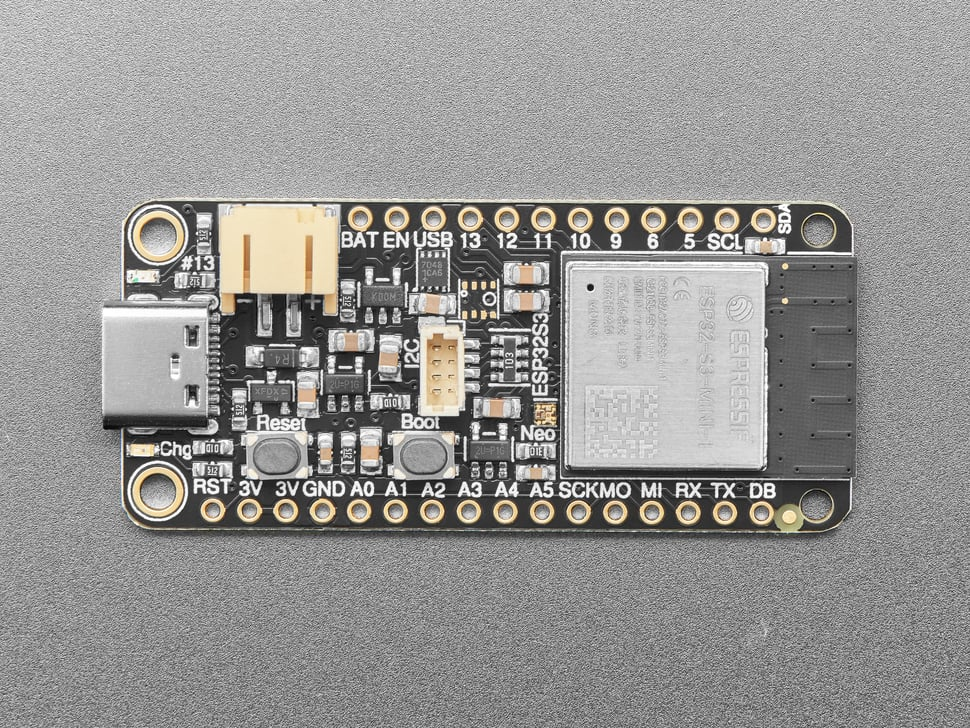
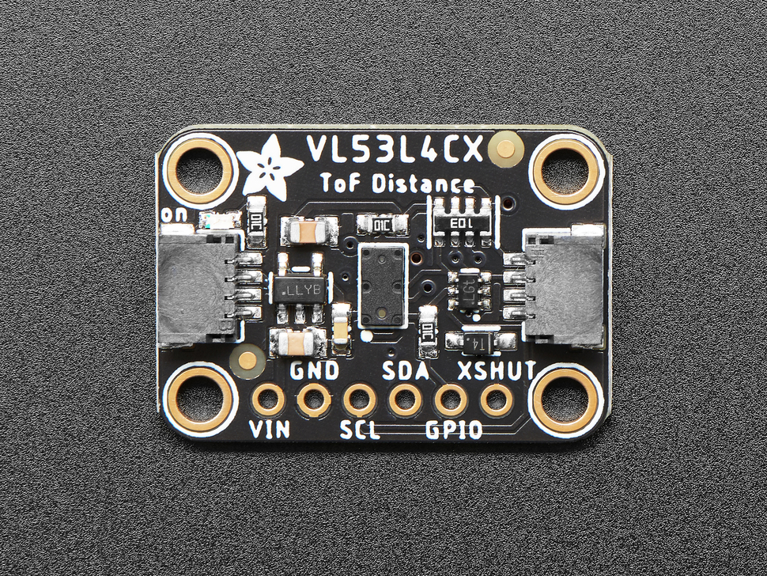
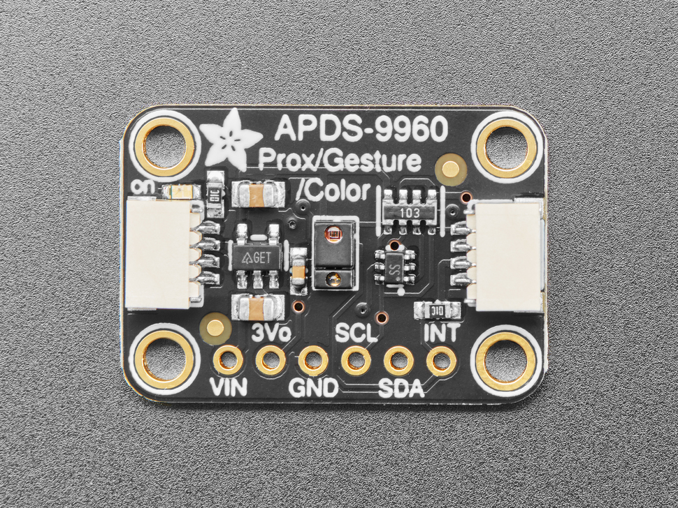

# ProtoFabStats
*Author: Adriana Moisil*

## Table of Contents
- [ProtoFabStats](#protofabstats)
  - [Table of Contents](#table-of-contents)
  - [Background](#background)
  - [Motivation](#motivation)
  - [High Level Overview](#high-level-overview)
  - [Project Directory Structure](#project-directory-structure)
  - [Implementation Details](#implementation-details)
    - [Hardware](#hardware)
    - [Methodology](#methodology)
      - [MQTT](#mqtt)
  - [Appendix](#appendix)

## Background

...

## Motivation

While the other 2 projects (*UniLock* and *DEUS-EX*) focus on access at a software level, respectively phisically locking/unlkocking the door, this project tackels a differet aspect of the main problem. We chose to observe how the space is used and compute statistics that could be helpful for decision making in the future (i.e. answering questions like "Is today a good day to use the laboratory, or is it going to be too crowded?").

## High Level Overview 

...

## Project Directory Structure

The main directory contains 3 pdfs, one for each of the three different presentations that took place during the semester (*idea proposal*, *midterm presentation* and *final presentation*), and two subdirectories: *arduino_app*, containing the 3 files needed for the app running on the Adafruit ESP32 S3 Feather, and *raspberrypi_app*. The set up for the part that runs on Arduino is straightforward. However, the same cannot be said for the second part of the project. Thus, the *raspberrypi_app* subdirectory containing an additional README.md file explaining how to set up the pi for this project.

## Implementation Details

### Hardware

For this project the following pieces of hardware are required (in addition a breadboard and cables to connect the components together):
* *Raspberry Pi Zero* 
  

    
  

  
* *Adafruit ESP32-S3 Feather* 
  

    
  

* *Adafruit VL53L4CX*
  

    
  

  This is a Time of Flight sensor that can detect objects that are up to 6m away from it. 
  Furthermore, it offers support for multi-object detection. This is not something that the ProtoFabStats project needs, but there is a simple solution: we are keeping only the closest object detected for each reading. The ... is that the sensor

* *Adafruit APDS9960*
  

    
  

  This is a sensor for Proximity, Light, RGB, and Gesture. However, we only used its gesture capabilities. The sensor is capable of detecting gestures in the following directions: up, down, left and right. 

There is one more sensor that we have tried to use but fail: *Adafruit VL53L0X*. Another Time of Flight sensor, a predecesor of *Adafruit VL53L4X*, this sensor does not offer multi-object detection and proves to be difficult to work with.

### Methodology

#### MQTT

With the help of MQTT we can easily make the data collected by the Adafruit Sensort available on the server running on the Raspberry Pi.

The project uses the following 4 topics:
* esp32/APDS9960
  * for recorded measurements by the Adafruit APDS9960 sensor
  * published only by the Arduino application
  * this project is responsible for publishing all the information for this topic (and, at the same time, one of its components subscribes to this topic)
* esp32/VL53L4CX 
  * for recorded measurements by the Adafruit VL53L4CX sensor
  * published only by the Arduino application
  * this project is responsible for publishing all the information for this topic (and, at the same time, one of its components subscribes to this topic)
* door/event/locked_unlocked 
  * for passing around information about whether the door is locker or unlocked 
  * this project publish only partial information for this topic (whether the door is open/closed, and not whether it is locker/unlocked), while it subscribes to everything
  * example message "locked_unlocked status=1"; 1 for locked, 2 for unlocked, 0 for unknown
* door/event/open_closed 
  * for passing around information about whether the door is locker or unlocked 
  * this project is responsible for publishing all the information for this topic (and, at the same time, one of its components subscribes to this topic)
    * example message "open_closed status=1"; 1 for open, 2 for closed, 0 for unknown

All messages follow the InfluxDB line protocol.

## Appendix

There are a few tips&tricks learnt during the semester that might come in handy for future projects:
* When setting up Raspberry Pi, it might end up with different suffixes in the name: either *.home* or *.local*. 
* Search for the Raspberry Pi on the local network using `fping -gaqne -r 0 192.168.1.0/24`. Adding the additional flag *n* will output the name of the target instead of its ip (easier to check if the pi is connected to the network or not). 
* The Raspberry Pi can connect to different networks, without having to reset it every time. In order to do so, the following configuration file can be modified (followed by restarting the pi): */etc/wpa_supplicant/wpa_supplicant.conf*.
* While working with the sensors for the arduino board, sometimes they had to be disconnected and reconnected again (the sensors to the arduino, not necessarily the arduino to the PC) in order for a restart/installation of a program to properly reinstantiate their start state.