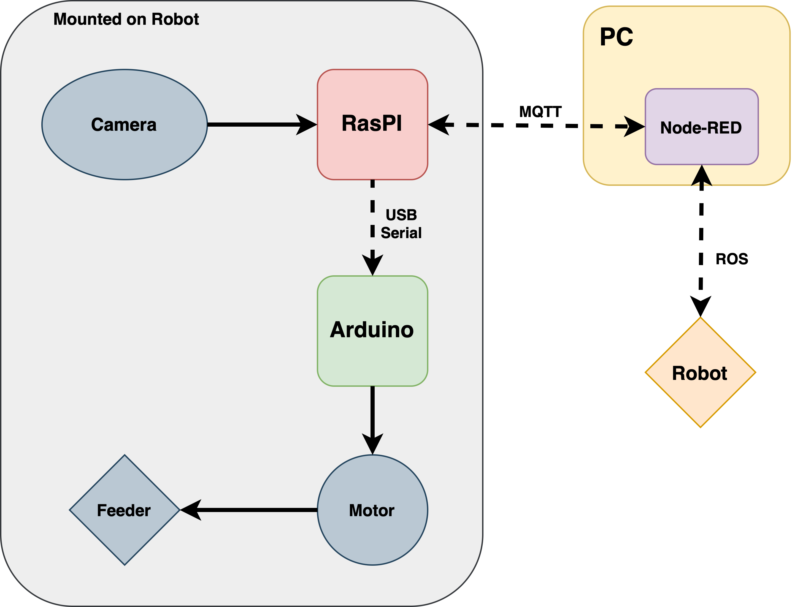
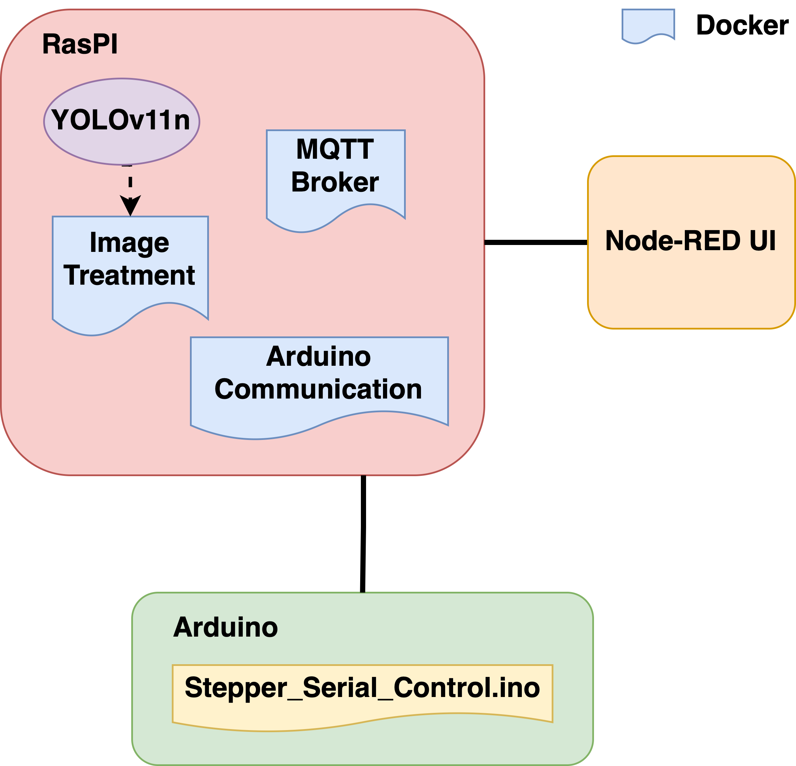
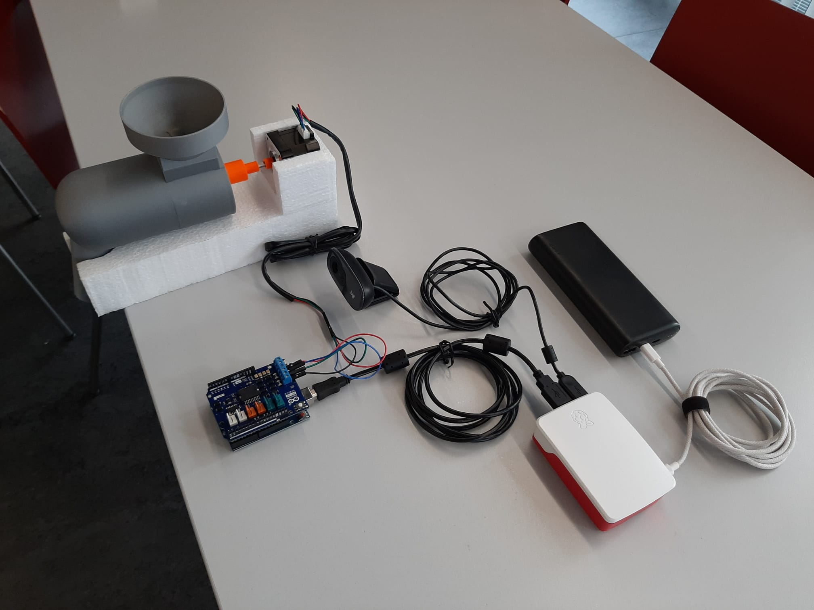
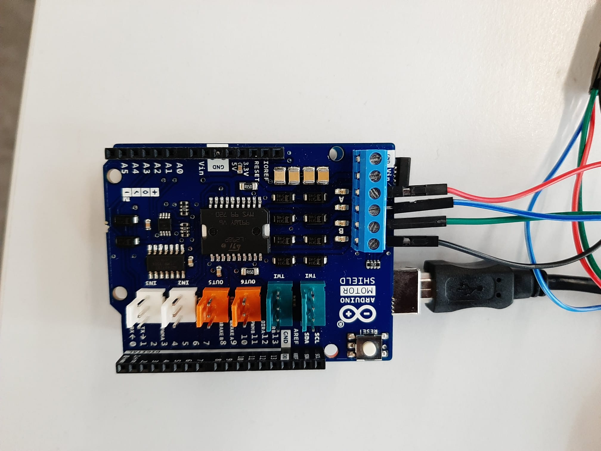
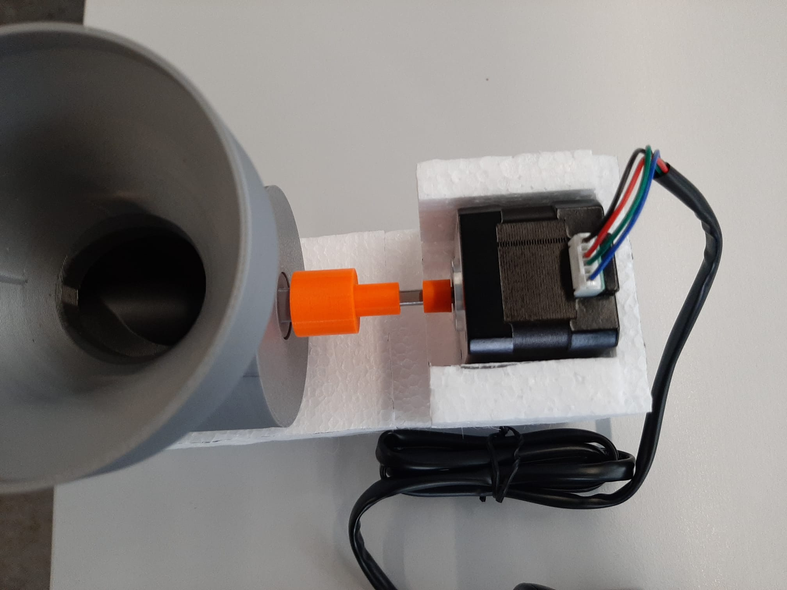
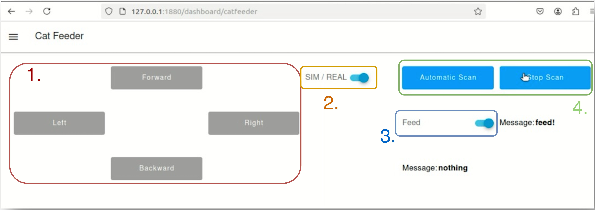

# Cat Feeder Project
This project aims to create a cat feeder that can be controlled remotely. This feeder will be able to dispense food when a cat is detected.
The project will be based on a Raspberry Pi 4 and will use a camera to monitor the cat. 
It will also include a web interface to control the feeder and monitor the presence of the cat.

## Table of Contents
1. [The Project](#1-the-project)
   1. [Global Project](#11-global-project)
   2. [Our Prototype](#12-our-prototype)
      1. [Hardware Required](#121-hardware-required)
      2. [Software Required](#122-software-required)
      3. [System Logic](#123-system-logic)
      4. [System Architecture](#124-system-architecture)
2. [Installation](#2-installation)
    1. [Configuration of the Raspberry Pi 4](#21-configuration-of-the-raspberry-pi-4)
    2. [Installing Docker](#22-installing-docker)
    3. [Cloning project files onto Raspberry Pi](#23-cloning-project-files-onto-raspberry-pi)
    4. [Uploading the Arduino code](#24-uploading-the-arduino-code)
    5. [Building the setup](#25-building-the-setup)
    6. [Create and locate the robot (if not already done)](#26-create-and-locate-the-robot-if-not-already-done)
    7. [Running the project](#27-running-the-project)
4. [Usage](#4-usage)
5. [Demo](#5-demo)
6. [Limitations and Future Work](#5-limitations-and-future-work)
7. [Credits](#7-credits)

## 1. The Project
### 1.1 Global Project
Our initial idea was to design a 'Cat Carer', that takes care of your favourite companion when you are away from home.  
Indeed, it would be nice to be able to interact with your cat, feed it, and play with it even when you are at work or enjoying your holidays. 
This could have multiple features, like dispensing food, playing with the cat, or even interacting with the cat.

### 1.2 Our Prototype
The prototype we decided to develop as a proof of concept is focusing on the feeding aspect of the 'Cat Carer'.  
The prototype consist of a detection mechanism, that will detect a cat non-distinctively, a food dispenser (for dry food) and an interface
for the owner to interact with.  
There are two modes of interaction with the robot from a user perspective: manual and automatic.
The first one allows the user to control the robot manually with a dpad-style controller, while the second one allows the robot to follow autonomously a pre-defined path and feed the cat when it is detected.

#### 1.2.1 Hardware Required
- Raspberry Pi 4
- USB Webcam
- Stepper Motor (Nema 17)
- Arduino Uno R3
- Arduino Motor Shield v3
- 3D Printed parts (feeder+adaptor)
- PMB2 Robot or simulation

#### 1.2.2 Software Required
- ROS (Robot Operating System)
- Node-RED
- Arduino IDE
- Raspberry Pi Imager
- Docker (to be installed on the Raspberry)
- Slicer 3D

#### 1.2.3 System Logic
Our setup consists of two main parts: the Raspberry Pi that handles all the MQTT and serial communications between the different components, and a node-red interface that allows the user to interact with the system.  
The Raspberry Pi is serially connected via USB to the Camera and the Arduino Uno.
The Arduino Uno is connected to the stepper motor that controls the food dispenser via the Arduino Motor Shield.
The communication with the node-RED interface is handled via MQTT topics.  
Finally, the communication between node-RED and the PMB2 Robot is handled via ROS topics.

<div style="text-align: center;">
   
</div>

#### 1.2.4 System Architecture
The code execution is handled in the Raspberry Pi by three different docker containers. The first one is handling the MQTT
communication by implementing a Mosquitto broker. The second docker is handling the camera and the cat detection using the YOLOv11n object recognition algorithm.
The third one is responsible for the serial communication with the Arduino. It sends signals to the arduino board when the feeder has to be activated.  
The Arduino code just activates the feeding mechanism when it receives a signal from the Raspberry Pi.  
Meanwhile, node-RED is constantly listening to the MQTT topics to monitor the current state of the system. 
It is also responsible for sending instructions to the Raspberry Pi when the user wants to feed the cat.

<div style="text-align: center;">
    
</div>


## 2. Installation
### 2.1 Configuration of the Raspberry Pi 4
- Open the pi imager, and choose Raspberry Pi 4, OS: Raspberry Pi OS Lite (64-bits)
- Add all infos for user, network, passwords, and enable ssh with password authentication

Then ssh into the raspberry pi
```
  ssh <username>@<ip>
```
### 2.2 Installing Docker
```
  curl -fsSL https://get.docker.com -o get-docker.sh
  sudo sh get-docker.sh
```

Then we add the current user to docker group
```
  sudo usermod -aG docker ${USER}
  groups ${USER}
```

Once the user is added to the docker group, you need to reboot the raspberry pi (unplug and replug).

We can finally check if the docker installation is working
```
  docker version
  docker info
  docker-compose version
```

### 2.3 Cloning project files onto Raspberry Pi
Using the 'scp' command on the local machine, we can copy files from the local machine to the Raspberry Pi
```
  scp -r <path to the folder> <username>@<ip>:<path to the folder>
```

Then, on the Raspberry Pi, we can enter the project folder and build the docker container:
```
  cd Docker_project
  docker-compose up --build
```

### 2.4 Uploading the Arduino code
Open the Arduino IDE and upload the code, located in the 'Arduino' folder, to the Arduino Uno R3.

### 2.5 Building the setup
In the following image you can see the overview of the setup and the different cables that need to be connected:


The stepper motor needs to be connected to the Arduino Motor Shield like shown in the picture below:


The stepper motor needs to be attached to the feeder like shown in the picture below, using the 3D printed parts:


### 2.6 Create the map and locate the robot (if not already done)
You can follow the instructions in the following link: https://wiki.ros.org/Robots/PMB-2/Tutorials (section 2)

### 2.7 Running the project
#### 2.7.1. Simulation
To launch the simulation, you can use the following command:
```
bash simulation.sh      
```

#### 2.7.2. Real World
In order to be able to connect to the robot and the Raspberry Pi, you need to connect to both the 'ProFab' and 'PMB2' WiFi networks (ideally using a USB key).
Before executing the following command, make sure that the IP address in the file is the same as your local machine IP address on the robot WiFi.

```
bash real_world.sh
```

## 3. Usage
### 3.1. Web Interface
To access the web interface, you can open a web browser and enter the following address:
```
http://127.0.0.1:1880/
```

Then click on 'Deploy' to start the web interface.
To access the ui, you can enter the following address:
```
http://127.0.0.1:1880/dashboard
```

### 3.2. Controlling the Feeder
To control the feeder, you can use the following web interface:



1. **Manual Control**: You can use the 4 buttons to control the robot manually
2. **Simulation vs Real World**: You can switch between the simulation and the real world setup for the automatic scan by clicking on the switch (in order to switch the set of coordinates for the pre-defined goals)
3. **Feed Options**: You can choose if you want the cat to be fed the next time it is detected
4. **Automatic Scan**: You can start the automatic scan of the cat or stop it
- **Note**: The two messages are indicating if a cat is detected and if it has been fed

## 4. Demo
You can find a demo of the project on the following link:
https://youtu.be/ao27HTqZLQU

## 5. Limitations and Future Work
Overall the project was working well, however, there are still some improvements that could be made:
- Up until now, the food that is dispensed is spreading on the ground, a simple solution could be to add a small container to catch the food.
- The cat detection works well, but the cat is only detect when exactly in front of the camera. This could be improved by using a camera with a wider angle.
- Strangely, sometimes the MQTT connection is lost, this could be improved by adding a reconnection mechanism.
- A final limitation is tied to the automic scan speed of the robot. It is a simple fix, but it has to be changed directly on the robot.

## 6. Credits
This project as been developed by:
- **Davide Morelli** (davide.morelli@unifr.ch)
- **Sophie Maudonnet** (sophie.maudonnet@unifr.ch)