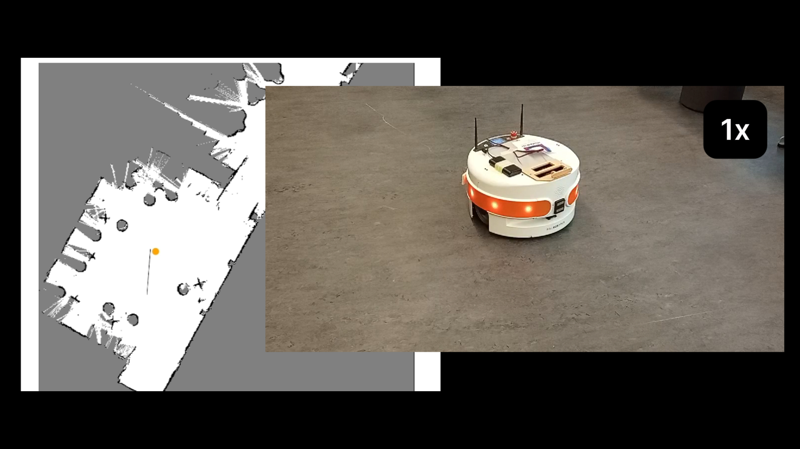
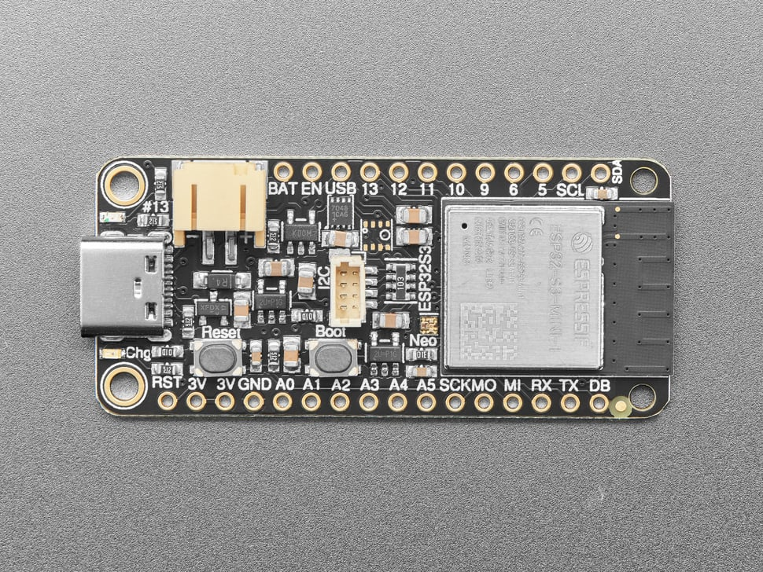
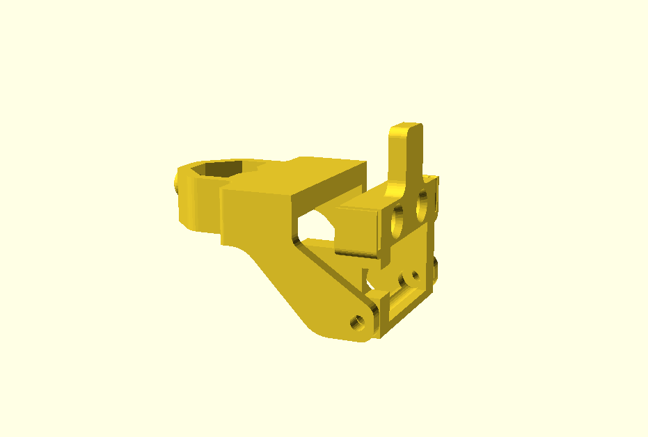
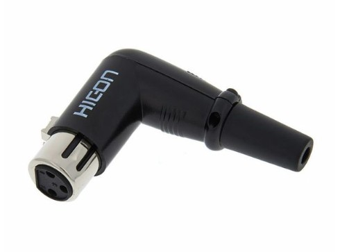
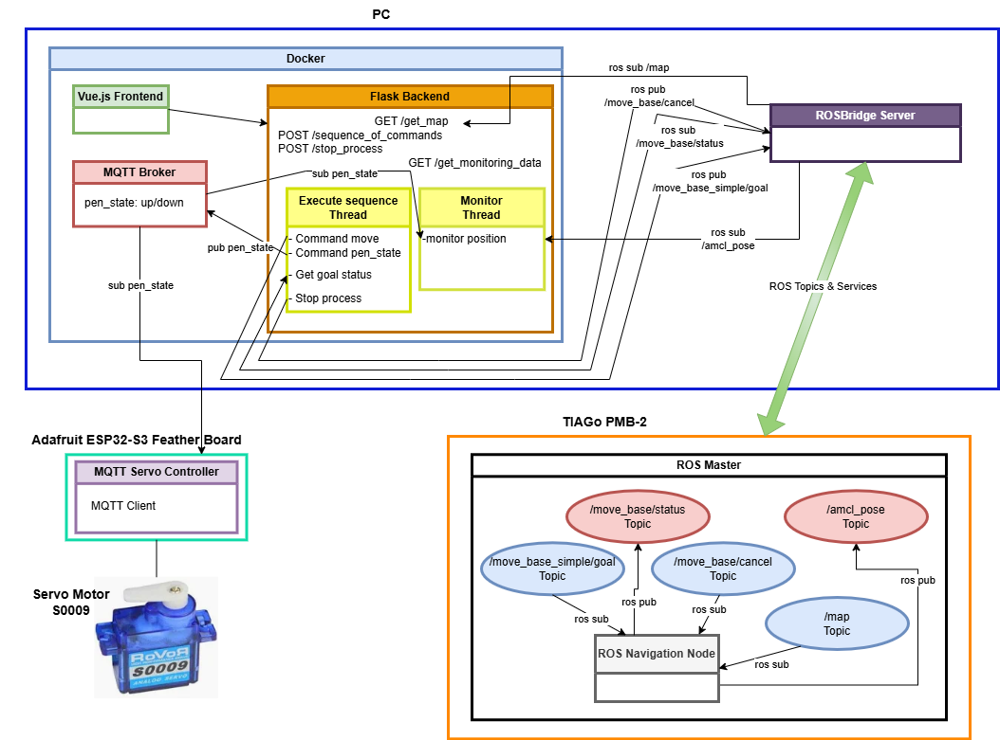
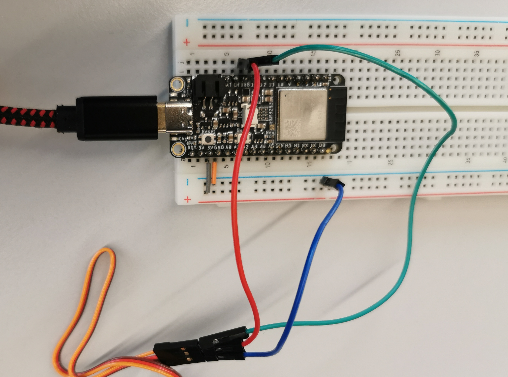
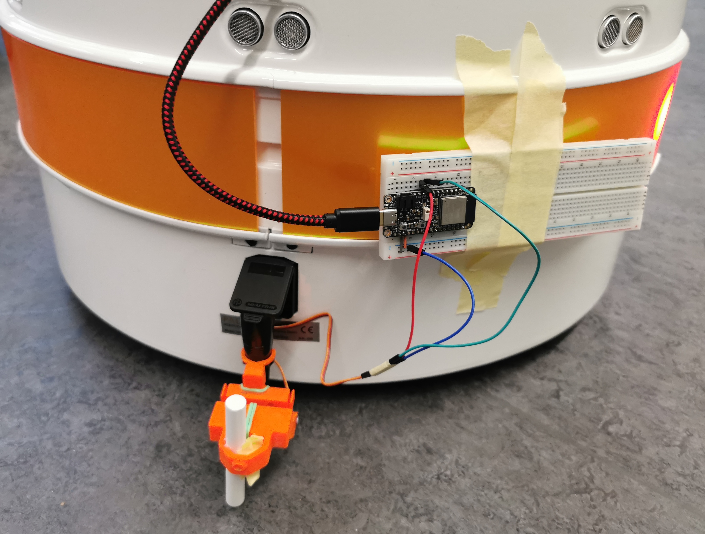

# TIAGo-Picasso

- Authors: Sebastian Käslin and Aditya Deshpande

## Table of Contents

- [TIAGo Picasso](#tiago-picasso)
  - [Table of Contents](#table-of-contents)
  - [1. Introduction](#1-introduction)
    - [1.1. Global Project](#11-global-project)
    - [1.2. Prototype](#12-prototype)
    - [1.3. Video](#13-video)
  - [2. Implementation](#2-implementation)
    - [2.1. Hardware](#21-hardware)
    - [2.2. Mounting Elements](#22-mounting-elements)
    - [2.3. Software](#23-software)
  - [3. Getting Started](#3-getting-started)
    - [3.1. Prerequisites](#31-prerequisites)
    - [3.2. Running the Application](#32-running-the-application)
      - [3.2.1. Running in Gazebo simulation](#321-running-in-gazebo-simulation)
      - [3.2.2. Running with TIAGo PMB-2 Robot](#322-running-with-tiago-pmb-2-robot)

## 1. Introduction

### 1.1. Global Project

The TIAGo-Picasso project is an enhancement of the TIAGo PMB-2 robot's functionality, enabling it
to autonomously draw on the floor a user produced drawing.

This system is particularly suited for educational and recreational environments, such as schools.
By equipping the TIAGo robot with our custom extension, schools can easily and creatively customize
their playgrounds. Possible applications include drawing floor games like hopscotch, twister, and mazes, as well as
creating field markings for sports such as mini-tennis and badminton, or hosting fun demonstrations to introduce robotics
to children in an engaging and interactive way.

### 1.2. Prototype

The prototype includes several key functionalities:

1. Drawing Input
   - Users can draw simple shapes or upload SVG images
   - Supported SVG elements are: path, line, rect and ellipse.
2. Map Handling
   - Fetch the map from the robot.
   - Crop the map to focus on the available drawing area.
3. Drawing Customization
   - Position and scale the drawing on the map.
   - Adjust the drawing's discretization.
4. Command Generation:
   - Movement commands (goals)
   - Control pen states (up/down).
5. Real-Time Visualization
   - Provide feedback during the drawing process, including the robot's position on the map.

### 1.3. Video

Below are demonstrations of the TIAGo-Picasso prototype:

- **Simulation**: Watch the TIAGo robot in a simulated environment autonomously drawing a user-defined pattern on the floor.  
  [](https://youtu.be/t4vfqvy7468)

- **Real Robot**: See the TIAGo robot in action, drawing directly on the floor in a real-world setting.  
  [](https://youtu.be/PCoJi2EztWI)

## 2. Implementation

### 2.1. Hardware

The TIAGo-Picasso project requires the following hardware components to enable the drawing functionality:

- **Adafruit ESP32-S3 Feather Board**  
  

  - Acts as the microcontroller, managing the servo motor and communicating with the backend via MQTT.

- **Servo Motor S0009**  
  
  - Controls the vertical movement of the pen, enabling it to lift or press against the floor during the drawing process.

### 2.2. Mounting Elements

The mounting elements are essential for attaching the pen to the TIAGo robot. Below is an overview of the components and their purpose:

- **Pen Mount** (`3d-models/midt_esp32_pen_mnt.stl`)

  - This 3D-printed model is used to hold the pen in place.
  - Source: [midTbot_esp32 project](https://github.com/bdring/midTbot_esp32/tree/master/STL)

- **Head Block** (`3d-models/midt_esp_32_head_block.stl`)

  - This 3D-printed component holds the **Servo Motor S009**.
  - Source: [midTbot_esp32 project](https://github.com/bdring/midTbot_esp32/tree/master/STL)

- **Combine Head Block and Pen Mount** (`3d-models/head_block_and_pen_mnt.scad`)

  - The pen mount and the head block are then combined together, as it is shown from the custom OpenSCAD file that combines them.
    

- **Hicon Hi-X3RF-M XLR Connector**

  - A commercial component that is used to attach the mounting system to the robot's charging port.
  - Source: [Hicon Hi-X3RF-M](https://www.thomannmusic.ch/hicon_hi_x3rf_m.htm)
    

- **Custom XLR Connector Mount** (`3d-models/xlr_connector_mount.scad`)
  - A 3D-printed model designed to attach the combined mount to the XLR connector.
    

### 2.3. Software

The software architecture of the TIAGo-Picasso project integrates multiple components, below is a description of each component and their role in the system:

- **Main Computer (PC)**

  1. **Frontend**

     - Developed using **Vue.js** and **TypeScript**
     - Provides a user-friendly interface for drawing input, customization, and monitoring robot progress.

  2. **MQTT Broker**

     - Utilizes **Mosquitto** to manage message exchange between component via MQTT topics
     - The only topic used is `pen_state`.

  3. **Backend**

     - Built with **Flask (Python)**.
     - Acts as the core processing unit, that sends commands to the robot and to the ESP32 controller.

  4. **ROSBridge Server**
     - Creates a bridge between the backend and the TIAGo robot's ROS environment.
     - Enables the backend to interact with ROS topics like `/move_base/status` and `/map`

- **Adafruit ESP32-S3 Feather Board**

  - Connects to the WiFi and subscribes to the `pen_state` topic from the MQTT broker.
  - Controls the **Servo Motor S0009** to manage the pen's vertical movement (up/down).

- **TIAGo PMB-2 Robot** (or **Gazebo Simulation**)
  - Runs a **ROS Master** that manages the robot's navigation and map data.
  - The **Navigation Node** handles path planning and movement.
  - The Topics used are:
    - `/move_base/status`: tracks the robot's navigation status.
    - `/move_base_simple/goal`: receives navigation goals.
    - `/move_base/cancel`: cancel active navigation goals.
    - `/map`: provides the map used for navigation.
    - `/amcl_pose`: tracks the robot's estimated position.

The diagram below illustrates the interactions between these components, highlighting the flow of data and control.


## 3. Getting Started

### 3.1. Prerequisites

- **Common Prerequisites**

  The following are required for both simulation and real robot setups:

  1.  **ROS** installed on the machine

      [Install Ubuntu with ROS + TIAGo PMB-2 base](https://wiki.ros.org/Robots/PMB-2/Tutorials/Installation/InstallUbuntuAndROS)

  2.  **Docker** installed on the machine

      [Install Docker Desktop](https://docs.docker.com/desktop/)

  3.  **ROSBridge** installed on the machine

      To install it from the terminal:

      ```bash
      sudo apt install ros-noetic-rosbridge-server
      ```

  4.  **Set .env** file in folder `code/backend`

      ```
      MQTT_HOST=host.docker.internal
      MQTT_PORT=1883
      ROS_CLIENT_HOST=host.docker.internal
      ROS_CLIENT_PORT=9090
      ```

      This file configures the application to connect to the MQTT broker and ROSBridge server.

- **Additional Prerequisites for Simulation**

  No additional hardware is needed for running the simulation.

- **Additional Prerequisites for TIAGo PMB-2 Robot**
  - Having all the required **Hardware** and **Mounting Elements**.
  - **Adafruit ESP32-S3 Feather board**
    - **Install the Arduino IDE**: Download and install the [Arduino IDE](https://www.arduino.cc/en/software) to program the board.
    - **Add ESP32 Board Support**:
      - Open the Arduino IDE and navigate to **File** > **Preferences**
      - In the "Additional boards manager URLs" field, add the following URL:
        ```
        https://espressif.github.io/arduino-esp32/package_esp32_index.json
        ```
      - Go to **Tools** > **Board** > **Boards Manager**, search for "esp32". Install the package named "esp32 by Expressif Systems".
    - **Install Required Libraries**:
      - Open **Tools** > **Manage Libraries** in the Arduino IDE
      - Search for and install the following libraries:
        - PubSubClient
        - ESP32Servo
  - **Connecting the Servo Motor S0009 to the ESP32 Board**
    - **Signal Pin**: connect the servo's signal wire (yellow) to pin 13 on the ESP32-S3.
    - **Power Pin**: connect the servo's power wire (red) to **USB** pin (5V) on the ESP32-S3.
    - **Ground Pin**: connect the servo's ground wire (brown) to a **GND** pin on the ESP32-S3
      
  - **Mounting Elements**
    - Secure the servo motor and ESP32-S3 board to the TIAGo PMB-2 robot using the provided mounting elements. Ensure the servo motor is aligned properly for its intended function.
      

### 3.2. Running the Application

Note: The simulation setup does not require hardware components like the ESP32-S3 Feather Board, while the real robot setup requires both harware and connection to the TIAGo WiFI network.

Choose the instructions that match your setup:

#### 3.2.1. Running in Gazebo Simulation

1. **Create a map with Gmapping**

   Follow these steps to create a map in the simulated environment:

   - Set up the simulation environment:

     ```bash
     cd ~/pmb2_public_ws/
     source ./devel/setup.bash
     ```

   - Launch the mapping simulation:

     Without specifying the argument **world** Gazebo will launch the simulation with the **default world** `small_office`,
     in case you would like to use another world it is possible to define it with the argument **world**.
     The worlds available for the simulation can be found in this directory:

     ```bash
     cd ~/pmb2_public_ws/src/pal_gazebo_worlds/worlds
     ls
     ```

     The command to launch the simulation for mapping a world is:

     ```bash
     roslaunch pmb2_2dnav_gazebo pmb2_mapping.launch public_sim:=true world:=[world_name]
     ```

   - Control the robot for mapping

     ```bash
     rosrun key_teleop key_teleop.py
     ```

   - Save the map

     ```bash
     rosservice call /pal_map_manager/save_map "directory: '[world_name]'"
     ```

2. **Run the app in a specific world**

   - Launch the navigation simulation

     ```bash
     roslaunch pmb2_2dnav_gazebo pmb2_navigation.launch public_sim:=true world:=[world_name]
     ```

   - Localize the robot

     ```bash
     rosservice call /global_localization "{}"
     rosrun key_teleop key_teleop.py
     ```

     **Note**: **Stop** teleoperation once localized

   - Launch the ROSBridge server:

     ```bash
     roslaunch rosbridge_server rosbridge_websocket.launch
     ```

   - Run the application using Docker Compose

     ```bash
     docker compose build
     docker compose up
     ```

     **Note**: it is possible to combine the previous two commands into one

     ```bash
     docker compose up --build
     ```

   - Access the frontend at http://localhost:8080

#### 3.2.2. Running with TIAGo PMB-2 Robot

- Connect to TIAGo WiFi:

  ```
  ssid: ...
  pass: ...
  ```

- Disable the firewall on the Main Computer (PC)

- Setup Hardware:

  - Configure **Adafruit ESP32-S3 Feather board**, you can find the .ino file in `code/servo_controller/esp/esp32servo_s0009_pen_state`. It is necessary to change the network credentials and the IP of the local machine where the MQTT broker runs.
    ```
    // Replace with your network credentials
    const char *ssid = "...";
    const char *password = "...";
    // Put your MQTT broker credentials here
    const char *mqttServer = "...";
    const int mqttPort = 1883;"
    ```
  - Compile and load the code on the board.

- Configure your ROS system on the Main Computer (PC)

  - add in the .bashrc the following line to set up TIAGo PMB-2 robot as the ROS Master:

    ```
    export ROS_MASTER_URI=http://...:11311;
    ```

    **Note**: command to get the current value of ROS_MASTER_URI

    ```bash
    echo $ROS_MASTER_URI
    ```

  - add the following line to specify the IP address of your machine so that your commands will be accepted by TIAGo:

    ```
    export ROS_IP=...
    ```

  **Note**: to work again in the simulation ROS_MASTER_URI must be reset to `http://localhost:11311`.

- Remotely Control TIAGo

  ```bash
  cd ~/pmb2_public_ws/src/pmb2_navigation/pmb2_2dnav/config/rviz
  rviz rviz-d navigation.rviz
  ```

  Use the teleop tool to control TIAGo:

  ```bash
  rosrun key_teleop key_teleop.py
  ```

- Specify the map the robot should use for navigation:

  ```bash
  rosservice call /pal_map_manager/change_map "input:'...'"
  ```

- Localize TIAGo

  - To get the current mode of TIAGo:

    ```bash
    rosservice call /pal_navigation_sm/state
    ```

  - To set the current mode to localization

    ```bash
    rosservice call /pal_navigation_sm "input: 'LOC'"
    ```

  - To reset the global localization:

    ```bash
    rosservice call /global_localization "{}"
    ```

  - Remote control TIAGo to localize itself:
    ```bash
    rosrun key_teleop key_teleop.py
    ```

- Launch the ROSBridge server:

  ```bash
  roslaunch rosbridge_server rosbridge_websocket.launch
  ```

- Run the application using Docker Compose

  ```bash
  docker compose build
  docker compose up
  ```

- Access the frontend at http://localhost:8080
