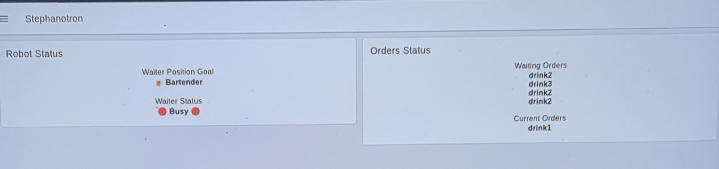

# *Stephanotron* : The Waiter at Your Service

Christine Groux: chrstine.groux@unifr.ch \
Dario Marti: dario.marti@students.unibe.ch

## Introduction

The aim of this project is to create a prototype for a **drink-serving robot**. 

We allow customers to order drinks using buttons attached to an Arduino board. Pushing one of those buttons then triggers an order that is added to a FIFO list. One the TIAGo robot is available, it receives the order and travels to the bar, where a bartender places the corresponding drink in its drink holder mechanism. The robot then goes to the customer's location and waits for them to pick up their order.

## System Architecture
<div>

</div>

*Fig. 1: System Architecture*

| ID | Description |
| - | - |
| 1 | Bartender location |
| 2 | Arduino for the customer to place orders | 
| 3 | LEDs that signal the status of the order | 
| 4 | Cans to place on the TIAGo | 
| 5 | Can holder with a button on the bottom | 
| 6 | Customer location | 
| 7 | Raspberry Pi running MQTT | 
| 8 | WIFI network | 
| 9 | Computer running NodeRed | 

## Prerequisites 

### Hardware

- 1 TIAGo robot
- 2 Adafruit ESP32-S3 Feather Board Arduinos
- 1 Raspberry Pi
- 1 other computer
- 1 power bank (2nd needed depending on customer configuration)
- 1 3D printer (ideally with PLA)
- 2 breadboards
- Many male-male cables for the breadboard
- 5 LEDs (2 green, 1 yellow, 1 red, 1 blue)
- 4 buttons (1 yellow, 1 red, 1 blue, 1 whatever color)
- 4 resistors (220 ohm)

### Software

- Arduino IDE
- Docker
- Gazebo
- NodeRED
- MQTT
- OpenSCAD
- PrusaSlicer
- ROSBridge
- RVIZ

## Using This Project

For the following instructions, make sure that all the hardware are on the same network.

### 0. Install Project

Clone this repository on your local machine.

### 1. Build Breadboard

Assemble the hardware and build the two basic breadboards. The ESP32 board are placed such as the USB-C input is facing the outside.


*Fig. 2: Customer Breadboard*

Ideally, the buttons are yellow, red and blue so that they match the drinks.


*Fig. 3: TIAGo Breadboard*

The 3D-printed parts will be placed over the button on the TIAGo breadboard.

### 2. Print Can Holder

This project necessitates two printed objects per TIAGo used: (1) the cup and (2) the floor. The models for them can be found under `3d-prints`. For instructions on 3D modelling and printing, check assignment AN_07.


*Fig. 4: The Cup*


*Fig. 5: The Floor (turned horizontally)*

First, one must download the STL version of the file through OpenSCAD. 

Most features of the models are parametrized and can be modified. The only exception is the number of holes in the floor; they must stay at 4. While it is possible to remove plastic-saving holes that were added to the model, the center hole in the floor must stay as it is useful to push the button out.

Moreover, it is likely that the cable hole (small top rectangle in the cup) will need to be modified, as its location is tied to how we built our breadboard configuration. Other things to measure again would be the width of the breadboard and the diameter of the button. Change them in the code if they different from our measures.

Finally, it is possible to change the width of the printing. As of now, we have tested 0.5 mm and it is too thin (the print will break). A thickness of 1mm is fragile, but can work. And 1.5mm is a sure value. 

The printing parameters were the same as the ones mentioned in the assignment.

Once the printing is done, turn the floor upside down from how it was printed and place is to cover the button of the TIAGo breadboard. Place the cup around it.

### 3. Set Up Raspberry Pi

Set it up the Raspberry Pi according to the instructions given in assignment AN_05. Create an MQTT broker as in *Task 2*.

Take note of the Raspberry Pi hostname and the MQTT listening port, as they will come in handy later.

### 4. Set Up TIAGo Arduino

First, you must use the [Arduino IDE](https://www.arduino.cc/en/software). Assignment AN_04 is a good resource on how to work with Arduino boards.

Open the `Arduino\tiago\tiago.ino` file found in this repository and make sure the Wifi credentials are correct. Fill in the `MQTT_SERVER` with the name of the raspberry pi and make sure the `MQTT_PORT` is the same as the one used in the MQTT broker setup. Flash the code onto the Arduino board.

The green LED should light up to signify that the Arduino is running and that the setup was successful. If not, read the serial monitor in the Arduino IDE to find the problem.

#### 4.1 Testing

Test that the hardware is working by sending an order request:
```bash
mosquitto_pub -h yourname.local -p 1883 -t waiter/order/drink -m drink1
```
The blue LED should light up. Then, check if the arduino processes the button:
```bash
mosquitto_sub -h yourname.local -p 1883 -t order/status
```
Press the button and all the LEDs should turn on. You should see the "drink_received" message from the subscriber. Stop pressing all the LEDs should turn off. You should see the "drink_picked_up" message from the subscriber.

### 5. Set Up Customer Arduino

Follow the same instruction as the previous section, but with `Arduino\customer\customer.ino`.

#### 5.1 Testing

Check if the arduino processes the button:
```bash
mosquitto_sub -h yourname.local -p 1883 -t order/drink
```
Press the button one by one and you should see the drinks being listed on the terminal.

### 5. Setup TIAGo

If you have a TIAGo robot, follow the instructions given in the document AN_13_TIAGo. If you don't have a TIAGo, then you can use the simulation by following the instructions in AN_06.

You can place the TIAGo breadboard on the robot. The Arduino must be plugged into a power bank as it will move with the robot. Furthermore, is is better to secure the breadboard on TIAGo with a bit of gum or tape.

### 6. Set Up NodeRED

Install NodeRED on your machine according to the [installation instructions](https://nodered.org/docs/getting-started/local). Then, start NodeRED with the following command:

```bash
node-red Flows/mqtt_input_flow.json
```

Open the flow at http://127.0.0.1:1880/ and the dashboard at http://127.0.0.1:1880/dashboard/.

Adjust the hostnames in the MQTT nodes to the one of your Raspberry Pi in the four MQTT sub and pub nodes:
- Get Waiter Status
- Get Customer Order
- Get Current Order Status
- Send Order Out

Similarly, adjust the hostname of the TIAGo node (move_base_simple/goal) to match your TIAGo. If you don't have a TIAGo, set it to the address of your rosbridge server which is serving the Gazebo simulation. In order to use the Gazebo simulation, you need to first do the steps described in the tutorials [here](https://wiki.ros.org/Robots/PMB-2/Tutorials/Navigation/Mapping) and [here](https://wiki.ros.org/Robots/PMB-2/Tutorials/Navigation/Localization).

It is very useful to use the NodeRED dashboard to monitor the activity. On the admin page, you can clear all the data and explicit if the waiter is free or not, to help with debugging. 



*Fig 6. Main NodeRed Dashboard Example*

### 7. Define Locations

First, you need to define two locations, one for the bartender and one for the customer.

The JSON representing the location should be of the following format:
```
"{\"linear\": {\"x\": YOUR_X,\"y\": YOUR_Y,\"z\": YOUR_Z}, angular\": {\"x\":0, \"y\": 0, \"z\": 0}}"
```
The `x,y,z` values can be obtained from the RVIZ map. Then, replace the location values in the "Send Move Command to Waiter" node in NodeRED with your own. The values to be replaced are shown below (`msg.payload`)


*Fig 7. Location in NodeRED*

## Documentation

### Demo Video

A demo video showing the basic workflow can be found here : [video](https://youtu.be/d8kvi56JTS0).

### `MQTT` Topics

**`order/drink` : The drink a customer is ordering.**
- `drink1` 
- `drink2` 
- `drink3` 

**`order/status` : The status of the order, given by TIAGo.**
- `accepted` : TIAGo is available and will follow through on this order.
- `drink_received` : TIAGo senses the drink on his drink holder.
- `drink_picked_up` : TIAGo senses that the drink has left the drink holder.

**`waiter/order/drink` : The drink sent to TIAGo as an order it must fulfill.**
- `drink1` 
- `drink2` 
- `drink3`

**`waiter/status` : The status of TIAGo.**
- `free` : TIAGo is waiting for an order.
- `busy` : TIAGo is currently fulfilling an order.

### Drink Colors

| ID | Color |
| - | - |
| drink1 | blue |
| drink2 | red |
| drink3 | yellow |

## Possible Improvement

We could extend the system such that it can handle multiple TIAGos and customers. To do so, it you probably be best to add an ID to the MQTT routes. For example, instead of `order/drink`, we could have :

```
-t `customer/{customer-ID}/order/drink/ -m {drink-ID}
```
For `waiter/status` :
```
-t waiter/{waiter-ID}/status -m {status}
```
For `order/status` :
```
-t order/{order-ID}/customer/{customer-ID}/waiter/{waiter-ID}/status -m {status}
```

The NodeRed server would be responsible to manage the many to many relationships. For example, an easy way could simply to have a list of waiters by ID that are free, and a list that are busy. Similar to what is done for the waiting and current orders.

One will also have to get the locations for all the customers.