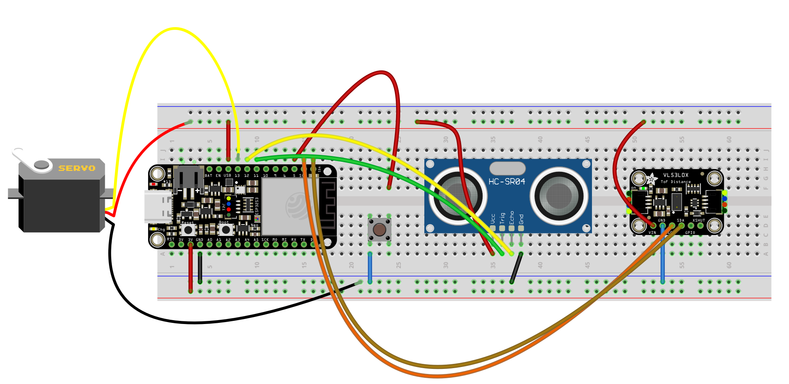
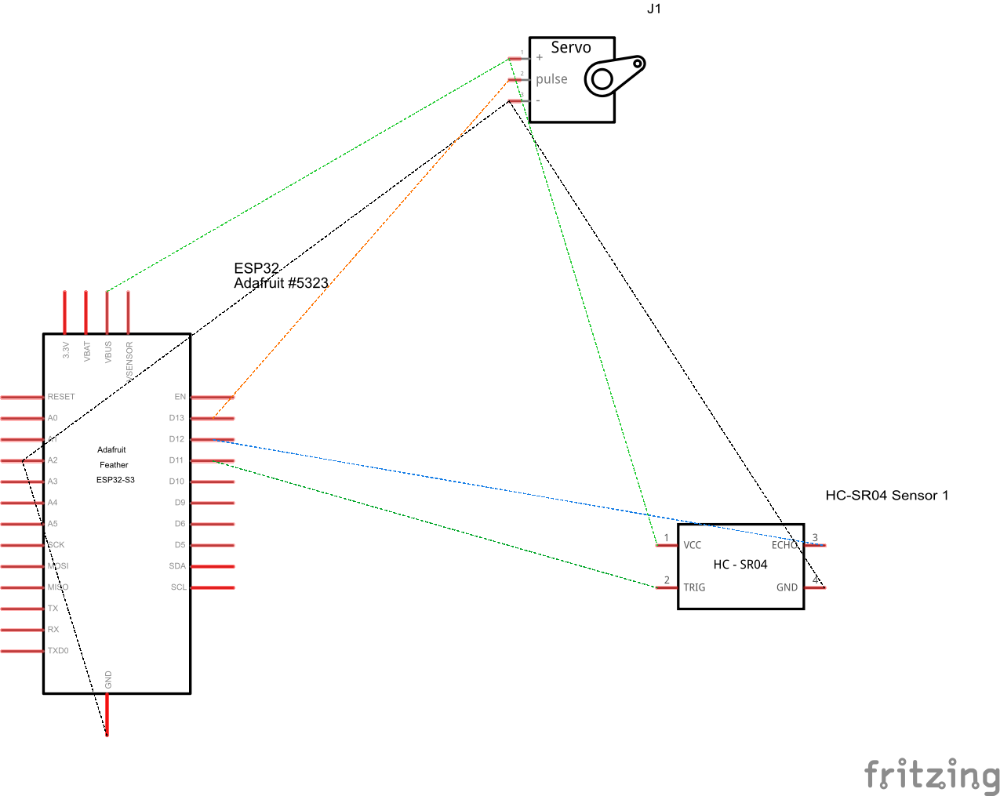
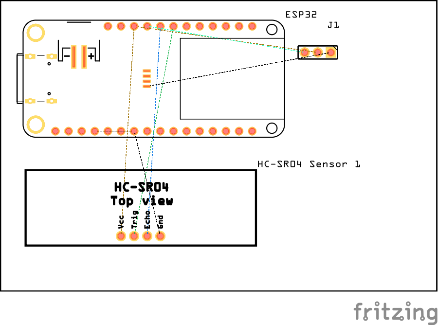

# ProtoFab-SmartBin

The **SmartBin** project is a platform with a trash bin that moves around the room when called by the user via an application, 
so that the user does not have to get up to throw out the trash.

## Getting Started

Follow these steps to launch the project.

### Navigation Simulation

#### 1. Start the ROS Node

First, run the following command to initialize ROS:

```bash
roscore
```

#### 2. connect ROS to Node-RED

Start ROS bridge to enable the connection between Node-RED and ROS

```bash
roslaunch rosbridge_server rosbridge_websocket.launch
```

#### 3. Launch the Simulation in Gazebo

This command will launch a simulation where the environment map is already scanned, 
allowing the robot to know its location within the space. 
The robot can navigate autonomously within the mapped environment.

```bash
roslaunch pmb2_2dnav_gazebo pmb2_navigation.launch public_sim:=true
```

#### 4. Open the Node-RED Dashboard

Copy smartbin.json to the desired node-red directory in advance. By defualt it is 
should be created in the directory: `~/.node-red/projects/<project-name>` 
After launching ROS, open the Node-RED, deploy the project and open Dashboard at the following link:

```bash
http://127.0.0.1:1880/dashboard/
```

This dashboard provides an interface to interact with the SmartBin system and view real-time data.


### Arduino

#### BreadBoard



#### Schematic



#### PCB



#### 1. Open Arduino IDE

#### 2. Download libraries

- esp32 (for ESP32)
- HC-SR04 by dirk (for ultrasonic sensor)
- ESP32Servo (for servo motor)
- Adafruit_VL53L0X by Adafruit

#### 3. Change the configuration and Upload the code to ESP32

You may need to change WIFI credentials and IP address for ROS server

IMPORTANT: make sure to disable the firewall, otherwise it cannot connect to ROS server !!!

#### 4. Handle TCPconnections

 Start the node that will handle TCPconnections (with thedefault port [11411]). You can change the
 port, if necessary, but then also modify the port in the sketch:

```bash
rosrun rosserial_python serial_node.py tcp 11411
```

#### 5. Open the Node-RED Dashboard

Node-RED requirements:
- @flowfuse/node-red-dashboard
- node-red-contrib-ros
- @sumit_shinde_84/node-red-dashboard-2-ui-webcam
- node-red-contrib-image-tools
- node-red-contrib-viseo-qrcode
- node-red-contrib-remote

Copy smartbin.json to the desired node-red directory in advance. By defualt it is 
should be created in the directory: `~/.node-red/projects/<project-name>` 
After launching ROS, open the Node-RED, deploy the project and open Dashboard at the following link:

```bash
http://127.0.0.1:1880/dashboard/
```

This dashboard provides an interface to interact with the SmartBin system and view real-time data.

#### 6. Goal with QR CODE

You can set a goal for the robot using QR code.
The QR code can be created using the site https://qrcode.tec-it.com/en/Raw. The data must have the following structure

```json
{ "a":-3,"b":-0.6,"c":1,"d":0}
```

<b>HINT:</b>

Unfortunately it is not always possible for the camera to recognize the QR code. During tests, in order to eliminate image recognition errors, it is recommended to load the QR code directly. To do this, place your QR code in `home\<username>\Image\qr-code.png`. To trigger the QR code, click inject node `localImage`

#### 6. Node-RED remote

To use node red on your phone, download the `Remote-RED` app (available on android/Phone). In node red, open the node `remote access  -> config -> Connect Remote-RED app`


### QR code of HTTP request

Now, we can use phone to scan the QR code and control the robot easily by making GET request.

#### 1. encode request URL to QR code

you can get QR code by running `/node-red/qrcode_maker.py`. Also, you can modify the encoded data. Here is an example.

```python
# Data to be encoded
data = 'http://192.168.178.31:1880/setPosition?x=-3&y=-0.63&z=-0.1&w=0.89'
```

#### 2. use your phone to scan the QR code

you can use google len or other scanner to scan it. After that, there will be outputs in node-red.