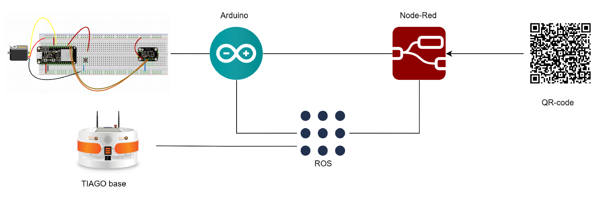
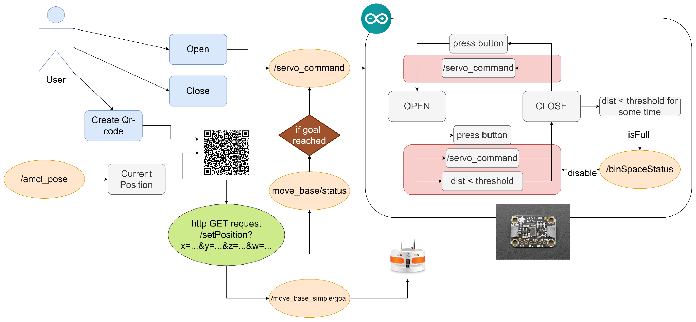
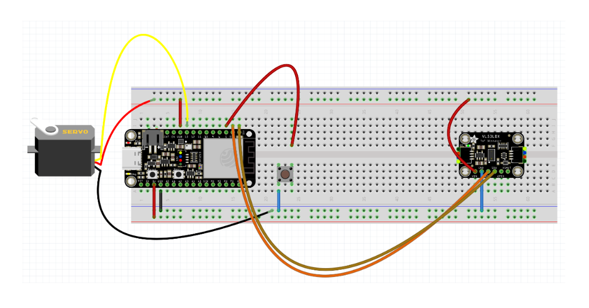
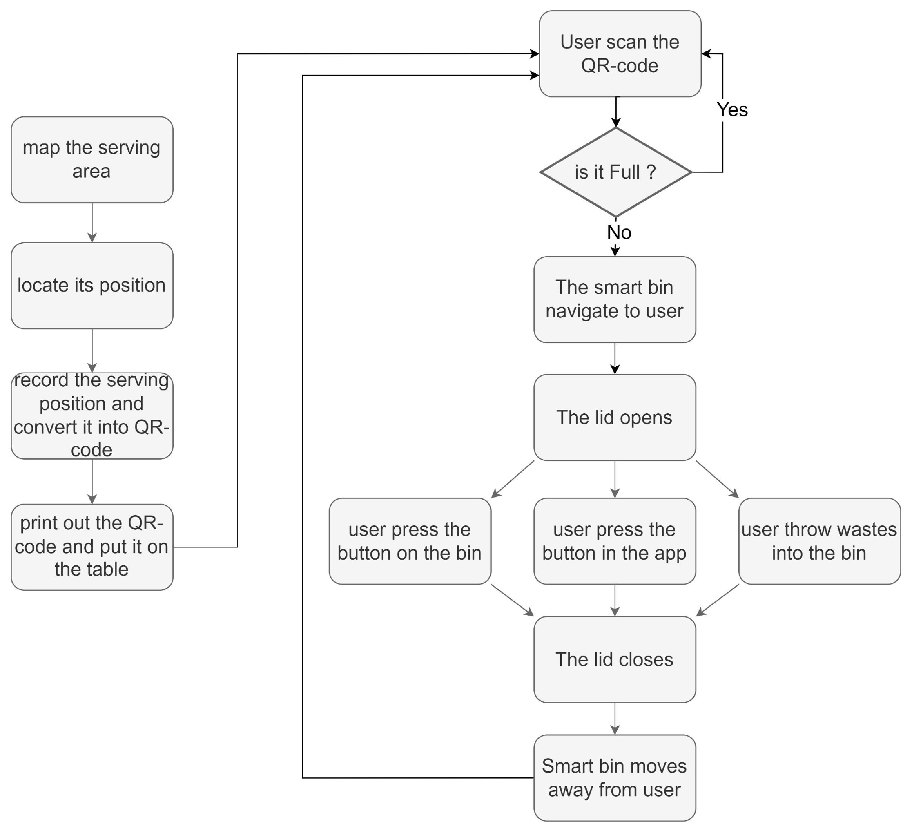

# Smart Bin

**Authors: Volodymyr & William**

## Table of Contents

- [Smart Bin](#smart-bin)
  - [Table of Contents](#table-of-contents)

  - [Introduction](#1-introduction)
    - [Background and Motivation](#background-and-motivation)
    - [The Idea](#the-idea)
    - [Video](#video)

  - [Implementation](#2-implementation)
    - [Hardware Components](#hardware-components)
    - [Software Architecture](#software-architecture)
    - [System Logic](#system-logic)

  - [Installation](#3-installation)
    - [Hardware Setup](#hardware-setup)
    - [Software Setup](#software-setup)

  - [Instructions](#4-instructions)

  - [Limitations and Challenges](#5-limitations-and-challenges)
    - [Current Limitations](#current-limitations)
    - [Remaining Challenges](#remaining-challenges)

  - [Conclusion](#6-conclusion)
    - [Project Value](#project-value)
    - [Future Potential](#future-potential)

------

## 1. Introduction

### Background and Motivation

Efficient and hygienic waste disposal remains a pressing challenge in various public and private environments, such as hospitals, offices, and public spaces. Traditional bins often require physical interaction, raising hygiene concerns, especially in sensitive areas like healthcare facilities. Additionally, individuals with limited mobility face accessibility challenges.

The **Smart Bin** project addresses these issues by introducing a contactless, autonomous waste management solution that combines modern robotics and IoT technologies.

### The Idea

The Smart Bin offers a seamless, user-friendly experience by integrating mobility, automation, and sensor-driven interactions. Its design prioritizes hygiene, accessibility, and efficiency, making it suitable for diverse environments.

Key features include:

1. **Autonomous Navigation** – The Smart Bin can move to the user's location upon request.
2. **Motorized Lid Operation** – Automatically opens and closes based on sensor feedback.
3. **Contactless Interaction** – Enables users to dispose of waste without touching the bin.
4. **Real-Time Detection** – Distance sensors ensure accurate detection of waste.

### Video

#### Demo

https://github.com/user-attachments/assets/1ff15f5a-f7bf-499a-9d03-b49b8dc612f5

#### Smart bin full detection

https://github.com/user-attachments/assets/6d957d79-a874-45cf-82a6-070bd5881719

#### Smart bin create QR-code

https://github.com/user-attachments/assets/39eb4b04-b9d5-4a7c-a44c-cd528d433314

------

## 2. Implementation

### Hardware Components

1. Motorized Lid

   - Servo motor for precise lid operation.
  <div style="text-align:center">
    
  </div>
   
2. Distance Sensor

   - Used to detect user interactions and confirm the presence of waste inside the bin.
  <div style="text-align:center">
    
  </div>

3. Microcontroller

   - **ESP32**: Controls motor operations and handles ROS communication.
  <div style="text-align:center">
    
  </div>

3. Power System

   - Rechargeable batteries to power the microcontroller and motors.
  <div style="text-align:center">
    
  </div>

4. Servo Arm (3D Model)

   - A 3D-printed servo arm designed to securely operate the lid mechanism.
  <div style="text-align:center">
    
  </div>

When it all comes together, it appears like this:

  <div style="text-align:center">
    
  </div>

### Software Architecture

The Smart Bin software is divided into the following modules:

- **Arduino:** Programs the ESP32 with the control logic.
- **Node-RED:** Manages communication between ESP32, ROS, and external systems.
- **ROS:** Handles navigation and system integration with robotic platforms like the TIAGO base.
- **QR Code:** Users scan the code to summon the bin or issue commands.



### System Logic

**User Interaction**:

- The user creates a QR code that specifies their location. This location is derived from the `/amcl_pose` topic, which represents the robot’s current estimated position.

**Navigation to User**:

- The QR code data is used to send an HTTP GET request (`/setPosition`) with position parameters (`x`, `y`, `z`, and `w`) to set the navigation goal.
- ROS handles navigation:
  - The position goal is sent to `/move_base_simple/goal`.
  - Navigation status is monitored via `/move_base/status`.
  - The bin moves to the target location using the **TIAGO Base**.

**Lid Control**:

- When the bin reaches the target:
  - A **servo command** (`/servo_command`) is triggered to **open** the bin lid.
  - The servo motor executes the "OPEN" action.

**Waste Detection**:

- A VL53L0X distance sensor continuously monitors the bin contents:
  - If the detected distance is below a threshold for some time, the bin determines it is **full** (`isFull`).
  - If the bin is full, it disables the **binSpaceStatus** topic to indicate no space for further waste.

**Lid Closure**:

- After waste is detected or a timeout occurs, another **servo command** (`/servo_command`) is triggered to **close** the lid.

**Manual Override**:

- A physical button is available for manual operation:
  - Pressing the button sends a **servo command** to toggle the lid (open or close).
  - Distance checking still ensures proper operation and waste detection.

**Status Updates**:

- The system publishes the bin’s status on the `/binSpaceStatus` topic to inform about its availability (e.g., full or not).



------

## 3. Installation

### Hardware Setup



### Software Setup

1. Clone the repository:

   ```bash
   git clone https://github.com/your-repo/smart-bin.git
   ```

2. Navigate to the project directory:

   ```bash
   cd smart-bin
   ```

3. [install ESP32 board in Arduino](https://docs.espressif.com/projects/arduino-esp32/en/latest/index.html)

4. Install the required Arduino libraries:

   - [**ESP32Servo**](https://docs.arduino.cc/libraries/esp32servo/): Servo motor control.
   - [**TimerEvent**](https://docs.arduino.cc/libraries/timerevent/): full detection every certain time period.
   - [**Adafruit VL53L0X**](https://docs.arduino.cc/libraries/adafruit_vl53l0x/): Distance sensor integration.
   - **WiFi**: Network communication.
   - [**ROSSerial**](https://docs.arduino.cc/libraries/rosserial-arduino-library/): ROS communication.

5. Add your own WIFI credential and IP address, then flash the ESP32 with the provided Arduino code

6. Run the script:

   ```bash
   sh run_simulation.sh
   ```

   or:

   ```bash
   sh run_tiago.sh # don't forget to add your uri and ip of ros server
   ```

   if you want to test on the real TIAGO-base robot. Also, check the `contribution.md` if you want to know more details.


------

## 4. Instructions

The Smart Bin system operates in the following steps:

1. **Preparation (Mapping and QR Code Creation):**
   - The **serving area** is mapped, and the positions of key locations (e.g., tables or user spots) are identified.
   - Each serving position is recorded and converted into a **QR code** that encodes its location.
   - The QR code is printed and placed on tables or serving spots for user access.
2. **User Interaction:**
   - The **user scans the QR code** at their location using a mobile device.
   - The system checks the bin's status to determine if it is full:
     - If the bin is full, it will not navigate to the user, and an alert may be issued.
     - If the bin is **not full**, it proceeds to the next step.
3. **Navigation to the User:**
   - The Smart Bin uses the scanned QR code to navigate to the user's location autonomously.
4. **Lid Operation:**
   - Upon arrival, the **lid opens automatically** to allow waste disposal.
   - Users can interact with the Smart Bin in three ways:
     - **Press the physical button on the bin** to operate the lid.
     - **Press a button in the app** to control the lid.
     - **Directly throw waste into the open bin** without further interaction.
5. **Post-Disposal:**
   - After waste is disposed of, the **lid closes automatically**.
6. **Departure:**
   - The Smart Bin moves away from the user to its next task or standby location, ready for further use.



------

## 5. Limitations and Challenges

### Current Limitations

1. The Smart Bin requires a flat surface for mobility.
2. Dynamic environments (e.g., crowded spaces) may pose navigation challenges.
3. Periodic charging is necessary, which may hinder large-scale deployment.
4. Simultaneous user requests can cause congestion and delays.

### Remaining Challenges

1. Blind Spots
   - The distance sensor has limited coverage, leaving undetectable areas.
2. Lid Mechanism
   - The current design is prone to instability under heavy use.
3. Structural Durability
   - The 3D-printed model is susceptible to damage and requires reinforcement.

------

## 6. Conclusion

### Project Value

The Smart Bin provides a hands-free, hygienic waste disposal solution, enhancing accessibility and efficiency in public and private spaces. It combines automation, robotics, and IoT technologies to create a user-friendly and innovative system.

### Future Potential

1. Enhanced Sensor Coverage
   - Incorporating additional sensors to eliminate blind spots.
2. Durable Materials
   - Upgrading the chassis with stronger materials to improve longevity.
3. Advanced Navigation
   - Using advanced algorithms for better mobility in dynamic environments.
4. Energy Optimization
   - Implementing solar-powered charging to reduce reliance on manual charging.
5. Scalability
   - Expanding the system for large-scale deployment in hospitals, airports, and shopping malls.

The Smart Bin project demonstrates how robotics and IoT can redefine waste management, paving the way for smarter and cleaner environments.

------

This document serves as a comprehensive guide to understanding, implementing, and improving the Smart Bin system. Contributions and feedback are welcome to further refine this innovative project.
