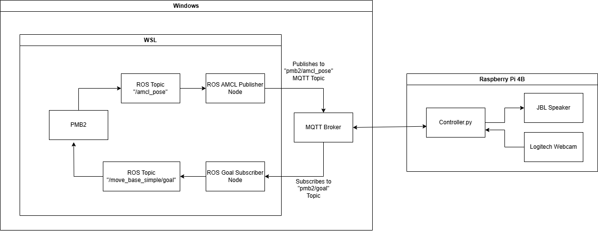

# Surveillance Robot​
## 1. Introduction
There are several situations where a humans may not enter the zone which needs observance. The reasons can vary from severe weather conditions (-20C) to disaster stroked areas(Fire accident) to covert operations and so on...​

Therefore, we shall create a prototype of a robot which shall do the automated surveillance in a designated area. During the surveillance, when it recognises an unauthorised person in the area, it shall follow the person and alert him/her about the trespassing.

**Advantages**
- Less operating cost.​

- Adaptable to extreme whether conditions.​

- Extendable to large areas.​

- Takes less time even there are several people to scan through..​

- Can store data regarding large number of people.​

**Disadvantages**
- Might be less reliable when compared to humans.​

- Huge setup costs and training costs.​

- Unpredictability in occurrence of untrained scenarios.​

## 2. Demo
https://github.com/user-attachments/assets/6325fd05-e518-46d2-be59-20b5ee9da56d


## 3. Setup
### 3.1. Components
1. Raspberry pi
2. Webcam
3. Coral Accelerator
4. Speaker
5. Laptop


### 3.2. Connection

Connect the components as shown in the diagram.

### 3.3. WSL2 & Ubuntu Installation
Install WSL2 & Ubuntu 24.04 LTS using the instructions in the following link: https://documentation.ubuntu.com/wsl/en/latest/howto/install-ubuntu-wsl2/

### 3.4. Install Mosquitto Broker in the Windows
- Install Mosquitto Broker in the windows using the following link:
https://mosquitto.org/download/

- Verify the installation
    > mosquitto -h

- After installation, open the configuration file
    > notepad "C:\Program Files\mosquitto\mosquitto.conf"

- Configure it as follows:
    ```
    listener 1883 0.0.0.0
    allow_anonymous true
    ```

- Start the mosquitto Broker:
Win+R -> type services.msc -> find mosquitto broker -> right click & start

- Verify if it is running:
    > netstat -an | findstr 1883

### 3.5. Configure Windows firewall
- Open Windows Defender Firewall:
Win+R -> type firewall.cpl

- Allow port 1883

- Create new inbound rule and save it:  
    Rule Type: Port  
    Protocol: TCP
    Specific local ports: 1883  
    Action: Allow the connection  
    Profile: Choose as needed (Domain, Private, Public)  
    Name: Mosquitto MQTT Broker  

### 3.6. Connecting Raspberry Pi & Verifying
- Install Paho-MQTT in Raspberry Pi:
    > sudo apt update\
    > sudo apt install python3-pip\
    > pip3 install paho-mqtt

- Copy the `Controller.py` script to the Raspberry Pi.

- Get the windows machine host ip:
    > ipconfig

- Update the Controller.py script:
    ```
    broker_address = "WINDOWS_IP_ADDRESS"
    ```

- Test the connectivity from raspberry pi
    > ping WINDOWS_IP_ADDRESS

- Install MQTT client on Raspberry Pi:
    > sudo apt-get install mosquitto-clients

- Try subscribing to a test topic:
    > mosquitto_sub -h WINDOWS_IP_ADDRESS -t "test/topic"

- Try publishing a message to the test topic:
    > mosquitto_pub -h WINDOWS_IP_ADDRESS -t "test/topic" -m "Hello from Raspberry Pi"

- Verify that the message is received.

### 3.7. Connecting WSL2 & Verifying
- Install Paho-MQTT in WSL2:
    > pip3 install paho-mqtt

- Test the connectivity from WSL2
    > ping WINDOWS_IP_ADDRESS

- Install MQTT client on WSL2:
    > sudo apt-get install mosquitto-clients

- Try subscribing to a test topic:
    > mosquitto_sub -h WINDOWS_IP_ADDRESS -t "test/topic"

- Try publishing a message to the test topic:
    > mosquitto_pub -h WINDOWS_IP_ADDRESS -t "test/topic" -m "Hello from WSL2"

- Verify that the message is received.

- Create a catkin workspace:
    > source /opt/ros/noetic/setup.bash \
    > mkdir-p ~/protofab_ws/src \
    > cd ~/protofab_ws/ \
    > catkin_make \
    > source devel/setup.bash 

- Create mqtt package:
    > cd ~/protofab_ws/src \
    > catkin_create_pkg mqtt std_msgs rospy \
    > cd ~/protofab_ws/ \
    > catkin_make

- Create the AMCL Publisher node, Goal Subscriber nodes and copy the contents of `MQTT_AMCL_Publisher.py`, `MQTT_Goal_Subscriber.py` scripts respectively:
    > cd ~/protofab_ws/src/mqtt \
    > mkdir scripts \
    > cd scripts \
    > touch MQTT_Goal_Subscriber.py \
    > touch MQTT_AMCL_Publisher.py \
    > chmod +x MQTT_Goal_Subscriber.py \
    > chmod +x MQTT_AMCL_Publisher.py \
    > code MQTT_Goal_Subscriber.py \
    > code MQTT_AMCL_Publisher.py 

- Add the following in `CMakeLists.txt` (~/proto
fab_ws/src/mqtt/)
    ```
    catkin_install_python(PROGRAMS scripts/MQTT_AMCL_Publisher.py DESTINATION ${CATKIN_PACKAGE_BIN_DESTINATION})
    catkin_install_python(PROGRAMS scripts/MQTT_Goal_Subscriber.py DESTINATION ${CATKIN_PACKAGE_BIN_DESTINATION})
    ```

- Build the packages and source the workspace:
    > cd ~/protofab_ws/ \
    > catkin_make \
    > source devel/setup.bash 

## 4. Running the prototype

- Enable ROS mapping
    > roslaunch pmb2_2dnav_gazebo pmb2_mapping.launch public_sim:=true

- Enable ROS localisation
    > roslaunch pmb2_2dnav_gazebo pmb2_navigation.launch public_sim:=true lost:=true

- Clear ROS localisation
    > rosservice call /global_localization "{}"

- Clear ROS cost maps
    > rosservice call /move_base/clear_costmaps "{}"

- Source the workspace
    > source /home/gunakarchalla/protofab_ws/devel/setup.bash

- Running the ROS Master 
    > roscore

- Running subscriber node 
To subscribe to MQTT topic and receive the 2D nav goals
    > rosrun mqtt MQTT_Goal_Subscriber.py

- Running the Controller in Raspberry Pi
    > python3 Controller.py

- Running publisher node
To publish the current position of robot to MQTT topic
    > rosrun mqtt MQTT_AMCL_Publisher.py
