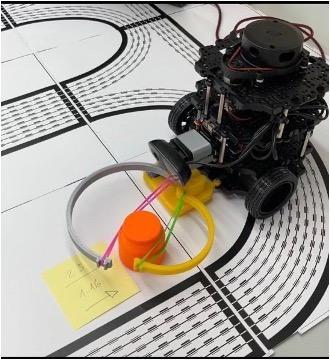
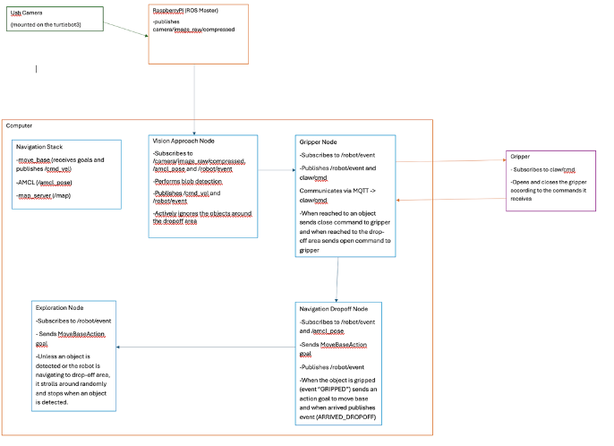
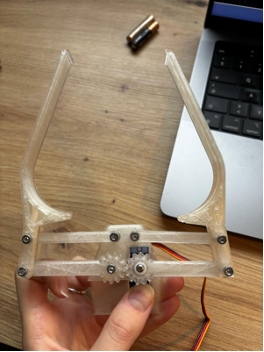
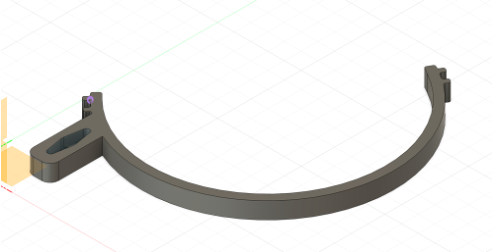
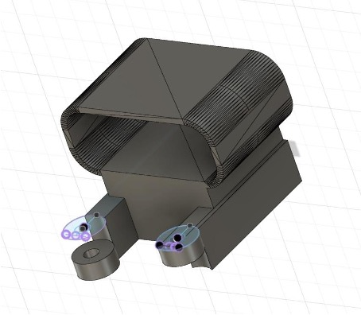
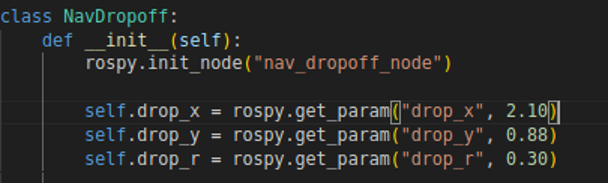
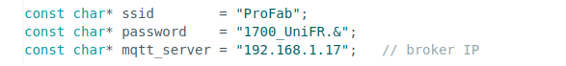
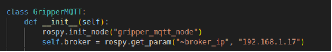
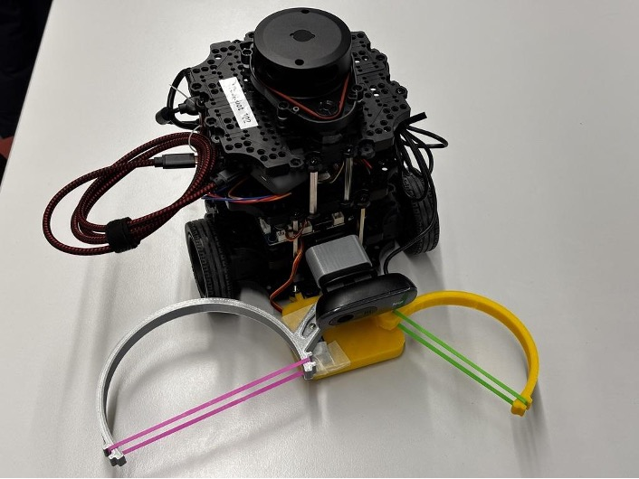

This project aims to create a fully autonomous robot that can search
for, pick up, and deliver medicine bottles. It is a helper robot that
tries to help someone by bringing them random objects. (Similar to your
cat bringing you a dead rat thinking it would make you happy) The name
comes from the dramaturgical effect we aimed to have. The random objects
are not helpful to pick up for the person in that exact scenario.

1.1 Our Concept
---------------

The robot notices the actress who is stuck in a place and tries to help
(symbolically) by bringing random objects to help the actress help
herself. The aim was to produce an autonomous robot with a robotic arm
with at least 2 DoF (Degrees of Freedom) that can search for, pick up,
and deliver random objects such as scissors, screwdriver etc. to help
the actress get rid of the chains that are pinning her to the ground.
However no matter what it brings, the actress still cannot be freed,
signifying no matter how much it tries, it cannot truly "free" or "help"
the person. The robot is a metaphor to symbolize that the only person
who can help someone is themselves.

1.2 Our Prototype
-----------------

As a prototype we have tried to produce a simple 1 DoF arm (gripper)
that can only grab and drop orange colored medicine bottles. And rather
than picking up the object like a normal robotic arm would do, it drags
the object to the dropoff area. Then goes around searching for other
bottles around the mapped area.

### 1.2.1 Hardware Requirements

-   TurtleBot3 Burger

-   USB Webcam

-   Arduino ESP32S Feather Board 

-   Servo motor

-   A powerbank

-   3D Printed parts (gripper, camera attachment and bright orange medicine bottles)

### 1.2.2 Software Requirements

-   Ubuntu 20.04

-   ROS Noetic

-   TurtleBot3 ROS packages

-   OpenCV (Python)

-   paho-mqtt (Python library)

-   MQTT broker (Mosquitto)

-   Arduino IDE

-   Slicer 3D

### 1.2.3 System Architecture

#### 1.2.3.1 Vision Approach Node

Using blob detection with HSV mask as the color of the bottle was very
bright, along with morphology methods from OpenCV to make the detection
very accurate and cancel out unnecessary noise, so it can easily be
detected. As the robot sees the object it waits for 5 seconds to confirm
the object and then proceeds further.

After the detection, we used Gradual speed reduction to move towards the
object instead at constant speed which will make it difficult to dock
the object in between the gripper. Using very low Angular velocity for
turning to make it easier to look for the object. For the image topic,
sending compressed image topics instead of normal ones which makes the
frame rate smoother and improves the quality for better detection.  This
approach allows for better alignment and more stable detection. A
predefined proximity threshold parameter is used rather than an explicit
physical distance measurement to make it stop very close to the object.
As the robot approaches the object, its apparent size in the visual
input increases, once this size exceeds the specified threshold, the
object is assumed to be within a reachable range.    

#### 1.2.3.2 Gripper Node

The gripper MQTT node sends open and close commands to the gripper based
on system events and reports the gripper state back to the system.

#### 1.2.3.3 Navigation Dropoff Node

The navigation drop-off node moves the robot to a fixed drop-off
location after the object has been grasped. Once a grasp confirmation
event is received, the node sends a navigation goal in the map frame and
reduces the planner's speed limits so the robot moves more slowly and
steadily while carrying the object. This helps prevent the object from
being dropped or getting tangled during transport.

Instead of waiting for exact goal completion, arrival is detected using
a proximity region around the drop-off point, which works more reliably
given localization noise. When the robot enters this region, navigation
is stopped, the speed limits are restored, and an event is published to
indicate that the object can be released.

#### 1.2.3.4 Patrol Search Node

The patrol search node is responsible for moving the robot around the
mapped area when no object interaction is active. It navigates the robot
through a predefined set of waypoints to observe the environment from
different viewpoints until a valid object is detected by the vision
approach node.

During development, we observed that allowing patrol to run while other
behaviors were active caused false detections and navigation conflicts.
To avoid this, the patrol node does not perform any perception on its
own and relies entirely on system events for control. Patrol is
immediately paused when events indicate that object detection, approach,
grasping, or drop-off is in progress. In these cases, all navigation
goals are canceled and the robot is actively stopped to prevent patrol
motion from interfering with object detection or approach behavior.

In addition, patrol remains inactive while the robot is near the
drop-off area, since this region is intentionally excluded from further
object search by the vision approach node. Patrol resumes only when the
object is released or explicitly lost, ensuring that search behavior is
enabled only when it is actually needed.

#### 1.2.3.5 State Machine (Communication Between the Nodes)

Instead of implementing a state machine node, the system follows the
current state, based on the /robot/event topic. As explained each node
implements a small part of the overall behavior and transitions are
triggered by the event messages.

  **Event Name**     **Published By**           **Triggered When**                                                         **Consumed By**                        **Effect / Purpose**
  ------------------ -------------------------- -------------------------------------------------------------------------- -------------------------------------- ---------------------------------------------------------------------
  OBJECT\_DETECTED   Vision--Approach Node      Target blob is detected and confirmation timer starts                      Patrol Search Node, Vision Node        Pauses patrol; keeps robot stationary during detection confirmation
  LOST OBJECT        Vision--Approach Node      Object disappears before confirmation or is lost during approach timeout   Patrol Search Node                     Resumes patrol search behavior
  REACHED\_OBJECT    Vision--Approach Node      Apparent object size exceeds proximity threshold (within grasping range)   Gripper MQTT Node                      Triggers gripper close command
  GRIPPED            Gripper MQTT Node          MQTT feedback indicates gripper has fully closed                           Navigation Drop-off Node, Vision       Starts drop-off navigation; blocks vision-based driving
  ARRIVED\_DROPOFF   Navigation Drop-off Node   Robot enters drop-off proximity zone (AMCL-based)                          Gripper MQTT Node, Vision, Patrol      Triggers gripper open; blocks vision and patrol during release
  RELEASED           Gripper MQTT Node          MQTT feedback indicates gripper has fully opened                           Vision--Approach Node, Patrol Search   Enables cooldown, then resumes search and patrol

Gripper actuation is handled with communication through MQTT, separate
from the /robot/event topic. Task events (REACHED\_OBJECT,
ARRIVED\_DROPOFF) are translated into gripper (arduino) commands (CLOSE,
OPEN) in the gripper MQTT node. Feedback from the arduino (CLOSED,
OPENED) is then translated back into task events (GRIPPED, RELEASED) and
published on the /robot/event topic.

  **MQTT Topic**   **Direction**   **Message Payload**   **Sent By**         **Received By**     **Purpose**
  ---------------- --------------- --------------------- ------------------- ------------------- --------------------------------------------
  claw/cmd         ROS → Gripper   OPEN                  Gripper MQTT Node   ESP32 Gripper       Commands the gripper servo to open
  claw/cmd         ROS → Gripper   CLOSE                 Gripper MQTT Node   ESP32 Gripper       Commands the gripper servo to close
  claw/state       Gripper → ROS   OPENED                ESP32 Gripper       Gripper MQTT Node   Confirms that the gripper has fully opened
  claw/state       Gripper → ROS   CLOSED                ESP32 Gripper       Gripper MQTT Node   Confirms that the gripper has fully closed

### 1.2.4 Gripper and Design

The gripper design process went through several iterations. We initially
started with an existing open-source gripper design to understand basic
dimensions and principles, and then modified it to fit the exact
geometry of our target object. However, during testing these many
different iterations, this adapted design turned out to be too
restrictive and highly sensitive to alignment.

Due to the limitations, we have decided to discard the initial design
then create a new gripper from the start. The final version had
additional elastic bands which is helpful for the gripper adapting
passively to the object instead of relying on the exact measurements.
This made the grasp more tolerative for small positioning errors, also
meaning an improvement on the overall reliability.

!(media/image3.png)

The servo motor, which is attached to the base of the gripper, controls
only one arm. The control logic is applied using an Arduino sketch that
is uploaded to the Featherboard, which is then externally powered with a
powerbank.

#### 1.2.4.1 Other Designs

The medicine bottle model was obtained from an external source and it is
implemented in the system as the target object. In addition, a camera
attachment design created by a classmate was used as a starting point
and then modified to fit the mounting constraints of our robot base.
These reference designs helped speed up development while still allowing
us to adapt them to the specific requirements of our
setup.

2. System Installation and Setup
--------------------------------

1.  Print all necessary 3d components. (Important: Medicine bottle
    > should be printed using a bright orange filament as the blob
    > detection relies on orange color based detection)

2.  Upload the arduino sketch to a featherboard and assemble the gripper
    > mechanism. Then mount the gripper to the TurtleBot3 base.

3.  Connect and mount the USB camera to the robot and verify that the
    > camera is publishing /usb\_cam/image\_raw/compressed

4.  Install all necessary libraries and packages required to run the
    > system

> *\`\`\`*
>
> *pip3 install pahomqtt opencv-python numpy*
>
> *\`\`\`*
>
> *\`\`\`*
>
> *sudo apt install ros-noetic-image-transport
> ros-noetic-compressed-image-transport*
>
> *\`\`\`*

5.  Map the operating area using the TurtleBot3 navigation stack and determine a suitable drop-off location. Update the dropoff area locations in the nav\_dropoff\_node.py file accordingly.

> 

6.  Install an MQTT broker and start the broker and ensure that the server address is correctly set both in the arduino code and the gripper\_mqtt\_node.py file.

> 

7.  a.  **Terminal 1:** Start rosmaster

    b.  **Terminal 2:** SSH into the robot and start TurtleBot bringup

    c.  **Terminal 3:** SSH into the robot and start the USB camera

    d.  **Terminal 4:** Start navigation using the saved map

    e.  **Next Terminals:** Launch the nodes in the following order
        (patrol\_search\_node, vision\_approach\_node, gripper\_mqtt\_node, nav\_dropoff\_node)

8.  It should be working as intended.

3. Demo Video
-------------

[**[https://youtu.be/nSntjbdOWOk]{.underline}**](https://youtu.be/nSntjbdOWOk)

4. Limitations and Future Work
------------------------------

Object detection was a big challenge because it needed a lot of tuning ,
trial and error because we had to first detect the object perfectly as
it was not happening with Yolo versions as they are mostly used for
common objects which was not the case for us. Using Blob detection with
HSV colour mask took a lot of time to get the precise value of the
object for that we took some pictures of the object from the USB camera
attached on robot and using GIMP 3 photo editor and some help from LLM
models we manage to get the exact values but then the problem was the
noise around the bottle which we removed using Morpholy methods from
OpenCV library. 

Driving towards the object was a problem at first because we had very
low camera fps because we were sending raw images where the robot was
arriving very quickly but due to bad camera fps it was losing the object
and had a lot of jerky motion, overshooting and robot drifting left and
right. Using compressed image topics instantly solved this problem. We
were also using constant linear and angular velocity which made it very
difficult to stop as it would just hit the object, but later we managed
to fix this problem with Gradual speed reduction and very slow Angular
Velocity.

The robot's position estimation had inaccuracies that increased over
time. We have reset the mapping to resolve this problem. But this build
up affected the navigation accuracy repeatedly, specifically near the
drop-off area.

The blob detection module is sensitive to lighting conditions since it
relies on color-based detection. Changes in illumination directly affect
the accuracy of the detection.

Finally, the single degree-of-freedom gripper is only capable of
grasping objects with compatible geometry. This restricts the range of
objects that can be handled by the gripper.

Future work will focus on improving object detection under different
lighting conditions, improving the robot's position estimation, and
refining the overall system to create a smoother workflow.
