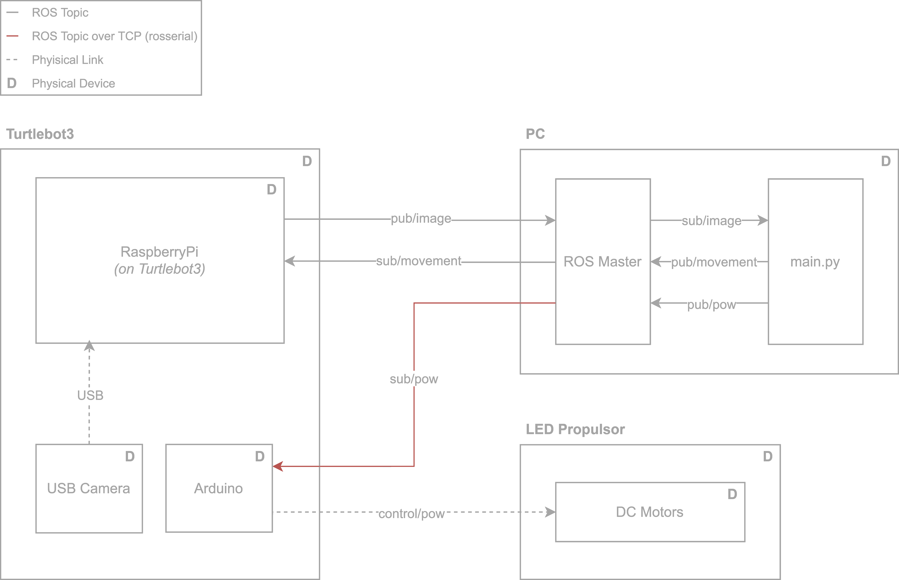
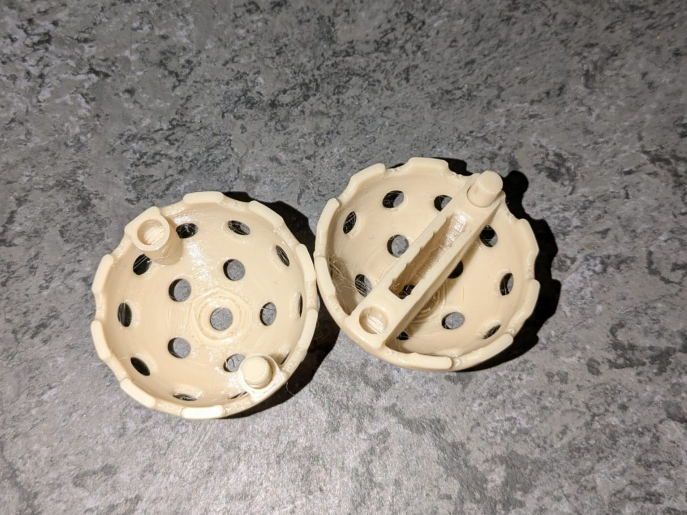
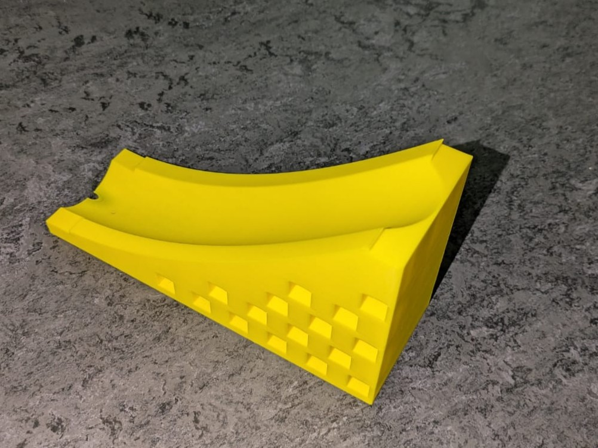
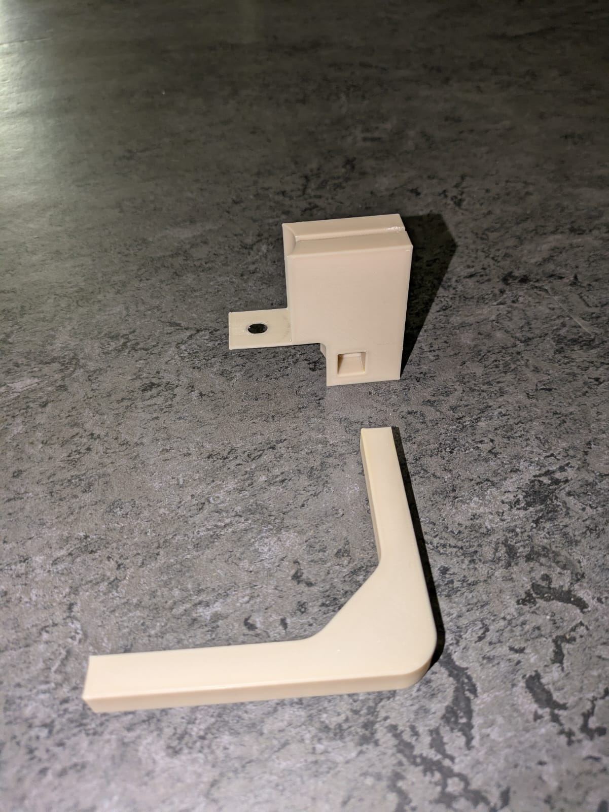
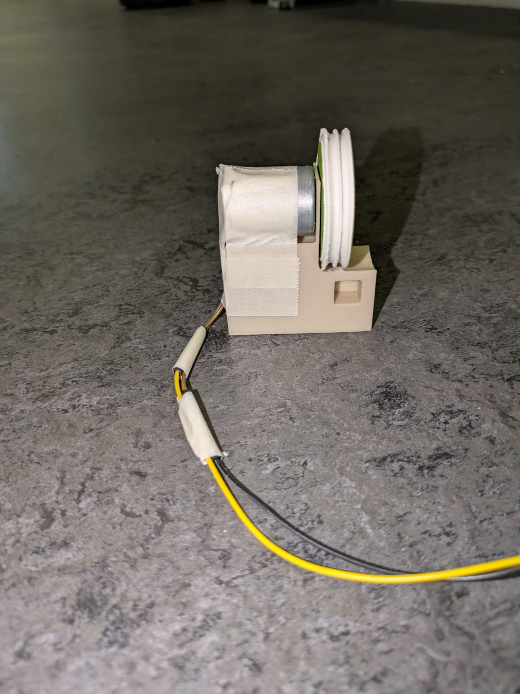
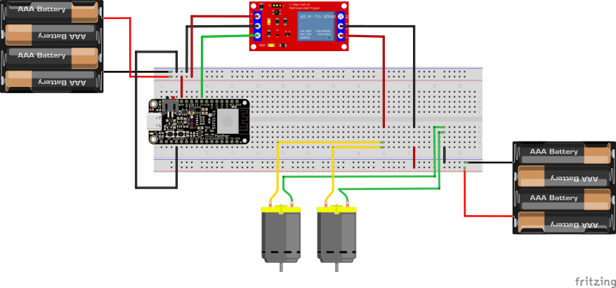
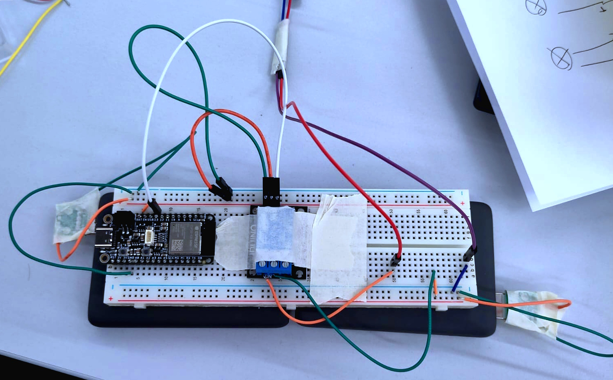
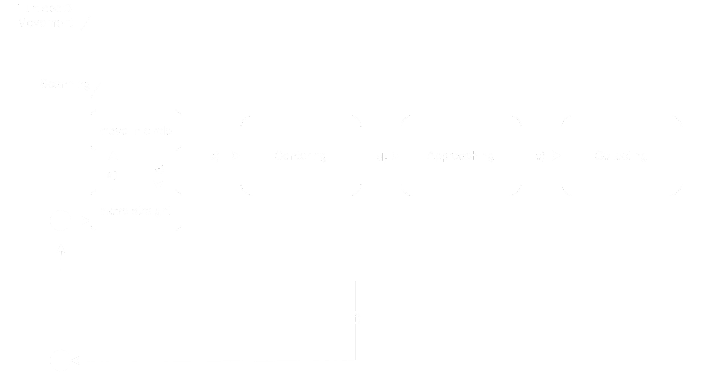

# Ball-E

## Abstract

In the theatre piece *Le Train*, a scene creates the opportunity for a robot to become part of the performance. We introduce **Ball-E**, a compact robot that uses a USB camera to detect a glimmering ball of light. It autonomously navigates toward the ball and, through a custom 3D-printed mechanism, guides it through a funnel into spinning DC motors that launch it up a ramp. The result is a striking visual effect, scattering sparks of light that bring moments of hope into the darkness of the scene.

## Table of Contents

- [Abstract](#abstract)
- [Introduction](#introduction)
- [System Overview](#system-overview)
  - [System Architecture](#system-architecture)
  - [Hardware Components](#hardware-components)
- [Mechanical Design](#mechanical-design)
  - [Propulsion mechanism](#propulsion-mechanism)
    - [LED-Ball](#led-ball)
    - [Ramp](#ramp)
    - [DC-Holders](#dc-holders)
    - [Small Gear](#small-gear)
    - [Funnel](#funnel)
    - [Ramp Extension](#ramp-extension)
    - [Turtlebot mounts](#turtlebot-mounts)
  - [Preliminary Tests](#preliminary-tests)
    - [Controlling the DC-Motors](#controlling-the-dc-motors)
  - [Autonomous Movement to LED-Ball](#autonomous-movement-to-led-ball)
    - [Detecting the LED-Balls](#detecting-the-led-balls)
      - [Set up camera](#set-up-camera)
      - [Blob Detection](#blob-detection)
- [Results](#results)
- [Discussion](#discussion)
- [Conclusion](#conclusion)
- [Outlook](#outlook-the-perfect-implementation)

## Introduction

In [Le Train](https://www.opus89-collectif.com/en-creation.html) by Joséphine de Weck, hope appears only briefly; fragile, fleeting, and easily lost. Ball-E was created as a robotic stage companion that supports this atmosphere through light and repetition rather than narration or action. Positioned in the background, the robot continuously collects and launches illuminated balls, releasing spectacle of short arcs of light that recall fireflies or shooting stars: momentary glimmers of hope in an otherwise dark space.

At the same time, the endless cycle of collecting and throwing evokes the myth of Sisyphus and show parallels to the tirelessly working robot WALL-E, although Ball-E gathers sparkly light balls and not cubes of trash. The robot's task never resolves; meaning emerges through repetition and persistence rather than progress. Imperfect motion, visible effort, and mechanical delay are not errors but expressive qualities that align the system with the emotional undercurrent of the play.

Technically, Ball-E combines mechanical design, embedded electronics, and computer vision to autonomously detect illuminated objects, move toward them, and launch them back into the environment.

To this project we contributed:

- 3D modeling in Fusion 360 for custom hardware components including the LED ball, ramp system, and motor mounts
- Designing and implementing blob detection and autonomous navigation algorithms
- Circuit design and Arduino integration for DC motor control via ROS
- Combining mechanical, electronic, and software subsystems into a working autonomous prototype

This repository documents the design and development of the prototype, exploring how simple autonomous systems can contribute to mood, symbolism, and dramaturgy in theatrical contexts.

We begin with a [System Overview](#system-overview) of the architecture and hardware components. The [Mechanical Design](#mechanical-design) section details the iterative development of the propulsion mechanism and 3D-printed parts. [Autonomous Movement to LED-Ball](#autonomous-movement-to-led-ball) describes the perception and navigation algorithms. We then evaluate the prototype's performance in [Results](#results) and [Discussion](#discussion), followed by the [Conclusion](#conclusion) and an [Outlook](#outlook-the-perfect-implementation) on how a expert-level implementation could look.

## System Overview

Ball-E is an autonomous robotic sytem designed to repeatedly collect and shoot illumintaed balls in a theatrical dark environment. The system integrates mechanical, electronic and software components to create a continuous loop of perception, movement, and collection and propulsion.

Conceptually, the robot performs two core actions:

- Detect and move to illuminated LED-balls
- Collect and launch the LED-balls

### System Architecture

This leads us to the following system architecture, composed of three tightly coupled subsytems:

1. **Perception**: Lead by..
   - A full-HD USB camera mounted on the robot used for "seeing" the balls, sending its image to the maincomputing station
   - A script for executing real-time blob detection for lights executed on the maincomputing station
2. **Movement and Control**: Making use of..
   - Prebuild [Turtlebot](./Media/Images/turtle_bot_sideview.jpeg) with LIDAR for object detection and navigating the landscape
   - Raspberry Pi 4 for communicating with the maincomputing station by means of publishing and subscribing to ROS topics
3. **Collection and Launch Mechanism**: With making use of or printing..
   - A Breadboard connecting 2x 2.5-6V DC-motors for the propulsion, connected to
   - A [ramp](./Media/Images/base_ramp_2.jpeg) which is connected to the robot and
   - An extension of the ramp which gives the optimal angle for the propulsion in regards to the chosen motors
   - A [funnel](./Media/Images/funnel_2.jpeg) guiding the balls to the DC-motors
4. **Connecting everything**: By a Python  script which automates
   - the movement,
   - the detection,
   - and activating the propulsion motors to collect and launch the LED-Ball



### Hardware Components

| Amount      | Parts                                                              | Descriptions                                                                                                                                                                             |
|-------------|--------------------------------------------------------------------|------------------------------------------------------------------------------------------------------------------------------------------------------------------------------------------|
| 1x          | [TurtleBot preassembled](./Media/Images/turtle_bot_frontview.jpeg) | A preassembled turtlebot burger 3. Can move and be communicated over a network directly.                                                                                                 |
| 1x or more  | [3D-printend ball](#LED-Ball)                                      | Balls designed to contain cell batteries and LEDs                                                                                                                                        |
| 1x or more  | Coin batteries                                                     | For the LED balls                                                                                                                                                                        |
| 1x or more  | LED light                                                          | For the LED balls                                                                                                                                                                        |
| 1x          | [3D-printend base ramp](#ramp)                                     | A ramp with holes to be connected on                                                                                                                                                     |
| 1x          | [3D-printend ramp extension](#Ramp-Extension)                      | An extension for the ramp to adjust the propulsion angle                                                                                                                                 |
| 1x          | [3D-printend mounts / clamps](#Turtlebot-mounts)                   | Clamps for the ramp to be mounted on to the Turtlebot                                                                                                                                    |
| 2x          | [3D-printend motor holders](#DC-Holders)                           | Motor holders for the motors to be mounted on and attached to the ramp for the propulsion                                                                                                |
| 2x          | [3D-printend gears without teeth](#Small-gear)                     | Gears directly on the dc motors creating the propulsion effect                                                                                                                           |
| 2x          | Stripes of Foam for coating the gears                              | Stripes of foam making the gears less hard and more adaptable for incoming angles of the LED balls                                                                                       |
| 2x          | 5V DC-Motors                                                       | The spinning motors are the main mechanism for the propulsion                                                                                                                            |
| 1x          | [Motor Relay](./Media/Images/relay.jpeg)                           | The motor relay is needed for letting the motors be controlled externally                                                                                                                |
| 2x          | Powerbanks                                                         | 1x powerbank for powering the motor relay; 1x powerbank for powering the DC motors (can be adapted to one powerbank in case of a stronger battery than ours)                             |
| 2x          | Usb power connectors                                               | For connecting the powerbanks directly to the elctric wires                                                                                                                              |
| 1x          | Bread Board                                                        | The breadboard is used for connecting all the electrical components together, in our case the motors, the microcontroller, the relay and the powerbanks through the usb power connectors. |
| xx          | Some male-male and male-female electric wires                      | The electric wires are used for connecting the different parts on the breadboard to the external parts apart or on the breadboard                                                        |
| 1x          | [Microcontroller](./Media/Images/microcontroller.jpeg)             | The microcontroller is used to send signals from the main computing station to the motor relay to activate                                                                               |
| 1x          | [Funnel](#Funnel)                                                  | The funnel is used to spread the gathering radius for the robot when moving about                                                                                                       |
| xx          | Some cable ties                                                    | Cable ties are need for attaching the powerbanks with the breadboard onto the turtlebot or possibly other parts                                                                          |

## Mechanical Design

### Propulsion mechanism

Before designing our propulsion mechanism, we did some research like any responsible person would do: By watching YouTube videos. We found a clip where a propulsion device was created using two spinning DC-Motors, with wheels wrapped in rubber band attached, to shoot a Ping Pong ball.

We tried to recreate this contraption, cutting two circles, each with a hole in its center, into a piece of wood, using a Lasercutter. We attached the wooden circles to the DC-Motors and mounted the Motors onto another piece of wood, with one in between acting as a ramp. We powered the DC-Motors up by using a 4.5V battery pack for each with a button on a breadbord in between to control the power. As a ball, we used a scrambled up piece of paper, with some tape around to hold it together. Et voila, our first prototype was created and it worked:

[Watch the propulsion prototype video](./Media/Videos/propulsion_prototype_1.mp4)

<Video src="./Media/Videos/propulsion_prototype_1.mp4" controls style="max-height:600px; height:100%; width:auto;"></video>

However, we noted that, although on video the paper ball seems to fly quite a bit, in reality it was rather underwhelming. This could become a critical point of our project. The ball must fly high enough to create a good effect. And to add to that, our actual LED-ball is going to be heavier. Nevertheless, we decided to stick with this idea and hoped that through more precise work, we could still build this propulsion mechanism effective enough.

Anyhow, our first prototype showed promise and we started with designing and testing key components. After some discussion with our professors, which gave their helpful tips and ideas in class and at the midterm presentation, we made up our mind on how we wanted to begin implementing a more robust prototype:

- Create a 3D-printed ball to hold the LED and coin battery which powers it.
- To reduce complexity, we decided to combine collection and propulsion into one. Thus, placing the spinning wheels close to the floor, to shoot the LED directly from there.
- Use a ramp to guide ball upwards and connect the DC-Motors to it.

And so we began, iterating through these three parts (LED-Ball, DC-Motor holder and wheels, Ramp) through making changes in the 3D-model to printing and adjusting through repeating this. We present the following main iterations and changes we made on these components, in the following Subsubsections.

#### LED-Ball

*Intial idea*:

Our first idea included 3D printing the outside of a ball and putting a LED inside that is directly attached to a coin battery. A bit like a Ping Pong ball with a light inside. To make the light shine through the ball we thought about adding holes to its outside.

*Iteration 1*:

- **Considered Implementation:** To check how well our prototype would work with a 3D printed ball, we first pulled a pre-made 3D model from the internet, which useed hexagonal holes.
- **What Didn't Work:** The large size of the hex-shaped holes, caused the balls surface to be less-smooth. This could decrease how high the ball can be shot, when it rolls up the ramp. Further, the ball we printed was clearly to small to fit a LED and a coin battery inside.
- **Next Improvements:**
  - Create our own model
  - Balance size and number of holes to maintain roundness of the ball.

*Iteration 2*:

- **Considered Implementation:** We modelled our own ball in Fusion360. First, we focused solely on the ball and its shape without the LED and coin battery in mind. But, we already considered that we need to put them inside somehow. Thus, we can't print the full ball at once. The Prusa Slicer has a neat feature, which allows to cut 3D-models and place connectors between the split shapes, such that one can assemble them later on. So, we printed the ball in halves, with small connectors, sticking out of one half and their corresponding holes in the other.
- **Special Considerations:** To make our ball easily adaptable, especially since, the hole and ball size might need to be changed, we excessively used the parameter feature in Fusion360.
- **What Worked:** Our modelled ball rolled much nicer. Assembling the ball afterwards worked.
- **What Did Not Work:** The connectors where too small and broke easily due to the layer direction of the print. Also, the connector placement in the Prusa Slicer isn't very exact, resulting in difficulties of putting the halves together, when the connectors where symmetrically placed, such that it wasn't clear which plug belonged to which hole.
- **Next Improvements:**
  - Use larger and better placed connectors for increased stability
  - Add coin battery holder.

*Iteration 3*:

- **Considered Implementation:** To increase the size of the connectors, the thickness of the balls outside wall needed to be increased. For not disturbing the weight distribution too much, we wanted to place the coin battery at the center of the ball. Here, we also made a separate test print, solely printing the coin battery holder, to determine a good fit beforehand.
- **What Worked:** Making the wall thicker added a little improvement. The ball's halves held better together. The coin battery holder came out neat, and we even added a little hexagonal pattern to it.
- **What Didn't Work:** Still, the connectors are suboptimal, because they can still break, especially when disassembling the ball into its halves. The coin battery fits well inside, but there isn't much room for the LED to fit inside the ball.
- **Next Improvements:**
  - Model connectors directly in Fusion360, make them somehow larger and more robust.
  - Make room for the LED.

*Iteration 4*:

- **Considered Implementation:** We realised that using a dowel mechanism to connect the two ball halves instead of a one-sided plug would solve two problems. First, when modelling the connectors ourselves, it is difficult to eyeball the buffer well, such that the plug fits into the whole, but at the same time isn't too loose. Using a dowel allows us to test the dowels diameter by printing it alone instead of the whole ball again. Secondly, it allows to print the dowel separately and thus, by printing it horizontally the layers are printed such that our small dowel becomes nearly indestructible.
To make room for the LED, we realised that the battery holder might better be placed at the bottom of the ball. This would also provide a nice effect of the ball stabilizing with the LED pointing up after rolling around, due to the battery changing its center of mass.
Given its new position, we could also nicely align the new connectors with the coin battery hold, using now only two and instead thicker connectors.
- **What Worked:** The new dowels worked really well, and the coin battery still fits very nicely into its newly positioned holder. Due to placing the connectors no longer on the ball's outside wall, we could also reduce its thickness, reducing its weight.
- **What Didn't Work:** However, the coin battery fits so well that there isn't enough room for the LED pins to fit as well. The hex pattern on the battery holder added some print instabilities.
- **Next Improvements:** We need to add some cutouts for the LED pins to fit and remove the hex pattern.

*Final Iteration*:

- **Considered Implementation:** Early on our professors already gave use the idea to use transparent filament instead of hole cutouts to allow for better blob detection. And while we were first cautious with that, since the light emitted might be too little by doing so, when we saw during blob detection development that the cutout holes create small ball shaped reflections on the floor that get mistaken for the LED ball in the detection, we decided to go with their idea. So, we removed the holes, decreased the thickness of the balls outside and printed it with transparent PLA.
We decided to remove the hexagonal pattern from the coin battery holder and added the LED pin cutouts.
  
Model file of the last iteration can be found ```./3D-Models/led_ball_no_holes.f3d``` and ```./3D-Models/led_ball_with_holes.f3d```
This is what they look like:




#### Ramp

*Intial idea*:

The ramp should have a nice curvature without any edges in it, such that the LED-ball wouldn't be decelerated by anything. But it also needs to guide the ball well enough. Therefor its track can't be flat, but needs to be curved such that the ball follows a straight line. For the best effect, our ball would optimally be shot nearly straight up.

*Iteration 1*:

- **Considered Implementation:** We set out to create a solid base ramp with adjustable parameters for its height, length, curvature etc. such that we can easily adjust these, if they don't fit.
- **What Worked:** The ramp came out very solid already, proving that our concept is on the right track.
- **What Didn't Work:** We modelled the ramp such that it was lifted of the floor by a few milimeters. But, we adapted our project to place the wheels spun by the DC-Motors close to the floor, it would make the project a lot simpler to remove this extra cushion below the ramp and placed it at floor level, as well. When testing our ramp by flinging the ball into it using just our fingers, we realised that the curvature of the ramp was way too steep, as well as the exit angle of 90 degrees.
- **Next Improvements:**
  - Change the steepness and exit angle.
  - Put the ramp to the floor, make adjustment for top cut off.

*Iteration 2*:

- **Considered Implementation:** Adapting the steepness, floor offset and curvature was easily done, due to us using parameters in fusion. Thus, we could just set the floor height to zero, increase the length of the ramp and change the exit angle.
- **What Worked:** Now, the ball rolls up more easily and can be rolled into the ramp directly from the floor.
- **What Didn't Work:** The ramp takes quite some time to print. Because we knew that we would still be adding things to it (e.g. DC-Motor holders), it could not stay that way.
- **Next Improvements:**
  - Make ramp more modifiable.

*Final Iteration*:

- **Considered Implementation:** To allow for adding components to the ramp and thus, making external modifications, we added squared cutouts to the ramp, such that we can later simply use self-made connectors to plug other things onto it, similar to the dowels for the LED ball.
  
Model file of the last iteration can be found ```./3D-Models/ramp_it_up_3.f3d```
This is what it looked like:



#### DC-Holders
*Initial Idea*:

The DC-motor-holders are supposed to hold the DC-motors with a good fit, while staying fixed in front of the ramp so that the motors and their attached "gear" are close enough to shoot the LED ball, without pushing it off.

*Iteration 1*:

- **Considered Implementation:** We started out to create a holder directly attached to the side of the ramp for gathering a better rotational momentum by complementing big gears with smaller gears to each other. The only consideration, it should be directly attached to the ramp and hold the motors afloat while rotating the gears all the way to the front.
- **What Worked:** The mechanism worked, the gears turned, the holders held the motor.
- **What Didn't Work:** The holders were too heavy, chunky and spread like wings. Also, the mechanism was too complicated. The connectors were to tight a fit. 
- **Next Improvements:** 
  - Make smaller holders, less chunky, closer to the ramp.
  - Include cable-management for the DC-motor cables.
  - Add a bigger offset for connectors

*Final Iteration*:

- **Considered Implementation:** We restarted the designing mechanism with a more minimalistic approach. This time we wanted something that can stand on its own, but can easily be attached to the ramp. All this, while keeping in mind, that later on we will need something for gathering the balls. Therefore we added a connector indentation for that purpose. 
At the same time, we added a bigger offset for the connectors and added a small notch for the DC-motor cables.

Model file of the last iteration can be found ```./3D-Models/motor_holder_2.f3d```.
This is what it looked like:




#### Small Gear
*Initial Idea*:

The Small Gear is supposed to be attached directly onto the dc-holder, and use the rotation provided by the dc motor to propell the ball onto the ramp
It is thus favorable, to be as small as possible to have more rotations and traction.

*Final Iteration*:

- **Considered Implementation:** Design a gear with a diameter of 4cm, the width as that of the length of the rod of the dc motor (minus the holder offset) and a hole in the middle with the diameter of the rod.

Model file of the last iteration can be found ```./3D-Models/small_spur_gear_2.f3d```.
The gear can be seen marginally on the picture of the dc-holders with a rubber band overlay.

#### Funnel
*Initial Idea*:

As the Turtlebot is moving towards the LED balls, it is important, that the ball reaches the propulsion mechanism. To do that we thought about having a funnel, which makes the collecting easier. The disadvantage of that however being, that the robot might have a bigger turning radius than initially expected.

*Iteration 1*:

- **Considered Implementation:** Using cardboard for testing out what angle is needed for the LED ball to be collected at the intended moving speed of the robot, we started at 45 degrees and adjusted it accordingly.  
- **What Worked:** The angle was too wide initially, we adjusted it to 60 degrees
- **What Didn't Work:**
- **Next Improvements:**
  - Make it connectable to the Motor holders
  - Design it so that the LED ball is getting led to the gears

*Iteration 2*:

- **Considered Implementation:** We started designing it in Fusion360 with adjustable parameters for the angles, in case we would want to readjust it later. We also made it connectors with the right length to the motors.
- **What Worked:** The design was already well thought out, everything worked as intended.
- **What Didn't Work:** We realised, when connecting it to the robot, that it started to get slow because of the weight and maybe also the friction with the floor
- **Next Improvements:**
    - Make it more lightweight
    - Raise the funnel so that it has less friction with the floor when moving around

*Final Iteration*:

-**Considered Implementation:** We raised the funnel by only having the first part of the funnel touching the floor and thus having its weight directly on the connectors to the motor holders. We also made the funnel less light weight by cutting out some of the filled parts in the design while still keeping a stable build.

Model file of the last iteration can be found ```./3D-Models/funnel_2.f3d```.
This is what it looked like:


#### Ramp Extension
*Initial Idea*:
Having the Turtlebot assembled to this stage, we realised, that the ramp will shoot the bot itself instead of propelling the ball into the air. So we decided we needed to change the final propulsion angle. Instead of redesigning the ramp however, we build an extension. This is more modular, material- and ecofirendly as well.

*Final Iteration*:

-**Considered Implementation:** It has to extend the ramp such that it directly continues the direction of the ball to the desired angle. It also should include connectors to the ramp.

For this model, as it needed to be modeled directly onto the ramp, you can find the extension in the same file as the ramp ```./3D-Models/ramp_it_up_3.f3d```.

#### Turtlebot mounts
*Initial Idea*:
Having the ramp and all the other parts connected together, it still needs to be attached to the robot. For that purpose, additional connectors are needed. The main consideration for the connectors is that they should hold well together and that they should be able to lift the ramp up a bit on the backside (where the connectors are attached).

*Final Iteration*: 

-**Considered Implementation:** Measuring the optimal distance from the ramp to the robot with the extension considered as well, and inspired by how we designed the LED ball to fit together, the connectors where a resounding success from the getgo.   

Model file of the last iteration can be found ```./3D-Models/bot_mounts_1.f3d```.

Finally, to conclude this part, it remains to say, that before printing each part, we always checked with the integrated assembling functionality of Fusion360, if the parts fit together or if they need any offsets or paddings etc.
The Assembly file can be found ```./3D-Models/assembly_4.f3z```.

This what the final assembled robot looked like:


### Preliminary Tests

Having our key components ready, we wanted to check how well they work together. We assembled everything and ran the following tests:

[Watch our test video here](./Media/Videos/test_2_with_ramp_1.mp4) or [here](./Media/Videos/test_2_with_ramp_2.mp4).

<video src="./Media/Videos/test_2_with_ramp_1.mp4" controls style="max-width:500px; width:100%; height:auto;"></video>
<video src="./Media/Videos/test_2_with_ramp_2.mp4" controls style="max-width:500px; width:100%; height:auto;"></video>

#### Controlling the DC-Motors

To remotely control the DC-Motors we made use of our Arduino Adafruit Feather ESP32-S3, allowing us to control the DC-Motors via a ROS-topic.

Since we were concerned about the power of our propulsion mechanism, we wanted to have at least 5V DC-Motors. However, the Arduino runs on 3.3V and so, taking its signal alone as power isn't enough. We needed an external power source to power up the DC-Motors, while the Arduinos signal is solely used for control.
This is the typical scenario for using a relay. Our professors also suggested using a driver module to allow to control more exactly the power the DC-Motors receive. But since we only need either full or no power, we decided to use a relay module.
The DC-Motors we got, should be the ones with 2.5 - 6 V. We used a rechargable battery that in theory should generate 5V but in practice managed only below 3 V. Hence, we put the DC-Motors in parallel, as otherwise, the battery wouldn't even be able to turn them on.

**Problems:**
At first we used one batterypack to supply both the dc-motors and the arduino with power. However, this caused the arduino to power of as soon as the DC-Motors where switched on, likely due to different resistances and the batterie's low voltage. Thus, we ended up using two recharagable battery packs, one for the dc-motors and one for the arduino.

This alltogether gave us the following circuit, once more cleanly as a diagram modelled with Fritzing and once, the real implementation:




(Here, we only have one DC-Motor connected through the red and pink wires leaving the image.)

Now, we only need to set up the connection between the ROS master and our Arduino. For this we modified the `TcpHelloWorld` example from `"File"->"Examples"->"Rosserial Arduino Library"` which comes with the `Rosserial Arduino Library` creating our [Arduino-ROS DC-Controller](./Code/ros_dc_controller.ino). But instead of publishing to a topic, we set up a topic called `\dc_motor_cmd`,on which `Strings` are sent, which we subscribe to. If our Arduino receives a String `"off"` then the arduino pushes low or no voltatge over `PIN 13`, to which the Relay Module is connected. If it receives `"on"`, then it pushes high enough voltage to set off the Relay, turning on the DC-Motors.

We set up the WiFi to connect to a Mobile Hotspot that all other components are connected to as well. Then, our ROS-master can communicate with the Arduino over the rosserial python through tcp. And we can simply publish to the ROS topic `\dc_motor_cmd` to control the DC-Motors.

### Autonomous Movement to LED-Ball

To enable our robot to autonomously move to one of many LED-Balls such that our simultaneous collection and propulsion mechanism can grab a hold of it, we require two mechanisms. First, our robot must be able to locate the LED-balls and secondly, our robot needs to be able to navigate to one of these LED-balls and move such that the ball nicely rolls through the funnel into the two spinning DC-Motors.

**Initial Idea**
Our first intuition was to use a USB-Camera, and then locate the shining 3D printed balls by finding the brightest pixel(s) in the camera's image. Then, we could try to center one of those "pixels"/detected LED-Ball within the camera's view, through rotating the robot (This would require the camera to be placed approximately at the center of the ramp.). When the detected LED-Ball then is centered, our Turtlebot could simply move straight and the let the ball roll into the spinning DC-Motors.

Given a hint by our professors, we decided to go for a more robust detection approach: instead of trying to interpret pixel data in an overly simplistic way, we used opencv's blob detection.

#### Detecting the LED-Balls

##### Set up camera

First, we installed a USB-camera by following the tutorial in [AN_02](/2025/assignments/AN_02), plugging it directly into the Raspi on the Turtlebot3.
However, we could only receive the camera's raw image on the ROS master, which had a laggy framerate. It turned out that we were missed installing a certain package.

While testing the blob detection under different lighting, we noticed that the camera's auto-exposure and white balance interfered with LED detection. When we tested dim lighting conditions similar to the FabLab's, the camera's automatic configurations overcompensated and lit the image as if we were at a sunny beach. We solved this by disabling auto-exposure and white balance and setting a fixed exposure via a startup service [camera-fix.service](./Code/camera-fix.service), such that the Turtlebot would automatically configure the camera at boot.

#### Blob Detection

Blob detection was a crucial part of our method. Because in order to develop the navigational part, we need to detect some LED-Balls. Which is why we leveraged AI there to make quick progress when creating a simple blob detector for our LEDs.

To support our devolopment, we first recorded some [example data](./Code/example_data/), allowing us to test and tune the detector without needing the full robot setup.

Our first implementation attempt revealed an unexpected challenge. The initial version of our 3D-printed ball had holes to maximize LED light emission. Combined with a somewhat reflective floor surface, this created blob-shaped reflections  [placeholder for such picture](..) that confused OpenCV's `SimpleBlobDetector` module, leading us to develop a custom approach that works as follows:

1. **Peak Detection**: Identify the brightest local maxima in the image, assuming LED balls are the brightest light sources on stage
2. **Circularity Validation**: Approximate a radius around each peak and measure the light intensity fall-off pattern. A true LED ball should have relatively uniform radial intensity decay
3. **Size Filtering**: Use expected blob size to filter out tiny reflections from the holes in the ball
4. **Color Filtering**: Since we use green LEDs, verify that detected blobs match the expected green color spectrum

**Improvement Through Hardware Iteration:**
This performed well enough. So, after implementing this algorithm and testing it a bit, we followed our professors' suggestion to eliminate the holes in the LED ball and use transparent filament instead. This hardware change significantly improved detection reliability by eliminating the problematic reflections, validating our multi-stage filtering approach.

**Color Calibration Issue:**
We had already begun developing the blob detection when we corrected the camera's auto-exposure and white balance. So, in the demonstration, what occured was that some light sources were detected although they weren't close to our green. This was actually, because our initial example pictures had more of a cyanish green color and we missed out to consider this change after fixing up the camera settings.

**Set Up Code Project**
To make use of the LED detection script when navigating the robot, from our repository copy the [src folder](./Code/src) into `/home/<user>/profab_ws/src/turtlebot3_profab/` on your ROS_master. This is the folder we used in [AN_02](/2025/assignments/AN_02) to create the `ca_controller.py` script.

### Navigation to LED Balls

To control to whole movement and operation of our Turtlebot3, we use a Python script called [led_nav.py](./Code/led_nav.py) similar to the `ca_controller.py` or `goal_controller.py` from the exercise [AN_02](/2025/assignments/AN_02) or [AN_03](/2025/assignments/AN_03), respectively. Similarly, you need to add the following line to the CMakeLists.txt file at `/home/<user>/profab_ws/src/turtlebot3_profab/CMakeLists.txt`:

```CMake
catkin_install_python(PROGRAMS scripts/led_nav.py DESTINATION ${CATKIN_PACKAGE_BIN_DESTINATION})
```

This is also well documented in the exercise [AN_02](/2025/assignments/AN_02), so don't forget to follow the steps of rebuilding the project using `catkin_make`. Thus, our Python script is executed on the same node as the ROS-master and enforces control over the robot by subscribing and publishing on ROS-topics. We collect and publish the following in- and outputs from and to the Turtelbot3:

| Direction | Description       | Purpose              | Type       | Object Type     | Topic                         |
|-----------|-------------------|----------------------|------------|-----------------|-------------------------------|
| Input     | Compressed images | LED/blob detection   | Subscriber | CompressedImage | /usb_cam/image_raw/compressed |
| Input     | LIDAR scan data   | Collision avoidance  | Subscriber | LaserScan       | /scan                         |
| Output    | Movement          | Robot locomotion     | Publisher  | Twist           | /cmd_vel                      |
| Output    | DC-Motors on/off  | Ball propulsion      | Publisher  | String          | /dc_motor_cmd                 |

We use the image to let our simple blob detector deduce where LEDs are located on the image, control the robots movement to guide it to a LED-ball while checking LIDAR scan info to avoid collisions to then safely collect the LED-ball by turning on the DC-Motors and stopping them shortly after.

To iniate any navigation towards a LED, one must first be detected. We assume that our robot has no further information about the location of the LEDs, which would otherwise be unreasonable. Detection is thus based on the robot searching the room with its camera for any LEDs. This demandes two different phases of operation:

- A scanning phase in which the robot actively searches for LEDs
- and a collection phase in which at least one LED has been found and thus, our Turtelbot3 moves to collect it.

#### Scanning Phase

In the scanning phase, we want to move our robot around as much as possible, to find any LEDs. This means, we need collision avoidance, to avoid letting our robot meet a wall or such. Here, we didn't want to overcomplicate things and build upon the `ca_controller.py` we could build ourselves in the respective exercise.

To cover as many viewpoints of our stagelike room, we made the robot scan in two interchanges mode: straight and circular.
In the circular mode, we decide upon turning narrowly and strongly into one direction: left or right. We decide upon which direction, by checking, in which the distance to any possible obstacles is the furthest; thus, offering the lesser chance of interupting the movement, to avoid a collision.

To switch between those two patterns, we simply use a timer for how long the robot executes each mode. For the demo video, we wanted the robot to turn around after having thrown a ball to quickly repeat its process. Thus, we set the circle duration to 16s and the straight scanning to 4s, with the circular search mode, being the one first executed.

During all this, we always check to avoid collisions. Since we move our robot only forward, we only check for obstacles more or less in front.

**Collision Avoidance:**
Collision avoidance is handled exclusively using the LIDAR `/scan` data. From each scan, we extract the minimum distance to obstacles in three sectors in front of the robot (left, front, and right). These distances are continuously updated and used across all motion states.

The robot enforces a minimum safety distance $d_\text{min}$. When an obstacle enters a buffer zone slightly above this distance, the forward velocity is scaled down proportionally to the remaining free space. If the closest obstacle is detected in front, the robot additionally applies a steering correction towards the side with more free space. If the closest obstacle is on either side, a small turn away from it is applied.

Due to this buffer-based velocity scaling, the commanded forward velocity becomes zero or even negative once an obstacle is closer than $d_\text{min}$. This causes the robot to automatically slow down and, if necessary, move backwards. This behavior is intentional, as it allows the robot to recover from situations where it gets too close to an obstacle to safely maneuver, effectively backing up to regain sufficient free space. It also allows for a funny interaction where one can move towards the robot to shoo away and it will effectively back up.

#### Centering and Collection

Given that we have detected one or more LED ball(s), our approach to collect it is based upon first centering it on the camera image to then move straight, while keeping it in sight and, if close enough move straight through it for a while to collect it. This is based on the assumption that the USB-camera is positioned approximately at the center of the ramp and the spinnig DC-motors.
From the many LED-balls to collect, we at each time select the one that in the camera's image is closest to the centering line we choose.

So, to effectively collect the LED-ball, we have an automata with three stages:

- *Centering*:
In practice, our camera is not exactly centered on the ramp. But this is also not necessary, it can be approximate, as we use the funnel to help guide the LED-ball into the spinning wheels of the DC-motors. Instead our camera is just placed on the side of the ramp, which still makes it approximately close to the ramps center. To adjust for our offset, instead of centering the LED around the exact vertical center line the x-axis of the cameras image, we offset this by a constant. We further, consider an allowed error, since the funnel allows for small inaccuracies. Thus, in the centering phase, we turn the robot while very slowly moving forward, such that the led ball is within this allow error centered on the vertical x-line.

Given this vertical line, we can check the LED's x-offset to it and let our robot slowly turn until the LED's blob on the image is located approximately within the vertical x-line + the allowed error.

- *Approaching*:
We can then fairly assume that since the LED ball is in clear view, their aren't any obstacles between us and the LED ball in front. This is based on assuming a typical squared theatre stage. Still, there could be wall or an obstacle behind the LED ball; so, we still need to check for obstacles in front. If there is one too close, then this implies that our large propulsion construct in front, won't make collecting the ball without hitting a wall. Otherwise, in the approaching phase, the robot, simply moves straight while correcting slightly its direction to keep the LED ball approximately centered.

- *Collecting*:
As soon as the LED is approximately close, we switch to collecting it. This we detect by checking when the LED-ball moves below a certain horizontal y-axis on the camera. This presumes the camera is angled to point slightly downwards, otherwise, this won't work.

To collect the ball, the DC-Motors need to be spinning. Letting them spin at all times will drain battery too qucily. Initially, we turned them on at the start of the collecting phase, via publishing on the ROS topic. But in some cases this was too late. Hence, we turn the DC-Motors on when transitioning to the approaching phase and thus, they should already be running.

To allow for the ball to roll through the funnel into the spinning motors, we decelerate our robot and for a fixed duration of 10s tell it to move straight to ensure collection, unless an obstacle blocks its path. This should allow for the ball to be caught by the funnels. We use this timer, as during collecting, it is likely to loose vision of the ball, even though hit has not yet been flung into th air. Further, the robot must move slowly, otherwise it just takes the ball on its journey, without actually shoot it out.

Why not merge the two centering and approaching ?

- It helps to simplify selection, when multiple balls are detected.
- Makes moving to it simpler, as clear vision to a centered ball indicates moving straight should demand any parcoury avoidance skills to move around any obstacles, as there shouldn't be any, assuming a clear theatre stages, with only rougher object props.
- Also, it gives this nice comical/cartoonish effect, of turning and then, moving to it, which could in a further work be even more emphasized.

**Difficulties in centering:**

During centering it can very much occur, that the blob detection for one or another frame can fail to detect the LED. Hence, we implemented a cooldown buffer, which counts the successive frames in which no blob was detected. If this exceeds a limit of 15 frames, then we can savely assume, that the led has been lost. Otherwise, we stop the robot from turning, and hope the blob detection mechanism can get detect it again.

The following UML-State diagram summarizes the interactions:



### Start Up Software

We have three devices that run code:

| Device      | Usage                                     | Short             |
| ----------- | ----------------------------------------- | ----------------- |
| Our own PC  | Runs the ROS master and the Python script | [PC]              |
| The Raspi   | Controls the TurtleBot3                   | [turtlebot_raspi] |
| The Arduino | Controls the DC-Motors                    | [Arduino]         |

To start the whole interconnected system, the code should be run in the following order, with the target device denoted in square brackets. Use a new terminal for each command. For this to work, we assume that:

- All devices have been set up on the same Wi-Fi network
- The connection to the ROS master has been correctly configured
- The following components have been correctly set up:
  - **USB-camera**: Plugged into the Raspi on the TurtleBot3, with setup steps from exercise [AN_02,(/2025/assignments/AN_02) task 6, method 1] completed
  - **Python script**: Located correctly on your PC, with the CMake file properly modified and built
  - **Arduino**: The correct firmware has been loaded onto it

#### Startup Sequence

First, launch the ROS master:

```bash
roscore # [PC]
```

Next, set up rosserial Python for the Arduino to connect to ROS via TCP:

```bash
rosrun rosserial_python serial_node.py tcp 11411 # [PC]
```

The Arduino will connect automatically when powered by the battery.

Now, set up the USB camera on the TurtleBot3. Turn the TurtleBot3 on and SSH into it from your PC:

```bash
ssh ubuntu@ubuntu.local # [PC] (This works if you have the avahi-daemon installed to provide mDNS)

# Then, enter the password

roslaunch turtlebot3_bringup turtlebot3_robot_usbcam.launch # [turtlebot_raspi]
```

Finally, run the Python script that contains all the control logic:

```bash
rosrun turtlebot3_profab led_nav.py # [PC]
```

#### Testing

Here are some tests you can run to ensure the required components are operational:

**Test Arduino connection:**
Check if the Arduino is listening to the `/dc_motor_cmd` topic:

```bash
rostopic pub /dc_motor_cmd std_msgs/String "data: 'on'" # [PC]
```

or

```bash
rostopic pub /dc_motor_cmd std_msgs/String "data: 'off'" # [PC]
```

**Test USB camera:**
Check if the USB camera is sending images by opening RViz and inspecting the Image section:

```bash
roslaunch turtlebot3_navigation turtlebot3_navigation.launch # [PC]
```

## Results

We present our [Demo Video](./Media/Videos/demo/demo_video_link.txt), which is a compilation of videos taken during and directly after the in-person demo:

<a href="https://youtu.be/YZoG_0jyiCA" target="_blank">
  
</a>

In the demo our robot was able to detect a LED ball, turn to center it in the camera image, and approach it in a controlled manner. While strong external light sources occasionally interfered with detection, under the intended lighting conditions Ball-E was able to detect the LED ball with ease.

Because the ramp and propulsion mechanism were mounted low on the TurtleBot3 in order to collect balls directly from the floor, the ramp rubbs against the ground. This introduces additional friction and slightly reduced the Turtlebot's mobility. Nevertheless, our robot was able to navigate its environment and reach its target positions.

Obstacle avoidance worked reliably for large objects such as walls and furniture. However, narrow obstacles such as table legs caused collisions in some cases, as they were not handled robustly by the simple collision avoidance we employed.

Since the propulsion electronics were built in a modular way to allow disassembly and iteration, the DC motors were not soldered permanently. This led to intermittent contact issues during early runs. By reinforcing cable connections with tape and triggering the motor activation earlier in the approach phase, we were able to still make it work.

After approaching the LED ball, the propulsion mechanism could successfully launch it into the air. This demonstrated that the combined perception, navigation, and mechanical system under more ideal conditions works well.

## Discussion

### Revision of the Initial Concept

Initially, we planned to separate ball collection and propulsion into two independent mechanisms, including a storage stage. Early feedback from our professors suggested reducing complexity by combining both functions. We adopted this suggestion and integrated collection and propulsion into a single mechanism, to reduce unnecessary complexity.

### Interpretation of Results

We tested the system mainly with a single LED ball. While the original goal was to have multiple LED balls on stage, we didn't manage to test this experimentally. Based on how our selection and centering logic works, the system should in theory be able to select and approach one target among several visible ones, but this was not verified in practice.

During the demo, the robot occasionally mistook strong light sources for LED balls. We attribute this mainly to two factors. First, after switching the camera from automatic exposure and white balance to fixed values, we missed to adapt the color, for which we filtered as it changed from more cyanish green to strong green. This caused a mismatch between expected and actual LED color values. Second, our detection approach is based on identifying bright peaks in the image, which naturally increases sensitivity to strong light sources. Given the limited development time and the project scope, the blob detection was not optimized to be fully robust under all lighting conditions.

On the mechanical side, the low-mounted ramp caused friction with the floor and required careful tuning of approach speed and motor activation timing. The DC motors were also relatively loud, and the large ramp increased the robot's overall footprint, which made navigation in tighter spaces more difficult.

Despite these limitations, the prototype consistently achieved its main functional objective: autonomously detecting, approaching, and launching illuminated balls.

### Assumptions and Limitations

We can summarize the following assumptiosn and limitations for our prototype:

- Dim enough ligthing, such that the LEDs ligth is clearly visible.
- No strong external light sources
- A room that holds only rough obstacles

## Conclusion

Ball-E brings short moments of light into a dark stage environment by autonomously detecting LED balls, collecting them, and launching them into the air. Through repetition, visible effort, and continuous motion, the robot supports the intended effects through the sparks of hope and its sadness induced endless cycle.

We detailed the design decisions and iterative steps behind the prototype, from the 3D-printed LED balls and the ramp-propulsion setup to the software handling blob detection, TurtleBot navigation, and DC motor control. In our demo, the robot was able to spot a LED ball, move toward it while avoiding obstacles, and launch it into the air, showing how the mechanical, electronic, and computational parts come together into a single, functioning system.

## Outlook: The Perfect Implementation

Although our implementation had all functionality with some little quirks, it is only a prototype and we are only students, not experts. We want to give an outlook hinting at what could be, if such project was truly implemented with the right team and time. Already, if we ourselves, would put some further time into, given that we gained a lot of knowledge and skills, we could think of many adaptations.

On the software side, perception and navigation could be made more robust and precise. More stable blob detection, improved color calibration, and tighter coupling with spatial information from the LIDAR could reduce false detections and enable more controlled movement behavior on stage. In a full on pro version Blob Detection could be combined with the LIDAR map, inducing the LEDs position on a scanned map, from the detected blobs and the cameras known perspective.

From a hardware point of view, a more integrated mechanical design would be beneficial. In the current prototype, the ramp had to be extended far in front of the TurtleBot3 because it was built around an existing platform. A purpose-built chassis would allow the propulsion mechanism to be structurally integrated into the body, reducing friction with the floor, improving balance, and decreasing the overall footprint. Alternative launching mechanisms could also be explored to reduce noise and improve the shooting height.

In terms of visual appearance and expression, the robot could be developed further to communicate emotion and intention more clearly, similar to how WALL-E conveys character through simple movement and visual features. Adding expressive elements such as animated "eyes", lighting feedback, or subtle motion gestures could strengthen Ball-E's presence as a stage character.

Finally, extending the system to collect and store multiple LED balls before launching them in sequences or patterns, as we somewhat initially planned, could amplify the visual effect and introduce new rhythmic and dramaturgical possibilities.
