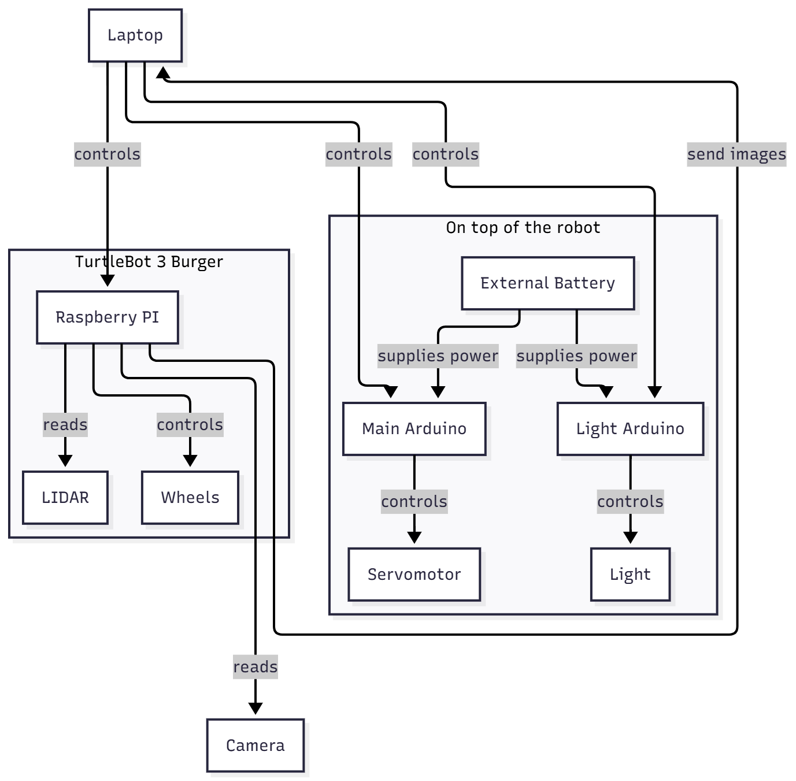
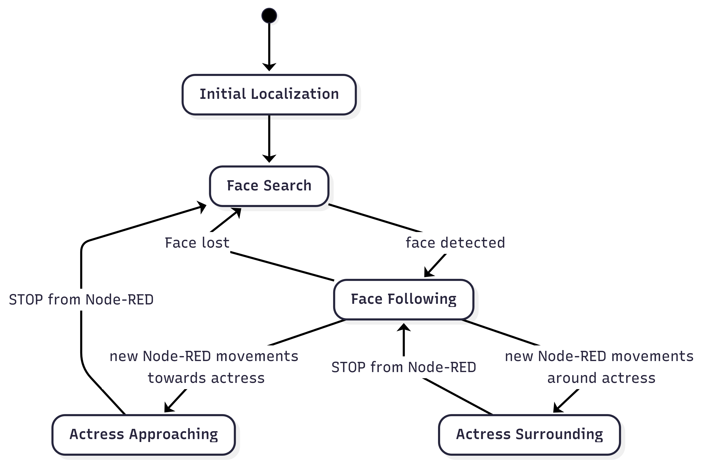
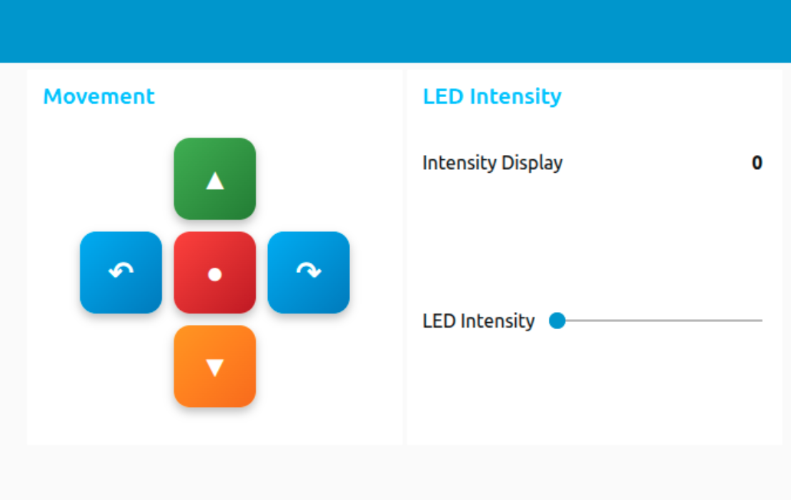

# Face-Following Illumination | Project 104

- Ángel Oroz Azcárate (angel.orozazcarate@students.unibe.ch)
- Beñat Solaegui Garralda (benat.solaeguigarralda@students.unibe.ch)

## Table of Contents

- [Project Description](#project-description)
- [Repository Structure](#repository-structure)
- [Hardware Structure](#hardware-structure)
- [Intended Robot Behaviour](#intended-robot-behaviour)
- [Node-RED Interface](#node-red-interface)
- [Arduinos](#arduinos)
- [ROS Source Files Overview](#ros-source-files-overview)
- [Implementation Choices](#implementation-choices)
- [Demo](#demo)
- [Possible Improvements](#possible-improvements)


## Project Description

This project explores the use of a mobile robot as an auxiliary element in a theatre play.

### Theatre Play Description

[Le Train](https://www.opus89-collectif.com/en-creation.html) by Joséphine de Weck, is based on a single actress who stays in the center of the scene during the performance. Instead of physical movement, the focus is on her emotions and psychological state. The atmosphere of the scene is tense and introspective, and there is a constant feeling of being watched or constrained.  

Because of this, lighting plays an important role in how the scene is perceived by the audience.

### Project Idea Related to the Play

The main idea of the project is to use the robot as a moving light source that illuminates the actress’s face from below and from different angles. This helps to highlight her facial expressions and emotions during the play.

By using a dynamic light instead of a fixed one, the robot can create shadows and visual effects that are not possible with standard stage lighting. As the robot follows the actress’s face, it becomes part of the scene and helps reinforce the emotional tension of the performance.

## Repository Structure

This repository contains all the files required to reproduce the project. The structure is organized by functionality, as described below:

```
.
├── arduino/
├── assets/
├── map/
├── models/
├── node-red/
├── src/
```

### arduino/
This folder contains all the Arduino sketches used in the project. The files here are the exact programs loaded onto the two Arduino boards used in our system.

### assets/
This folder contains all visual and presentation material, including:

- Demo videos showing the system in operation.
- Presentations and material that we prepared during the course.

### map/
This folder includes the map of a specific scenario used during the project. The map serves as an example environment. When reproducing the project, users should generate and scan their own map for their environment, but this file provides a useful reference for expected format and usage.

### models/
This folder contains all the 3D models used in the project, provided as `.stl` files.

- Individual STL files correspond to the separate 3D-printed parts designed for the robot.
- The file `modified_turtlebot.stl` includes the complete assembled model, combining the original TurtleBot with all the additional custom components designed for this project.  
  This file is useful for visualization of the whole picture.

### node-red/
This folder contains the Node-RED configuration used in the project.

- The flows can be imported directly into Node-RED to reproduce the same setup.

### src/
This folder contains all the ROS-related source files required to run the project.

- It includes ROS nodes, scripts, and launch files.
- To reproduce the project, users should:
  1. Create a ROS package on their local computer and place the contents of this folder inside it.
  2. Copy the file `turtlebot3_robot_usbcam.launch` to the TurtleBot robot.  
     This modification enables the use of a USB camera instead of the default camera setup.

#### Running the system

To run the project, follow these steps:

1. Start ROS core on the local PC.  
   ROS core is the main server that coordinates all ROS nodes.
   ```
   [localpc-terminal-1] roscore
   ```

2. Launch the TurtleBot on the robot.  
   This launch file starts the robot, including the USB camera and all required topics.
   ```
   [turtlebot-terminal] roslaunch turtlebot3_bringup turtlebot3_robot_usbcam.launch
   ```

3. Start the Node-RED interface on the local PC.  
   This interface allows user control of the robot’s movement and light intensity during operation.
   ```
   node-red
   ```
   After starting, open the Node-RED dashboard in a web browser (usually at `http://localhost:1880`) to access the controls.

4. Launch the project nodes on the local PC.  
   This command starts all the nodes required for the robot’s normal behaviour.
   ```
   [localpc-terminal] roslaunch <package_name> control.launch
   ```


## Hardware Structure

To continuously illuminate the actress’s face, the robot needs to be able to orient the light both horizontally and vertically.

For horizontal orientation (X-axis), we decided to rotate the entire robot using its wheels. This solution is simple and effective, but it introduces some limitations if the robot needs to move while keeping the face illuminated, as will be discussed in later sections.

For vertical orientation (Y-axis), rotating the robot is not sufficient. Therefore, we needed to design and add a new mechanism on top of the robot that allows the light to tilt vertically.

### New Components

Using the TurtleBot3 Burger as the base platform, the following additional components were added:

- A camera, used to detect the actress’s face and estimate its position in real time.
- A light source, used to illuminate the actress’s face.
- A servomotor, used to control the vertical tilt of the light.  
  This servomotor is controlled using a separate Arduino board.
- An external battery, used to power both the light source and the servomotor independently from the robot.

### Assembly

An additional floor was added on top of the TurtleBot. On this floor, a central elevated support holds the light source. A camera support was also designed and attached to the same structure. This means that when the light tilts, the camera tilts together with it.

This design simplifies the illumination task, since illuminating the actress’s face can be reduced to centering the detected face in the camera image.

To allow vertical rotation, two side supports were added:
- The servo support holds the servomotor, which provides the force required to tilt the light structure.
- The pivot support acts as a passive pivot on the opposite side, helping to maintain stability during movement.

Other approaches were considered. In particular, we explored solutions that would decouple the servomotor from the light, since directly attaching the servo to the light support can limit positioning precision. However, despite these limitations, the selected solution proved to be accurate enough for our use case and significantly simpler to implement, and was therefore chosen.

The complete assembly and movement of the mechanism can be seen in the following animation:


### Hardware Connection

After describing how the components are mounted, this section explains how they are connected.

The laptop acts as the main controller of the system and communicates with the robot’s Raspberry Pi. The Raspberry Pi handles the LiDAR, wheel control, and camera input, and streams the camera data back to the laptop.

On top of the robot, the light source (with its integrated Arduino) and the servomotor (controlled by a separate Arduino) are connected independently. The light Arduino communicates with the laptop via MQTT, while the servo Arduino communicates over Wi-Fi using UDP. An external battery is used to power the light and the servomotor.

Different communication options were considered for the Arduino boards, but MQTT was chosen due to its simplicity, flexibility, and good integration with the rest of the system.

The overall hardware connections and communication structure are illustrated in the following diagram:



## Intended Robot Behaviour

To describe the intended behaviour of the robot, we use a logic state diagram that summarizes the different operating modes and transitions. This diagram is meant as a high-level representation to help understand the overall behaviour of the system. The exact implementation details and internal states used in the code differ, as will be discussed in later sections.

The first step of the project is the creation of a map of the stage using LiDAR data. When launching the system, we assume that a map already exists and that an initial estimate of the robot’s starting position is available.

Once the map is loaded, the robot can be started in its normal operating mode. Its behaviour is described by the following state diagram.



The robot first enters the **Initial Localization** state, where it localizes itself within the map. Once localization is successful, it transitions to the **Face Search** state. In this state, the robot moves through the stage until a face is detected.

When a face is detected, the robot switches to the **Face Following** state. In this state, the robot continuously follows and illuminates the actress’s face. If the face is lost at any point, the robot transitions back to the **Face Search** state.

In addition to autonomous behaviour, the system allows user control of the robot’s movement on the stage. While in the **Face Following** state, the robot can receive commands from the Node-RED interface.

Depending on the received command, the robot can transition to:
- **Actress Approaching**, where the robot moves forward or backward relative to the actress.
- **Actress Surrounding**, where the robot moves around the actress, keeping her position as the center of the movement.

When a **STOP** command is received, the robot exits these modes and returns to the **Face Following** state, resuming normal illumination behaviour.

## Node-RED Interface

The robot’s behaviour can also be controlled through a Node-RED interface designed for use during the play.

The interface includes five main buttons to control movement:
- **Move Forward**
- **Move Backward**
- **Move Around Left**
- **Move Around Right**
- **Stop** (center button, used to stop the robot once it reaches the desired position)

In addition to movement, the interface allows the user to **adjust the light intensity in real time** using a slider, which also displays the current intensity value.

When any button is pressed or the slider is adjusted, the corresponding payload is published to MQTT topics. These topics are read both by the ROS controller node on the laptop and by the Arduinos on the robot.

The Node-RED interface is shown below:



## Arduinos

As mentioned, the project uses **two Arduino boards**: the integrated light Arduino and a separate Arduino board for the servo motor control.

### Light Arduino (`continuous_light_mqtt.ino`)

- Subscribed to the `light/intensity` MQTT topic, which is modified through the Node-RED interface and by the ROS controller in specific situations.  
- Controls LED brightness using either the potentiometer integrated in the light or the MQTT input.  
- Applies **gamma correction** to produce smooth changes in perceived brightness.  

### Servo Arduino (`servo_udp.ino`)

- Runs on an ESP32 and controls a servo over Wi-Fi using UDP messages. (The reason for using UDP is discussed in a later section.)  
- Continuously updates the servo’s position based on a velocity value.  
- Moves the servo smoothly over time.  
- The servo’s motion is limited to a **90º range**, which is sufficient for our use case.  

Both sketches are loaded onto their corresponding Arduino boards and communicate with the rest of the system via MQTT and Wi-Fi as described in previous sections.


## ROS Source Files Overview

This section provides an overview of the ROS-related files contained in the `src` folder, explaining their purpose and how they relate to the robot’s states.

### `control.launch`

- Launches all the nodes at once.  
- At startup, only `initial_pose_pub.py` is active, which corresponds to the **Initial Localization** state in the state diagram.

### `controller_node.py`

- Acts as the main coordinator of the system.  
- Decides which nodes are activated at any moment based on communication through ROS topics.  
- Connected to MQTT, it receives all movement and light commands from Node-RED and activates or deactivates other nodes accordingly.

### `initial_pose_pub.py`

- Handles robot localization inside the map.  
- Runs once at the beginning of the system and is not activated again.  
- Once localization is complete, the system transitions to the **Face Search** state.

### `face_search.py`

- Responsible for scanning the environment to detect a face.  
- Once a face is found, the system transitions to the **Face Following** state.

### `face_following_mp.py`

- Controls both the robot’s movement and the face tracking.  
- If the face is lost, the system transitions back to **Face Search**.  
- Responsible for keeping the actress illuminated while tracking her position.

### `map_functions.py`

- A set of helper functions for handling the map.  


## Implementation Choices

This section describes the main design and implementation decisions adopted in the development of the system. Instead of focusing on theoretical approaches, it explains the practical solutions chosen to satisfy the constraints of the theatrical scenario, the hardware limitations, and the real-time requirements of face tracking and illumination.

Each subsection details a specific aspect of the system. The goal of this section is to justify the selected strategies and to highlight how they balance simplicity, robustness, and performance within the context of a live stage environment.

### Actress Pose Estimation

The position of the actress is estimated using the environment map generated by the robot. Conceptually, the actress is modeled as a **vertical column** located near the center of the stage. This abstraction is justified by the theatrical setup: according to the play design, only one relevant obstacle is present on stage, corresponding to the actress herself. Therefore, identifying the largest obstacle in the map provides a reliable approximation of her position.

The map is first processed as a binary occupancy image, where occupied cells represent obstacles. Small contours produced by noise or minor structures are filtered out by applying an area threshold. Among the remaining contours, the one with the largest area is selected under the assumption that it corresponds to the actress.

Once this contour is identified, its **center** is **computed using a minimum enclosing circle approximation**. This provides a robust estimate of the obstacle’s geometric center, which is taken as the actress’s position in grid coordinates.

Finally, the estimated position is transformed from map coordinates to real-world coordinates using the map resolution and origin parameters. This conversion allows the robot to reason about the actress’s location in the same reference frame used for navigation and motion planning. If a rotation is defined in the map origin, it is also applied during this transformation to ensure spatial consistency.

### Robot Initial Pose Estimation

The initial position of the robot is required to start the localization process and to correctly relate the robot to the previously generated map. The original approach was to obtain the exact initial pose of the robot from external measurements. However, this method proved unreliable in practice due to setup variability and accumulated alignment errors between the physical robot and the map.

For this reason, another solution was adopted: the **initial pose** of the robot is **manually defined** and published to the localization system (AMCL), but with deliberately relaxed covariance values. This allows the robot to start with an approximate position while still giving the particle filter enough freedom to converge toward the correct pose.

Once the initial pose is published, the robot performs a short exploration movement designed to improve the quality of the localization estimate. This movement consists of a **full 360-degree rotation** followed by a brief **forward** and **backward displacement**. The rotation allows the laser scanner to observe the environment from all directions, while the linear motion helps to reduce ambiguity in the particle distribution.

This procedure spreads the AMCL particles across the state space and then progressively concentrates them as sensor measurements are integrated. As a result, the initially coarse estimate is refined into a more accurate and stable localization.

### Face Search Procedure

Before starting the visual search, the robot **first orients itself toward** the estimated position of the **actress**. This orientation is computed using the previously extracted map information, which provides an approximate location of the actress on the stage. By aligning the robot with this position, the search process is spatially constrained and more efficient, since the camera is initially directed toward the most probable region.

Once this orientation is reached, the robot enters the face search mode. The search is performed through a structured scanning strategy that combines **vertical** and **horizontal exploration**.

The first phase consists of a vertical scan of the camera and light assembly. The servomotor tilts the camera and the light upward and downward between predefined angular limits, performing a full sweep of the vertical field of view. During this motion, each captured image is processed to detect the presence of a face. If a face is detected at any point, the search process is immediately interrupted and the system transitions to the face-following state.

If no face is detected after completing a vertical sweep, the robot initiates a horizontal displacement of its viewing direction. This is achieved by rotating the robot by a fixed angular offset corresponding to a fraction of the camera’s horizontal field of view. The vertical scanning procedure is then repeated at this new orientation.

The horizontal search is structured into three stages:
1. **Center**: the robot scans vertically while facing the estimated actress position.
2. **Left**: the robot rotates slightly to the left and repeats the vertical scan.
3. **Right**: the robot rotates symmetrically to the right and repeats the vertical scan.

If the face is still not detected after completing these three stages, the entire process is restarted from the initial orientation toward the actress position. This loop continues indefinitely until a face is found.

### Face Detection Procedure

Face detection is a critical component of the system, as it directly determines when the robot switches from the search state to the face-following behaviour. Several detection approaches were evaluated during development, including OpenCV and MediaPipe methods.

The final implementation uses **MediaPipe's face detection module**, providing a suitable solution for continuous real-time processing of camera images. This method outputs bounding boxes corresponding to detected faces and confidence score for each detection.

Since the theatrical environment is poorly lit, this introduces significant challenges for reliable face detection.  To mitigate this issue, the detection threshold was set to a **low confidence value** in order to favor recall over precision. This allows the system to detect faces even under dark conditions, at the cost of occasional false negatives or unstable detections.

In addition, the **long-range configuration** of the MediaPipe model was selected. This choice is motivated by the physical layout of the scene: the robot operates at ground level, while the actress remains standing at a higher vertical position. As a result, even moderate horizontal separations translate into relatively large three-dimensional distances between the camera and the face.
 
### Movement Constraints and Design Choice

A key limitation of the system is that the horizontal alignment of the light depends entirely on the robot’s movement and rotation. Since the light and camera are rigidly mounted on the robot, the robot cannot move freely in the space while continuously illuminating the actress’s face. Any change in orientation directly affects where the light is pointing.

This limitation forces us to be careful when moving the robot, as uncontrolled motion can easily cause the face to leave the illuminated area. To address this, we designed a movement strategy that allows the robot to reach different positions on the stage while maximizing the time during which the actress’s face is illuminated.

First, we allow **forward and backward movement** toward or away from the actress. During this type of motion, it is not possible to reliably keep the face illuminated, so the light intensity is turned off. This prevents incorrect or distracting lighting while the robot is repositioning.

To reach arbitrary positions on the stage while maintaining illumination, we introduce **circular motion** around the actress, using her position as the center of rotation. In this mode, the robot can move around the actress while keeping the camera and light oriented toward her face. This allows continuous face illumination and tracking, despite the movement of the robot.

By combining forward/backward motion for repositioning and circular motion for continuous illumination, the robot is able to navigate the stage effectively while respecting the mechanical and kinematic limitations.


### Control of Servomotor and Robot Wheels

The control of both the servomotor (vertical light orientation) and the robot wheels (horizontal orientation and motion) is based on a **proportional control strategy**. The objective of the controller is to minimize the error between the detected face position and the center of the camera image.

For each control cycle, the horizontal and vertical offsets of the detected face with respect to the image center are computed. These offsets are interpreted as angular errors and are used as inputs to the controller. The servomotor corrects the vertical component of the error by tilting the light-camera assembly, while the robot base corrects the horizontal component by rotating or moving the platform.

To improve responsiveness while avoiding excessive oscillations, the proportional error is **raised to the fourth** power before being applied to the actuators. This amplification has two main effects:
large errors are strongly emphasized, producing faster corrective motions when the face is far from the image center, while small errors are attenuated, resulting in smoother and more stable behaviour when the face is already well aligned.

The same principle is applied consistently to both degrees of freedom, ensuring coordinated motion between the vertical light adjustment and the horizontal robot orientation.

### Circular Movement

The robot initially implements circular movement to follow trajectories defined by a **fixed radius** (the distance to the actress in the moment that this motion starts). This approach allows the robot to navigate smoothly along curved paths without requiring complex path planning, which is useful in this particular theatrical scenario.

However, a fixed-radius circular trajectory alone is insufficient for the face-following task. Since the robot must continuously keep the actress’s face centered in the camera, trajectory corrections are necessary whenever the face deviates from the desired image position.

To address this, the circular movement strategy was extended to allow dynamic adjustments based on visual feedback. The radius and angular velocity of the robot are modulated in real time according to the horizontal displacement of the detected face. This enables the robot to maintain circular motion while gradually steering toward the actress whenever the face moves off-center.

### Networking and Real-Time Control Challenges

During testing, the system revealed several challenges related to real-time performance and communication between the control software and the actuators. These issues occasionally affected the robot’s ability to correctly track and illuminate the actress’s face. Some of these problems were related to network instability, especially when using a **mobile phone hotspot**.

#### UDP for Communication with the Servo Arduino

Controlling the servomotor responsible for tilting the light in real time proved challenging. Initial attempts using MQTT for this task did not provide the desired behaviour. Although commands were sent at regular time intervals, they were not always received or processed in real time. In practice, several messages appeared to be processed at once, resulting in abrupt servo movements instead of smooth motion.

This behaviour suggested the presence of buffering or delays in the communication, which negatively affected the responsiveness of the system and made precise control difficult.

To address this issue, UDP communication was tested for the servo control. Using UDP significantly improved the behaviour, as messages were received more consistently and with lower latency. This allowed the servo position to be updated more frequently and resulted in smoother and more responsive movement.


#### Frames Without Face Detection

Due to a low camera frame rate and challenging lighting conditions, situations can occur where the face moves significantly between consecutive frames. In these cases, the face may temporarily exit the camera’s field of view, resulting in frames where no face is detected.

To avoid abrupt interruptions in motion, the wheels and servomotor **continue following the last known trajectory** during these frames, but at a slower rate. This strategy helps maintain smooth behaviour and increases the likelihood that the face re-enters the field of view in subsequent frames.

Only if multiple consecutive frames do not detect a face does the system transition back to the face search routine.


## Demo

The following demo video shows the main functionalities of the robot in a darker environment. The darker environment emphasizes the precision of the light control and better resembles the real theatrical setting:

- **Localization**  
- **Light intensity changes**  
- **Forward and backward movement**  
- **Face following**  
- **Circular motion around the person**  

Additional videos showing each functionality separately, including demonstrations in a lighter environment, can be found in the `assets` folder.

[Demo Video](assets/demo_final.mp4)

## Possible Improvements

In this section we present some possible future work that could improve the behaviour and usability of our system.

### States visualization in Node-RED

To facilitate understanding of the robot’s behaviour and decision-making logic, it would be beneficial to visualize the current state directly within the Node-RED interface. This would allow operators to monitor transitions between search, tracking, and other behaviours in real time.

### New Vertical Axis Tilting System

To achieve smoother vertical movements of the light and camera, a lever mechanism could be implemented. Instead of moving the servo directly with the mounted camera and light, the servo would control the lever, allowing more gradual and controlled tilting. A proof of concept can be found in ``assets/lever_mechanism.gif``.

### Wifi Connection

Replacing the mobile phone hotspot with a dedicated Wi-Fi network would improve connectivity, reduce latency, and increase the reliability of communication between the laptop, robot, and Arduino boards.

### Additional DoF

Apart from vertical tilting an additional servomotor could control horizontal orientation. Adding this extra degree of freedom would allow the light to follow the actress’s face independently of the robot’s movement. This would ensure continuous face illumination even when the robot moves forward, backward, or along curved trajectories.


