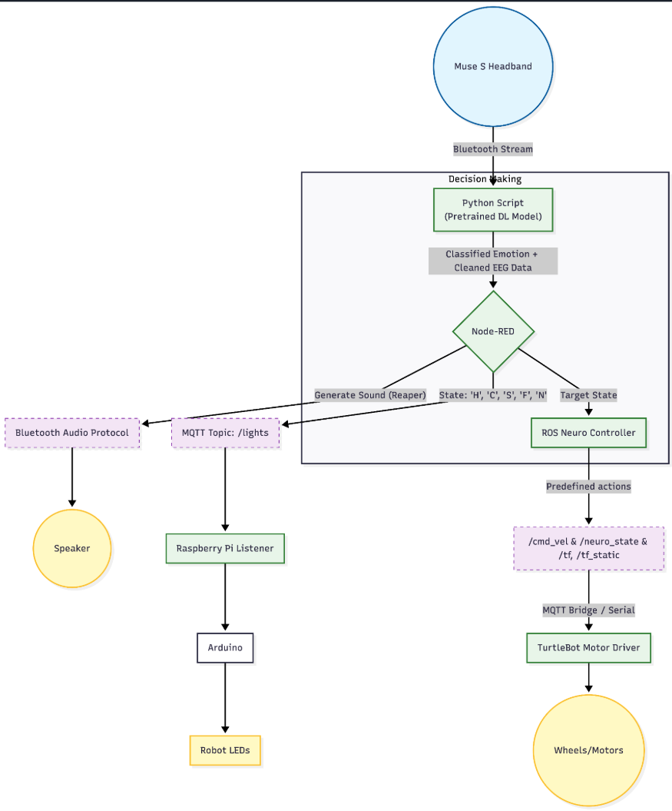
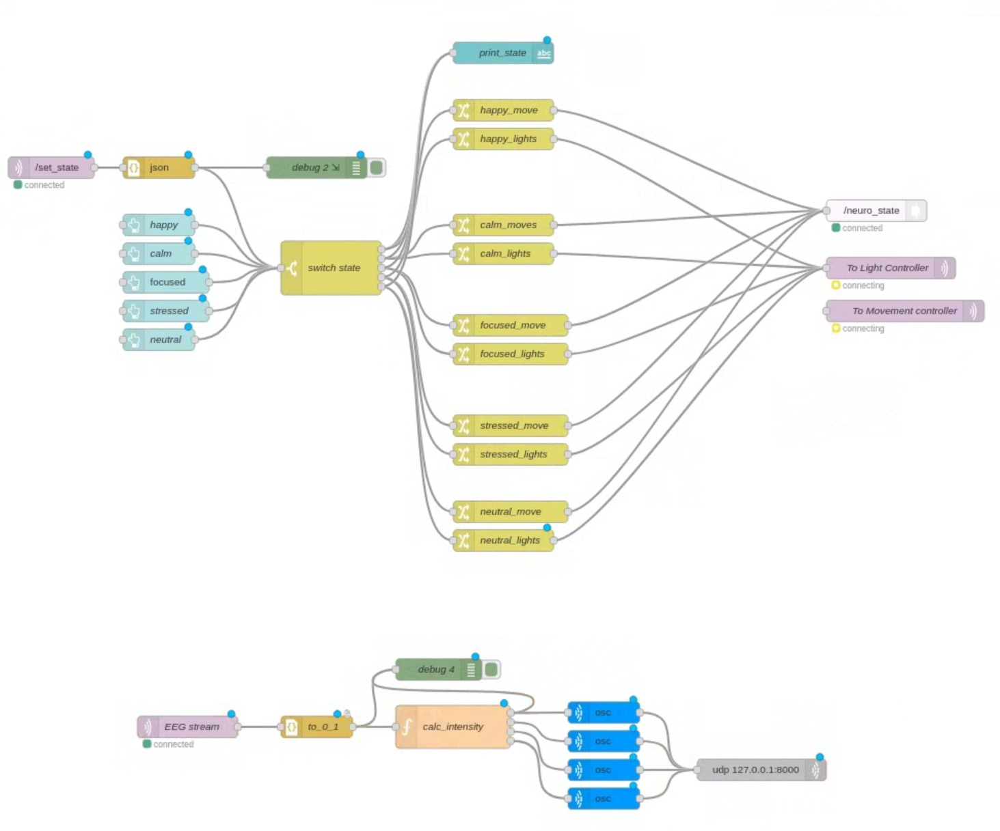
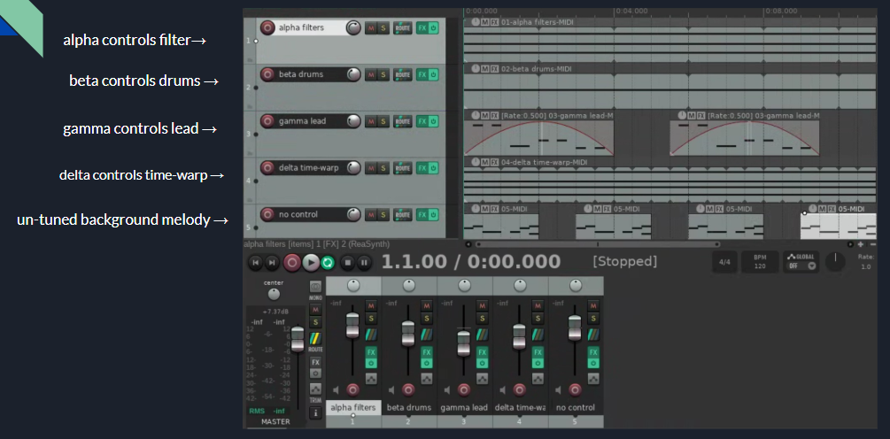
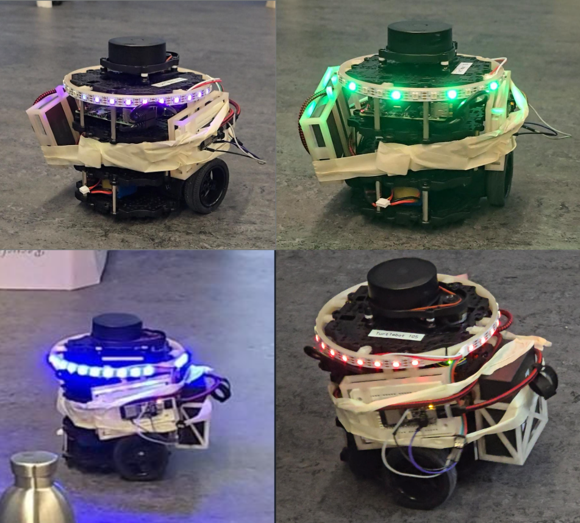
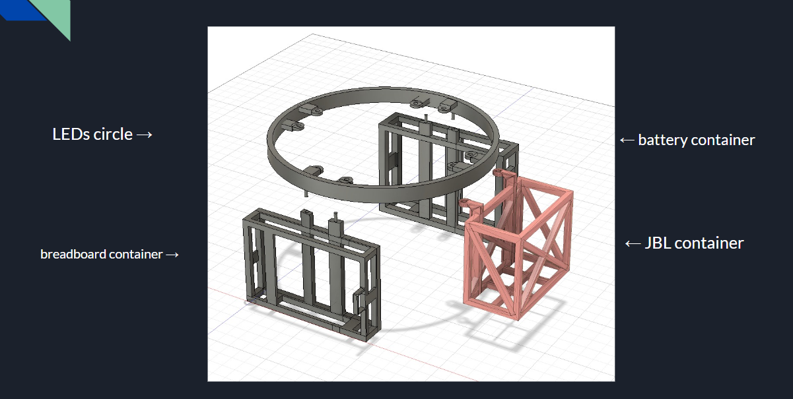
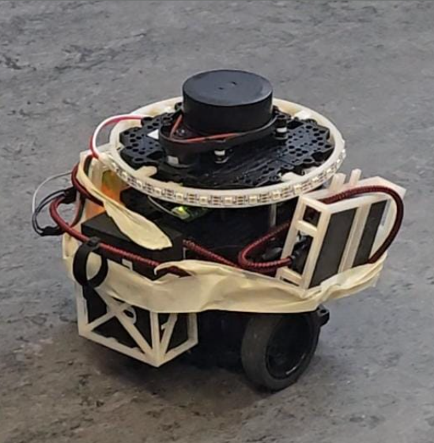

# NeuroBot 🧠

This project uses a Muse 2 headset and BrainFlow to capture EEG data, train machine learning models, and perform real-time classification of 5 psychological states (Calm, Focused, Happy, Stressed), which then drive the physical behavior of a TurtleBot3, a generative audio soundscape (Reaper), and an ambient lighting system (ESP32) for the scope of a theatre play.

---

## Table of Contents

1. [Project Structure](#-project-structure)
2. [Setup & Installation](#-setup--installation)
   - [Python Environment (BCI)](#1-python-environment-bci)
   - [ROS Workspace (Robot)](#2--ros-workspace-robot)
   - [Middleware (Node-RED)](#3--middleware-node-red)
3. [BCI Pipeline (The Brain): EEGNet (PyTorch)](#-bci-pipeline-the-brain-eegnet-pytorch)
4. [Utilities](#-utilities)
5. [Robot Control (The Body)](#-robot-control-the-body)
6. [Model Training](#model-training)
7. [IO Systems (Lights & Sound)](#-io-systems-lights--sound)
8. [System Pipeline](#-system-pipeline)
9. [NeuroBot Complete Report](#neurobot-complete-report)
    - [Executive Summary](#executive-summary)
    - [Link with the theatre piece](#link-with-the-theatre-piece)
    - [System Architecture](#system-architecture)
    - [Subsystem Implementation Details](#subsystem-implementation-details)
    - [Design Iterations & Technical Post-Mortem](#design-iterations--technical-post-mortem)
    - [Challenges & Limitations](#challenges--limitations)
    - [Future Work](#future-work)
    - [Contact](#contact)

---

## 📂 Project Structure

- **`muse/`**: The Brain. Contains the BCI pipeline, data recording, cleaning, visualization, and Deep Learning models (`dl_emotion_class.py`).
  - `eeg_data/`: EEG data recordings, visualisations and models. 
  - `plots_yk_combined/`: EEG data visualisations.
  - `plots_yk_separate/`: EEG data visualisations.
  - `models/`: Trained models.
- **`ros_ws/`**: The Body. Contains the Robot Operating System workspace.
  - `src/neuro_rover/scripts/`: Contains the main control logic (`neuro_controller.py`).
  - `src/neuro_rover/launch/`: Simulation launch files.
  - `src/neuro_rover/worlds/`: Custom Gazebo simulation worlds.
- **`IO/`**: The Senses.
  - `arduino/`: C++ code for the ESP32 LED controller.
  - `reaper/`: Reaper DAW project files (.RPP) for generative audio.
- **`misc/`**: images, 3d models...
  - `3d_models_for_neurobot/`: .stl files.
---

## 🔌 Setup & Installation

### 1. Python Environment (BCI)
Navigate to the root directory where `requirements.txt` is located and create and activate a virtual environment:

```bash
python -m venv venv
# Linux/Mac
source venv/bin/activate
# Windows
.\venv\Scripts\Activate.ps1
```
Then, install the required dependencies:
```bash
pip install -r requirements.txt
```

---

### 2. 🤖 ROS Workspace (Robot)

The robot behavior is handled by the `neuro_rover` package inside the `ros_ws` directory.

#### 1. Build the Workspace
Before running the robot, you must compile the ROS package.

```bash
cd ros_ws
catkin_make
source devel/setup.bash
```
*Note: You must run `source devel/setup.bash` in every new terminal you open.*

#### 2. Launch the Simulation (Gazebo + Controller)
This command launches the 3D world, spawns the robot, and starts the **Neuro-Empathic Controller**.

**⚠️ Graphics Fix (For WSL/Linux):**
If you see a black screen in Gazebo, run this command *before* launching:
```bash
export LIBGL_ALWAYS_SOFTWARE=1
```

**Launch Command:**
```bash
roslaunch neuro_rover neuro_behavior.launch
```
* **Default Behavior:** The robot will enter "Neutral Orbit" (circling the center point at 1m radius).
* **Safety:** The robot will automatically stop/turn if it detects an obstacle < 0.5m.

#### 3. Visualization (RViz)
If Gazebo is black or you want to see the LIDAR data:

1.  Open a new terminal.
2.  Run:
    ```bash
    roslaunch turtlebot3_bringup turtlebot3_model.launch
    ```
3.  **Configuration:**
    * Set **Fixed Frame** to `odom`.
    * Add **RobotModel**.
    * Add **LaserScan** (Topic: `/scan`, Reliability: Best Effort, Size: 0.1).

#### 4. Controlling States (Testing)
You can manually trigger emotional states to test the choreography.

**Method A: Graphical Interface (RQT)**
1.  Run `rqt` in a terminal.
2.  Go to **Plugins** -> **Topics** -> **Message Publisher**.
3.  Select topic `/neuro_state`.
4.  Set expression to `'happy'`, `'focused'`, `'stressed'`, or `'neutral'`.
5.  Check the box to start publishing.

**Method B: Command Line**
```bash
# Trigger Happy (Wiggle/Figure-8)
rostopic pub /neuro_state std_msgs/String "data: 'happy'" -1

# Trigger Stressed (Erratic)
rostopic pub /neuro_state std_msgs/String "data: 'stressed'" -1

# Trigger Calm (Slow Orbit)
rostopic pub /neuro_state std_msgs/String "data: 'calm'" -1

# Trigger Focused (Face Center)
rostopic pub /neuro_state std_msgs/String "data: 'focused'" -1

# Reset Center Point (Set current location as new orbit center)
rostopic pub /reset_center std_msgs/String "data: 'now'" -1

# Trigger Neutral (Standard Orbit)
rostopic pub /neuro_state std_msgs/String "data: 'neutral'" -1
```

**Method C: Command Line**

Open the node-red flow and inject the states manually.

#### 5. Manual Driving
To take over control manually (WASD keys):
```bash
roslaunch turtlebot3_teleop turtlebot3_teleop_key.launch
```

### 3. 🔀 Middleware (Node-RED) ###

Node-RED bridges the Python BCI script (MQTT), the Robot (ROS), and the Audio Engine (OSC).

1. Installation & Setup
```bash
npm install -g --unsafe-perm node-red
npm install node-red-dashboard
npm install node-red-contrib-ros
npm install node-red-contrib-osc
 ```
2. Launching
   In a new terminal on the laptop:
```bash
   # 1. Start the ROS Bridge (Required for Node-RED to talk to ROS)
roslaunch rosbridge_server rosbridge_websocket.launch

# 2. Start Node-RED
node-red
```
3. Configuration
   
* Open http://localhost:1880.
Import the flow file located at muse/node-red.json.
* Verify Configuration:
    - MQTT Nodes: Ensure the Server is set to localhost (127.0.0.1) port 1883.
    - ROS Nodes: Ensure the Server is set to ws://localhost:9090.
    - UDP/OSC Nodes: Ensure the destination is 127.0.0.1 port 8000.
---

## 🧠 BCI Pipeline (The Brain): EEGNet (PyTorch)

This is the primary BCI workflow using the EEGNet deep learning model. All BCI logic is located in the muse/ directory. The main entry point is `dl_emotion_class.py`.

### 1. Record Training Data
Specify a **user ID** (e.g., `yk`) and emotion to capture EEG data for specific states to train your user-specific model.


```bash
cd muse
# Record 30 seconds of 'calm'
python dl_emotion_class.py record yk calm --duration 30 --count 5
```
Repeat for `focused`, `happy`, etc. Saves the data under .csv format.

### 2. Train the Model
Train an EEGNet (Deep Learning) on your recorded data.
```bash
python dl_emotion_class.py train yk
```
Saves model to `models/yk/emotion_model_eegnet.pth`.

### 3. Run Live Prediction

```bash
python dl_emotion_class.py predict <user_id> --mqtt_ip 127.0.0.1
```
This streams EEG data from the headband, predicts the state, and publishes it via MQTT to the robot and audio systems.

---

## 📊 Utilities

**Data Visualization:**
To view recorded sessions (change user initials in script line 14 first):
```bash
python data_visualiser.py
```

## 🤖 Robot Control (The Body)

When moving from the Gazebo simulation to the physical TurtleBot3 (e.g., at the university), you must reconfigure the network settings to ensure the Laptop ("Brain") and Robot ("Body") can communicate.

### 1. Network Prerequisites
* **Wi-Fi:** Ensure both the Laptop and the Robot are connected to the same network (e.g., `ProFab`).
* **Firewalls:** Disable firewalls on your Laptop (Windows/WSL), or ROS messages will be blocked.

### 2. IP Configuration 
Every time your Laptop connects to a new network, its IP address changes. You must update **both** devices.

**A. On the Laptop:**
1.  Find your IP: `ifconfig` (look for `inet` under `wlan0` or `eth0`).
2.  Edit `.bashrc`: `nano ~/.bashrc`
3.  Update these lines with your **Laptop's IP**:
    ```bash
    export ROS_MASTER_URI=http://<YOUR_LAPTOP_IP>:11311
    export ROS_HOSTNAME=<YOUR_LAPTOP_IP>
    ```
4.  Apply changes: `source ~/.bashrc`

**B. On the Robot:**
1.  SSH into the robot: `ssh ubuntu@<ROBOT_IP>` (Check label on robot for its IP).
2.  Edit `.bashrc`: `nano ~/.bashrc`
3.  Update **ROS_MASTER_URI** to point to your **Laptop's IP**:
    ```bash
    export ROS_MASTER_URI=http://<YOUR_LAPTOP_IP>:11311
    # Leave ROS_HOSTNAME as the robot's own IP
    ```
4.  Apply changes: `source ~/.bashrc`

### 3. Launch Sequence

#### A. Running in Simulation (Gazebo) ####
```bash
cd ros_ws
source devel/setup.bash
# Launches Gazebo world + Neuro Controller
roslaunch neuro_rover neuro_behavior.launch
```

#### B. Running on Physical Robot ####
The startup order is strict. Run these in separate terminals:

1.  **Laptop (Terminal 1):** Start the Master.
    ```bash
    roscore
    ```
2.  **Robot (SSH Terminal):** Start the robot drivers.
    ```bash
    roslaunch turtlebot3_bringup turtlebot3_robot.launch
    ```
    *(Wait until you see "Calibration End" or connection success).*
3.  **Laptop (Terminal 2):** Start the Controller.
    ```bash
    rosrun neuro_rover neuro_controller.py
    ```
    **⚠️ Important:** Do **not** use `roslaunch neuro_behavior.launch` here. That file starts Gazebo, which conflicts with the real robot. Use `rosrun` to start only the Python script.
---
## Model Training ##

### Phase 0: Preparation (Every Session)
1.  **Environment:** Sit comfortably. Use noise-canceling headphones.
2.  **Signal Check:** Run the `predict` command to view the live signal and ensure connection.
    * *Test:* Close your eyes and relax.
    * *Pass Condition:* You must see a clear **Alpha peak (8-12 Hz)** rise on the graph (especially TP9/TP10).
3.  **Hydration:** If the signal is noisy ("rails"), wipe your forehead and mastoids (behind ears) with a damp cloth.


### Phase 1: Calm
* **Target:** High Alpha/Theta waves. Low Arousal.
* **Command:** `python dl_emotion_class.py record <user> calm --duration 60`
* **Eyes:** **CLOSED**.
* **Task:** Box breathing (In 4s, Hold 4s, Out 4s). Focus entirely on the sensation of your breath.
* **Physiology:** Relax your jaw. Let your shoulders drop.


### Phase 2: Focused
* **Target:** High Beta waves. High Arousal.
* **Command:** `python dl_emotion_class.py record <user> focused --duration 60`
* **Eyes:** **OPEN**.
* **Task:** Solve complex math problems in your head (e.g., "1000 minus 7, minus 7...") or read a dense academic paper.
* **Physiology:** **Do not frown.** Keep your gaze steady on one point; avoid wild scanning or rapid blinking.


### Phase 3: Happy
* **Target:** Frontal Alpha Asymmetry (Right > Left). Positive Valence.
* **Command:** `python dl_emotion_class.py record <user> happy --duration 60`
* **Eyes:** **OPEN** (watching video).
* **Task:** Watch a compilation of stand-up comedy or funny clips.
* **Physiology:** **Internalize the laugh.** Do not laugh out loud or grin widely (this creates muscle noise). Aim for a "Duchenne smile" (smiling with eyes) while keeping the jaw relaxed.


### Phase 4: Stressed
* **Target:** High Beta/Gamma. Negative Valence.
* **Command:** `python dl_emotion_class.py record <user> stressed --duration 60`
* **Eyes:** **OPEN**.
* **Task:** Perform a **Stroop Test** under time pressure, or listen to an annoying sound (e.g., alarm clock) while trying to ignore it.
* **Physiology:** **Watch your jaw.** Stress causes natural teeth clenching. Keep your mouth slightly open or tongue on the roof of your mouth to prevent EMG artifacts.


## 🎨 IO Systems (Lights & Sound) ##

### Lights (ESP32) ###
* Location: IO/neurobot_ESP32_lights/
* Setup: Flash the code to the ESP32. It connects via Wi-Fi and listens to MQTT topics sent by the BCI script/Node-RED.
* States: Happy (Green Chase), Calm (Blue Pulse), Focused (Purple Pulse), Stressed (Red Strobe).

### Sound (Reaper) ###
* Location: IO/reaper/
* Setup: Open the .RPP project file on the host laptop.
* Logic: Receives OSC messages derived from the EEG stream to modulate VST plugin parameters (Filter cutoff, Distortion drive, Delay time) in real-time.
  


## 📐 System Pipeline ##

1. **Sensing**:  
   Muse S — *(Bluetooth)* → Python Script (`dl_emotion_class.py`)

2. **Processing**:  
   Python Script — *(MQTT)* → Node-RED

3. **Actuation (Robot)**:  
   Node-RED — *(WebSockets)* → ROS Master — *(Wi-Fi)* → TurtleBot3 (`neuro_controller.py`)

4. **Actuation (Audio)**:  
   Node-RED — *(OSC / UDP)* → REAPER — *(Bluetooth)* → JBL Speaker

5. **Actuation (Light)**:  
   Node-RED — *(MQTT)* → ESP32


# NeuroBot Complete Report
---

## Executive Summary

The NeuroBot project integrates Brain-Computer Interface (BCI) technology with autonomous robotics to create an empathic system. Using a Muse S headset, the system classifies the user's psychological state (Calm, Focused, Happy, Stressed, Neutral) in real-time. This state drives a multimodal feedback loop consisting of physical locomotion (TurtleBot3), generative audio (REAPER), and ambient lighting (ESP32).

**Objective:** To create an autonomous robotic avatar that physically embodies human psychological states in real-time.

**Core Idea:** A bio-feedback loop where a performer can see the emotional state of the public during a play.

**The Metaphor:** The emotional display parallels the co-dependency theme of the scene.

---
## Link with the theatre piece

Le Train stages the psychological state of co-dependence: the erasure of the self in the orbit of an addict, and the experience of living through another’s intensity in order to feel alive. NeuroBot extends this dramaturgical logic beyond narration by materializing dependency as a cybernetic loop. As the protagonist exists only through the emotional gravity of her partner, the robot exists only through the neural activity of the audience. The actress modulates the spectators’ affect; the spectators’ affect drives the robot’s behavior. A closed circuit emerges in which perception, emotion, and action are no longer autonomous but mutually entrained. The installation thus externalizes the play’s core insight: subjectivity itself can become relationally captive, suspended in a system where no entity fully owns its own movement.

---

## System Architecture

The architecture follows a distributed star topology with an Ubuntu Laptop acting as the central compute unit, offloading specific tasks to the robot's embedded systems.

### Hardware Layer

- **Sensor:** Muse S Headband (4-Channel EEG: TP9, AF7, AF8, TP10).
- **Central Processor:** Laptop running Native Ubuntu. Handles the Python ML model, MQTT Broker, ROS Master, Node-RED, and REAPER DAW.
- **Robot Platform:** TurtleBot3 Burger (Raspberry Pi 3B+ + OpenCR). The Pi listens to ROS and MQTT topics.
- **Lighting Controller:** ESP32 Microcontroller (Wi-Fi enabled). Handles real-time LED timing.
- **Audio Output:** JBL GO Speaker (Connected via Bluetooth to the Laptop).
- **3D Prototyping:** Custom-designed containers for the breadboard, battery, JBL speaker, and a custom LED circular mount.

### Communication Protocols

- **MQTT:** Used for bidirectional state transmission, sending clean EEG data for visualization, and sending lighting commands to the ESP32.
- **ROS Bridge:** WebSockets connecting Node-RED logic to the ROS ecosystem.
- **OSC (Open Sound Control):** Used for low-latency communication between Node-RED and the REAPER audio engine.
- **Bluetooth:** Direct audio stream from Laptop to JBL Speaker and raw data stream from Muse to Laptop.

---

## Subsystem Implementation Details

<p align="center">
  
</p>
<p align="center"><em>Figure 1: System Architecture Flow</em></p>

### BCI Pipeline (Python)

The `muse` module handles data acquisition and inference using `brainflow`, `numpy`, and `torch`.

1. **Acquisition:** Muse headband streams raw voltage via BLE.
2. **Preprocessing:** Notch Filter (50Hz) and Bandpass Filter (1-45Hz) applied over the raw voltages to filter the noise and normalize data.
3. **Classification:** Deep Learning: `EEGNet` on raw time-series windows (2s, 256Hz).
4. **Output:** Publishes JSON payload `{"state": "happy", "confidence": 0.95}` to MQTT topic `/set_state` and raw band power to `/eeg`.

### Logic & Orchestration (Node-RED)

Node-RED serves as the integration bus.

- **Input:** Listens to MQTT `/set_state` for getting a predefined state such as 'happy', 'stressed', etc. and `/eeg` for continuous EEG data stream.
- **Signal Processing:** Calculates Root Mean Square (RMS) of raw EEG streams to normalize values (0.0–1.0) for audio modulation. For the movement controls, the psychological states dictate them.
- **Dashboard:** Integrates a small UI for monitoring states and manual overrides.
- **Routing:** Routes state decisions to the Lighting controller (MQTT) and Movement controller (ROS).

#### Node-RED Flow Logic Details

The Node-RED implementation is divided into two asynchronous parallel flows: the *State Orchestration Pipeline* and the *Generative Audio Pipeline*.

##### Flow 1: State Orchestration (Upper Branch)

This flow manages high-level behavioral switching based on classification results.

1. **Input Sources:**
   - **MQTT In (State Stream):** Subscribes to `/set_state` on `localhost`. Receives JSON payloads from the Python ML script (e.g., `{"state": "happy", "confidence": 0.9}`).
   - **Dashboard Buttons:** UI widgets allow manual state injection for testing and demonstration (Inject nodes configured with JSON payloads).

<p align="center">
  
</p>
<p align="center"><em>Figure 2: GUI</em></p>

2. **Data Parsing:**
   - **JSON Node:** Converts incoming string payloads into JavaScript Objects.
   - **Dashboard Text:** Extracts `msg.payload.state` to display the active state on the operator UI.

3. **Logic Routing (Switch Node):**
   A 5-way switch evaluates `msg.payload.state`. It routes the message to one of five branches: Happy, Calm, Focused, Stressed, or Neutral.

4. **Payload Transformation (Change Nodes):**
   Each branch triggers specific "Change" nodes to format data for the hardware endpoints:
   - **Lighting:** Sets `msg.payload` to a single character code ('H', 'C', 'F', 'S', 'N') required by the ESP32 firmware.
   - **Movement:** Sets `msg.payload` to the corresponding string identifier (e.g., "happy") expected by the ROS controller.

5. **Outputs:**
   - **ROS Publisher:** Publishes the state string to the `/neuro_state` topic via `node-red-contrib-ros`. This triggers the `neuro_controller.py` script to alter velocity vectors.
   - **MQTT Out:** Publishes the character code to `/neurobot/lights/set`. The ESP32 receives this via Wi-Fi to switch LED patterns.

##### Flow 2: Generative Audio Pipeline (Lower Branch)

This flow handles high-frequency continuous data for audio synthesis.

1. **Input (EEG Stream):**
   Subscribes to `/eeg`. Receives raw voltage arrays for all 4 channels (TP9, AF7, AF8, TP10) at 10Hz intervals.

2. **Signal Processing (Function Node):**
   A custom JavaScript function (`calc_intensity`) processes the raw arrays:
   - **RMS Calculation:** Computes the Root Mean Square of the incoming array to determine signal energy.
   - **Normalization:** Applies a divisor (400.0) to scale high-amplitude EEG artifacts down to the 0.0–1.0 range required by OSC.
   - **Clamping:** Hard limits values >1.0 to prevent audio glitches.
   - **Mapping:** Maps specific sensor channels to REAPER OSC addresses (e.g., TP9 → `/track/1/fx/2/fxparam/1/value`).

3. **OSC Encoding:**
   Four parallel `osc` nodes (one per audio track) convert the numeric payloads into binary Open Sound Control packets.

4. **UDP Transmission:**
   A single `udp out` node broadcasts the OSC packets to `127.0.0.1:8000`, where REAPER is listening.

<p align="center">
  
</p>
<p align="center"><em>Figure 3: Node-red Flow</em></p>


### Robotics Control (ROS Noetic)

The robot utilizes a custom `neuro_rover` package. The robot uses odometry and AMCL-corrected localization to maintain a defined trajectory.

#### Orbit Controller & Dynamic Behaviors

The robot switches between 5 distinct behaviors based on the detected emotional state:

- **Neutral:** 0.6m radius orbit around the performer, moderate speed (0.15 m/s), lights off.
- **Happy:** Wobbly orbit (0.55-0.75m range) with sinusoidal modulation. Faster movement, green lights.
- **Calm:** Wide 0.7m orbit, slow drift (0.08 m/s), blue lights.
- **Stressed:** Chaotic behavior. No forward velocity, but rapid rotation left and right. Flashing red lights.
- **Focused:** Stationary angular tracking. Stops moving, turns towards the performer, purple lights.


#### Multi-Layer Safety Systems

- **Virtual Leash (Geofencing):** A 1.5m safety radius is enforced. If the boundary is breached, a motor override pulls the robot back.
- **LIDAR Obstacle Detection:** Detection of objects <20cm triggers an immediate stop/turn, overriding all emotional behaviors.
- **Transitions:** Graceful state transitions to prevent jerky motor movements.

### Generative Audio (REAPER DAW)

Audio is generated in real-time based on specific EEG frequency bands via OSC control.

- **Alpha → Filter:** Controls the Low Pass Filter cutoff on Pad sounds.
- **Beta → Percussion:** Controls drum volume/intensity.
- **Gamma → Lead:** Controls distortion and drive on lead synths.
- **Delta → Time-Warp:** Controls delay time and arpeggiator rates to create a "time-stretching" feel without changing global BPM.
- **Background:** An additional un-tuned background melody plays to maintain atmosphere.

The base melody pattern for every track was manually built.

<p align="center">
  
</p>
<p align="center"><em>Figure 4: Reaper DAW Tracks </em></p>

### Lighting System (ESP32)

The ESP32 listens to MQTT topics over Wi-Fi to control WS2812B LED strips.

- **Happy:** Faster movement, spiraling green lights.
- **Calm:** Circling but slower, pulsing blue lights.
- **Focused:** Stops moving, turns towards the performer and the lights pulsate in purple.
- **Stressed:** No velocity but rapidly rotating left and right, flashing red lights.
- **Neutral:** Circling around the performer, lights off.

<p align="center">
  
</p>
<p align="center"><em>Figure 5: 4 Colorful States </em></p>

## Demo Video

<p align="center">
  <a href="https://youtu.be/VF_j0U2XuPs?si=5_hIBrLJz1O0gHRH">
    
  </a>
</p>

### Mechanical Design & Integration

To accommodate the additional hardware (JBL speaker, ESP32, external battery, and LED strips) onto the standard TurtleBot3 Burger chassis, custom mechanical components were modeled and 3D printed.

#### 3D Modeled Components

The following parts were designed using Autodesk Fusion software and printed in PLA:

- **Speaker Mount:** A custom bracket designed to secure the JBL GO speaker to the rear of the robot. It ensures the center of gravity remains balanced.
- **LED Ring Support:** A circular mounting frame attached to the upper tier of the robot to house the WS2812B LED strip, ensuring visibility from all angles.
- **Electronics Housing:** Protective containers for the ESP32 breadboard and the secondary external battery, preventing loose wire connections during movement.

<p align="center">
  
</p>
<p align="center"><em>Figure 6: 3D printed pieces</em></p>

#### Assembly & Mounting

The custom components were secured to the TurtleBot3's waffle-plates using mechanical fasteners.

- The components utilize the standard grid pattern of the TurtleBot chassis for modular attachment.
- Screw-based vices were initially implemented to clamp the JBL holder to the chassis plate; however, adhesive tape was ultimately used instead for the sake of simplicity.


<p align="center">
  
</p>
<p align="center"><em>Figure 7: Physical integration of the mechanical components on the TurtleBot3</em></p>


## Design Iterations & Technical Post-Mortem

### How we chose to implement the code and why (Part A: BCI Pipeline)
**Iteration 1** Windows Subsystem for Linux (WSL).

Virtualized network adapters (vEthernet/NAT) blocked multicast DNS and made bidirectional ROS/MQTT communication unreliable. `resolv.conf` corruption issues prevented package management.
 Migrated to native Ubuntu for direct hardware access (Bluetooth) and a unified network stack.

**Iteration 2** Implementing EGGNet (Deep Learning)

Initially, we used a classic Machine Learning approach to build the first model that would be used to classify between 4 psychological (emotional) states. We manually extracted features using Power Spectral Density (PSD). We calculated Arousal value (Beta/Alpha ratio) and Valence (frontal alpha asymmetry). We trained a Random Forest classifier. While functional, it struggled with the nuance of 4 distinct states. For this reason, we moved to a Deep Learning approach, speciffically implementing the EEGNet architecture (already existing model, reference paper here: https://arxiv.org/abs/1611.08024), which is a compact convolutional network (CNN) for EEG-based BCIs data, using PyTorch. Instead of manual features, we fed the model raw time-series data: 2-second windows of EEG recordings accross 4 channels (4 x 512 tensors). 

**Iteration 3** Data Augmentation 
We recorded our own training data (30s x 25 samples x 4 states = 50min of total data). When training the EEGNet, we hit 100% accuracy almost immediately. This was a classic case of overfitting. To solve this issue, we implemented a data augmentation pipeline inside the training loop: 
- sliding windows: instead of non-overlapping chunks, we used a 2-second window with a 0.25s stride, quadrupling our available samples.
- noise injection: we added Gaussian noise to the signal during training to force the model to focus on the underlying wave shapes rather than the static artifacts. 

We also added Dropout layers and Weight Decay to the optimizer, and implemented Early Stopping to halt training before the model began to overfit.

**Iteration 4** Hysteresis
In live testing, the model's preditions were volatile. A user would blink, and the state would flicker from "Calm" to "Stressed" for a split second, which isn't realistic in terms of how we normally switch emotional states in real life. For this, we implemented a Hysteresis Buffer (State Machine). We store the last 10 preditions, and the robot only switches states if 70% of the buffer 'agrees' on a new state. This provides "emotional inertia", making the robot's behavior feel deliberate and stable.

**Why**

We based this choice on the paper "Multiclass Classification of Visual Electroencephalogram Based on Channel Selection, Minimum Norm Estimation Algorithm, and Deep Network Architectures" (https://www.mdpi.com/1424-8220/24/12/3968). The paper explains that human perception has "persistance": we don't swap emotions instantly. By implementing a voting buffer, we replicated this biological phenomenon.

### How we chose to implement the code and why (Part B: Robot Locomotion)

**Iteration 1** ROS Navigation
We initially tried using the standard ROS Navigation Stack (move_base), sending goal coordinates (x,y) for the robot to travel to, but this was too utilitarian, and didn't work for changing the robot's movement patterns while keeping the same circular movement around a fixed centered target, because the navigation stack tried to smooth out all movements.

To fix this, we wrote a custom Python controller (neuro_controller.py) that calculates velocity commands (/cmd_vel) directly using geometry. So, instead of pathfinding, we used Vector Fields. We defined a "target radius" around a centered object (replacing the performer). 
- if the robot is too far, it drives towards the center;
- if it is too close, it drives away;
- if it is at the right distance, it drives along the tangent.

This created a smooth orbit around the performer without needing predefined waypoints.


**Iteration 2** Expressive Orbit
We modified the orbit logic to create disting emotional behaviors:
- happy: injected a sine wave into the target radius, creating a "wobbly", energetic orbit. We also added a periodic high-speed spin.
- focused: created a 'stop and stare' behavior where the robot halts translation but uses a PID loop to keep its front pointed at the performer.

**Iteration 3** Geofencing
For the 'Stressed' state, we wanted chaotic, random movement. However, simply sending random velocities caused the robot to run off the stage or hit walls. For that we implemented a Virtual Leash, a digital wall that would stop the robot from exiting the stage.
- the robot generated random, frantic velocity commands;
- before executing them, the code checks the robot's distance from the center (0,0);
- if distance > 0.9m, the random command is overwritten by a safety vector pulling the robot back toward the center.

**Why Distributed Architecture (Node-RED + ROS + MQTT)?** 

We faced a "Split Brain" problem. The Deep Learning model requires a powerful laptop, but the robot hardware requires low-level GPIO access.
So, we used MQTT as the nervous system. It is lightweight and asynchronous.
Why Node-RED? It acted as the "Translator." It takes the abstract emotional state ("Happy") and splits it into the specific hardware commands: sending a JSON string to ROS for movement, an HTTP request to the audio player, and a serial command to the Arduino for lights. This decoupled the systems, meaning if the robot crashed, the audio would keep playing, and vice versa.

Standard ROS navigation is designed for efficiency and safety, not expression. To make a robot look "Happy," it needs to move inefficiently (wobbling, spinning). Writing a custom kinematic controller gave us direct access to the wheel velocities, allowing us to modulate movement at 10Hz to create "texture" in the motion (like the vibration in the "Stressed" state) that standard navigation would have filtered out.

**Why the "Valid Pose" Check at Startup?**

The "Spin of Death" Bug: During testing, we found that if the robot started before the localization system (AMCL map scanned using LIDAR) was ready, it assumed it was at coordinates (0,0). Since the logic dictates "orbit around (0,0)," the robot thought it was inside the target and would spin in a spiral further and further away from the target, to escape.
To fix this, we added a safety flag (self.valid_pose) that prevents any motor commands until the localization system confirms a high-confidence position estimate. 

### Audio Architecture: Static vs. Generative

**Initial Approach:** Python script sending MQTT commands to Raspberry Pi to play static MP3 files via `mpg123`.

**Issue:** Transitions were abrupt and lacked nuance.

**Resolution:** Implemented REAPER on the Laptop with OSC control. This allows continuous, analog-feel control of audio parameters, effectively turning the brain into an instrument, which also corresponded better with theme of the theater play.

### Lighting Control: Pi GPIO vs. Microcontroller

**Initial Approach:** Direct GPIO control from Raspberry Pi.

**Issue:** Linux non-real-time interrupts caused timing jitter and visible flickering.

**Resolution:** Offloaded to ESP32. The microcontroller handles precise timing, while the Pi simply sends high-level state commands.

### Data Normalization for the Audio stream

**Issue:** Raw EEG RMS values fluctuated wildly (15 to 300+), causing OSC knobs to get stuck at max (1.0).

**Resolution:** Implemented a dynamic divisor in Node-RED (`rms / 400.0`) and logic clamps.

---

## Challenges & Limitations

### Limitations

- **Hardware Resolution:** Mapping complex psychological states with 4-channel consumer-grade EEG hardware is not ideal compared to clinical setups.
- **Dataset Variance:** Recording a robust dataset takes a long time and differs significantly for each participant.
- **Signal Noise:** EMG (muscle) noise and body movement impact the results, requiring heavy filtering.
- **Model Training:** The model cannot be generalized to a public since every one of us have different ways of expressing the various psychological states, as well as different brain area activations.

### Challenges Encountered

- **Odometry Drift:** The robot shifts over time as wheel encoders drift, requiring AMCL correction.
- **State Reliability:** Achieving stable emotional state changes in a noisy environment.
- **Data Collection:** Recording 25x30s CSV files for each state was labor-intensive, and works way better on people having short to no hair, since it interferes less with the signal.
- **Integration:** Connecting Python, Node-RED, ROS, REAPER, and ESP32 into a unified synchronous system.

---

## Future Work

- **Dynamic Tracking:** Using a camera to track the performer rather than relying on odometry orbits.
- **Expanded Emotional States:** Adding nuance beyond the basic four (e.g., "Curious", "Bored").
- **Model Accuracy:** Implementing subject-independent transfer learning.
- **UI/UX:** A more complete, user-friendly UI for the operator.
- **Industrial Design:** Rethought 3D models for better component housing and aesthetics.

---

### Contact
Ana Bog: [ana.bog@unifr.ch](mailto:ana.bog@unifr.ch)\
Yannick Kunzli: [yannick.kuenzli@unifr.ch](mailto:yannick.kuenzli@unifr.ch)