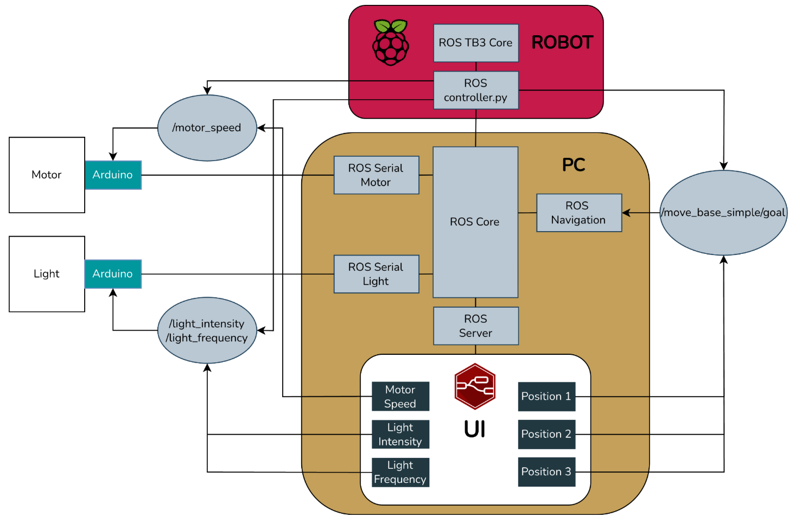
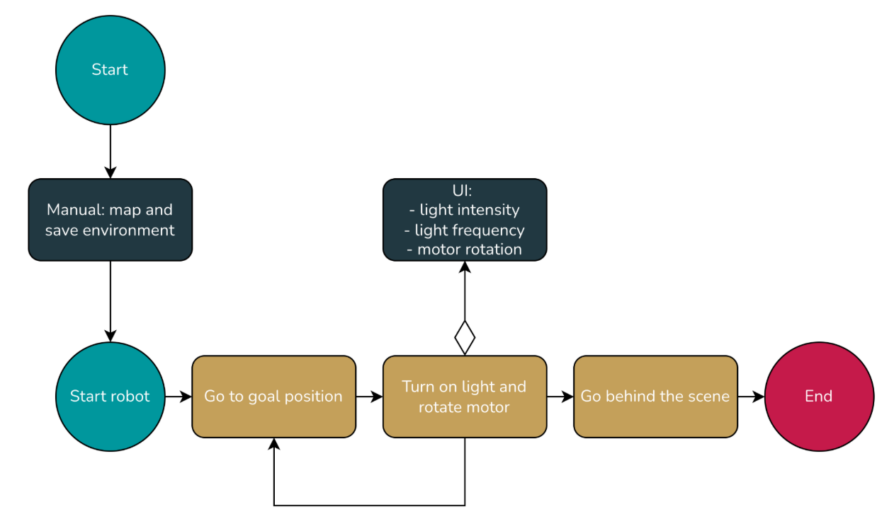
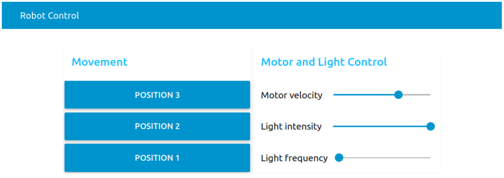
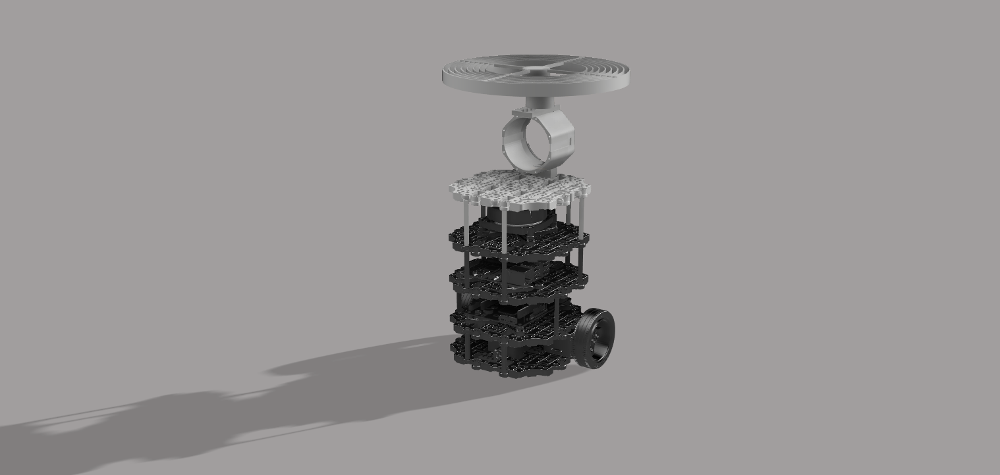
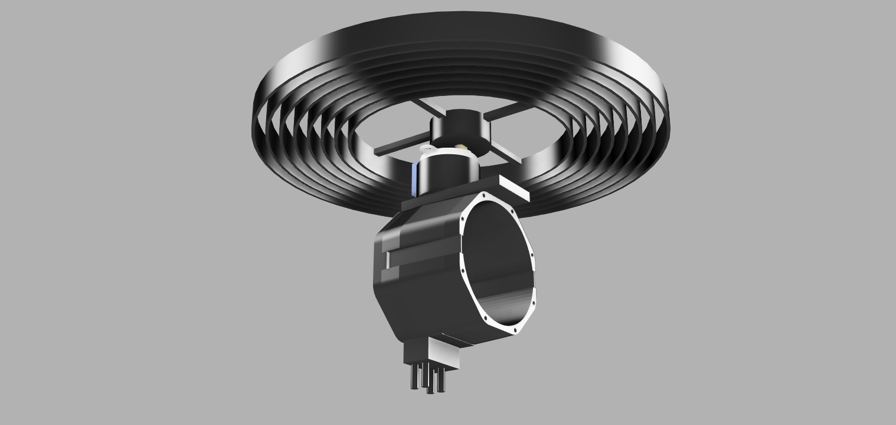
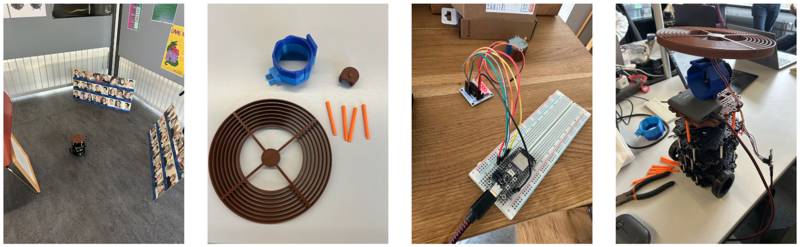
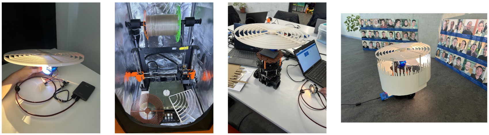
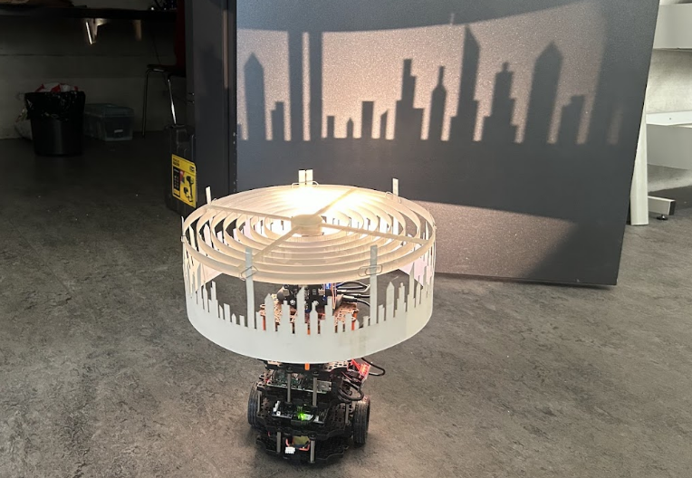

# Abstract

This project presents the design and implementation of a robotic scenographic system developed for a theatrical performance set on a train journey. Using a TurtleBot Burger, programmable lighting, and digitally fabricated components, the system projects dynamic shadows to simulate the perception of movement on stage. The project combines autonomous robot navigation, interactive control interfaces, and custom mechanical structures created through 3D printing and laser cutting. The result is a flexible and controllable scenic element that enhances the visual narrative of the performance through light and motion.

# Documentation

The instructions provide information on how to get started, install all dependencies, and how to set up the robot. 

- [Instructions](docs/instructions.md)
- [Hardware](docs/hardware.md)

# Introduction

The objective of the project was to contribute to a stage performance through a technological element that enhances the visual narrative without interfering with the physical constraints of the play.

The theatrical piece is set during a train journey and is performed by a single actress who remains physically fixed to the stage, moving only from the ankles upwards. This limitation motivated the search for an alternative way to convey motion and spatial progression. To address this challenge, a TurtleBot Burger was adapted and extended with custom hardware to generate dynamic light and shadow effects on stage, simulating the changing landscape seen from a train window.

The project combines autonomous robot navigation, interactive control systems, and custom-designed mechanical components produced using 3D printing and laser cutting. Together, these elements form a flexible scenographic system capable of adapting to different moments of the performance and reinforcing the theatrical atmosphere through light, motion, and shadows.

## Concept

The core concept of the project is the use of moving shadows to suggest the sensation of travel and continuous motion within a static stage environment. By projecting silhouettes of external elements such as buildings, trees, or light poles, the system recreates the visual experience of observing the outside world through a train window.

This effect is achieved by mounting a programmable light source and a rotating structure with interchangeable silhouettes on top of a mobile robot. As the circular structure rotates, the projected shadows move across the stage, creating the illusion of a passing landscape. The distance between the light source and the silhouettes can be modified, allowing different shadow scales and visual depths.

This approach was particularly well suited to the play, as it adds dynamism to the scene without requiring additional actors or complex stage mechanisms. The robotic system remains in the background while its visual impact supports the narrative, reinforcing the idea of movement and transition that is central to the story.

## Organisation

The project was carried out by a team of two students. Due to living far from each other, in-person meetings outside scheduled class time were limited. As a result, a structured and continuous communication workflow was established.

Each week, during the class session, both team members shared and discussed the progress made individually throughout the previous week. After reviewing the current state of the project, development continued collaboratively during the class. At the end of each session, specific tasks were assigned to be completed before the following week.

In addition, any complications, technical issues, or new ideas that arose during the week were communicated via phone. When physical presence was required, such as for hardware assembly or testing, meetings were arranged before class sessions to work together on-site. This organization allowed the project to progress efficiently despite the physical distance between team members.

# System Design

Communication between electronic parts was handled wirelessly using the Robot Operating System (ROS).

The light has an integrated Arduino. The stepper motor was connected through a driver to another Arduino. Both Arduinos could be configured to connect to WiFi. On both of them a ROS package was installed, which allowed serialized communication with ROS Core running on a laptop. The light is configurable in two ways: the intensity can be adjusted, and it can be made to blink at different frequencies. For the motor, the speed and direction of rotation is configurable. 

Sending commands to the light and motor can be done via ROS commands through the CLI, or via Python code, or via a Node-RED interface. The team members ended up using the Node-RED interface as it is most flexible and easy to set up. The auto-generated Node-RED config for the final interface can be found [here](node-red/interface.json).

The code for the light Arduino can be found [here](arduino/light_ros/light_ros.ino) and the code for the motor Arduino [here](arduino/motor_ros/motor_ros.ino).

An attempt was made to make the robot fully autonomous via Python code. The code is not fully tested / functional, but can be found [here](src/turtlebot3_profab/scripts/controller.py). The launch script for the controller can be found [here](src/turtlebot3_profab/launch/controller.launch).

Mapping the environment and localizing the robot still need to be done manually. Instructions for how to do so and for many other commands can be found in the [docs](docs/instructions.md). The [makefile](makefile) provides shortcuts for many commonly used commands. 

## System Architecture

The intelligence and control center of the robot is located on the laptop. There are several ROS nodes running on the laptop:

- ROS core — in charge of coordination between all the nodes. 
- ROS serial nodes - to allow serial communication between the Arduinos and the ROS language.
- ROS server - is a bridge to allow communication between ROS core and Node-RED
- ROS navigation - in charge of coordinating robot navigation and going to goal poses using a predefined map. 

During the mapping and localization phase of the robot the following other nodes are also used:

- ROS slam - to use the lidar and create a map of the environment
- ROS teleop - to allow remote control of the robot using keyboard keys
- ROS gazebo - to run the robot in a simulation environment

The robot has a core ROS node that enables its basic functionalty and optionally a controller that allows it to navigate autonomously. 

There are ROS topics for goal navigation, motor speed control, as well as light intensity and blinking control. 

  

## Robot Flow

The flow of the robot for the project is as follows. First the environment is mapped and saved manually. Then, using the RVIZ interface the coordinates of three goal poses are obtained, which are inserted into the Node-RED UI. Then the robot is launched and one of the goal poses is chosen in the UI. In response, the robot will move to the defined pose. Once there, the light and motor are manually turned on which starts the projection of the shadow scene onto the background. The light intensity, blinking frequency, and motor rotation speed can all be adjusted. Once the play is over, the robot goes back behind the scene.

  

## Interface

Light, motor and robot position control all happen through a Node-RED interface that talks to the respective components via ROS topics. The three positions define goal poses and, when clicked, send the robot in front of one of the scenes to project the shadow. 

  

# Hardware Designs

Several custom components were required to support the lighting system, the rotating shadow mechanism, and the additional electronics while maintaining stability and modularity.
Digital fabrication tools played a key role in this process. 3D printing was used to create structural and mechanical supports, while the laser cutting machine was employed to produce the shadow silhouettes and flat components. These techniques allowed for rapid iteration, precise customization, and easy adaptation of the system to the requirements of the performance.

## 3D Printing

3D printing was used to fabricate all custom structural components required to extend the TurtleBot Burger and integrate the lighting and shadow projection system. These parts were designed to be modular, lightweight, and easy to assemble, allowing the system to be mounted securely on top of the robot without interfering with its original structure or sensors.

The printed components include an additional base, support structures for the programmable light, and a vertical mount to hold the stepper motor responsible for rotating the shadow element. The light support was designed with multiple mounting positions on the base, enabling adjustments to its height and placement. Similarly, the motor could be mounted in different positions on the light support, providing flexibility in the overall configuration.
The rotating piece placed above the motor was also designed with several concentric positions to attach silhouette elements. This modular arrangement makes it possible to vary the distance between the light source and the silhouettes, which is a key aspect of the system. Adjusting this distance significantly affects the resulting shadows, influencing their size, sharpness, and overall visual appearance. This flexibility allows the system to adapt to different silhouettes and stage scenarios, producing distinct visual effects depending on the desired atmosphere.

In the image of the left, the custom 3D-printed components can be seen assembled on the TurtleBot Burger. The printed parts are shown in white, clearly distinguishable from the original robot components, which are black. This contrast highlights the added structures and their integration with the existing platform.

The right image shows only the 3D-printed parts prior to assembly. This view emphasizes the modular nature of the design and the variety of supports created to accommodate the different hardware elements. The use of 3D printing allowed rapid prototyping and iterative refinement of these components throughout the development process.

  
  

## Laser Cutting Machine

The laser cutting machine was used to fabricate the silhouette elements responsible for generating the projected shadows. For this purpose, it was necessary to select a material that was lightweight and easy to cut, while also being more resistant and stable than standard paper. A paper with higher grammage than a regular sheet was chosen, as it provided the required balance between rigidity, durability, and low weight.

The silhouettes were designed digitally and then cut using the laser cutting machine. This approach was significantly more efficient and less costly in terms of time and effort than manual cutting. Once the designs were prepared, the fabrication process was straightforward and easily repeatable.

One of the main reasons for using laser cutting was the high level of precision and the clean edges it provides. This aspect was especially important for the project, as small imperfections in the silhouettes become highly noticeable when projected as shadows. Clean and accurate cuts resulted in sharper, more defined shadows, directly improving the visual quality of the final scenographic effect.

  

# Process

The development of the project followed an iterative process that combined research, hardware fabrication, and software implementation.

The first step consisted of evaluating the feasibility of the initial idea. This phase focused mainly on researching the type of motor required for the rotating shadow mechanism. It was determined that a stepper motor was more suitable than a servo motor due to the need for continuous and controllable rotation. In parallel, different lighting solutions were explored in order to generate clear and defined shadows. This issue was later solved when suitable programmable lights were provided. Additionally, initial tests with 3D printing were carried out, revealing that printing components was time-consuming and required careful planning to avoid delays.

After this initial research phase, a basic planning stage was carried out to ensure that all project deadlines could be met while accounting for possible setbacks. The fabrication of 3D-printed components was prioritized, as multiple iterations were expected due to potential design errors or failed prints. Furthermore, several of these components were essential to begin testing the robot in real conditions.

The first parts to be designed and printed were the additional base for the robot and the initial support structures. While these components were being printed, work began on the implementation of the robot’s navigation and mapping system, allowing progress on both hardware and software in parallel.

At a later stage, once the stepper motor and the lighting system were available, the design and printing of the light support, the motor mount, and the rotating piece for holding the silhouettes were carried out. During this period, the control code for the stepper motor and the programmable light was developed and tested independently.

  

With these components printed and assembled, the system was tested as a whole, which led to the identification of several issues. The main problem was that the initial rotating piece was too small, causing the silhouettes to be positioned too close to the light source and resulting in poor shadow quality. To address this issue, a new and larger rotating piece was designed and printed. At the same time, development of the user interface continued, and the overall software was automated to allow the entire system to be executed easily, enabling any user to control the robot through the interface without technical knowledge.

  

Finally, once all components were correctly fabricated, assembled, and integrated, the last phase focused on fine-tuning the system. Multiple simulations and tests were performed to determine the most effective configurations for rotation speed, light intensity, and distance between the light source and the silhouettes, ensuring the best visual results for the stage performance.

  

# Challenges

One of the first challenges was the selection of the appropriate motor for the rotating shadow mechanism. The system required a motor capable of rotating continuously in both directions without limitation. A servo motor was not suitable for this purpose, as it can only rotate within a fixed angular range. After researching different options, a stepper motor was selected, as it allows precise and unlimited rotation control. However, finding a stepper motor compatible with Arduino and with low power requirements introduced additional constraints. To meet these requirements, the use of a motor driver was necessary, adding complexity to both the hardware setup and the software control.

Another major challenge was achieving the correct alignment between the light source and the silhouettes to obtain high-quality shadow projections. Depending on the type of silhouettes used and the specific stage configuration, the required distances and sizes varied significantly. Finding an optimal configuration through trial and error would have been inefficient and costly. To address this, several adjustable components were incorporated into the robot design. The light support could be mounted in different positions on the base, allowing the light to be placed either at the center or offset from it. The motor could also be positioned at varying distances relative to the light source, depending on whether the rotating element needed to align centrally or not. Finally, the rotating piece itself featured multiple concentric positions for attaching silhouettes, enabling fine control over the distance between the light and the silhouettes. Although this approach increased the complexity of the mechanical design, it significantly reduced printing time and material waste while providing great flexibility and precise shadow control.

The fabrication of the rotating piece presented an additional challenge. The initial design was too small, resulting in silhouettes being placed too close to the light source and producing poor shadow quality. When redesigning the piece at a larger scale, the 3D printer was unable to print it as a single component due to size limitations. To overcome this, the rotating piece was redesigned as a modular structure composed of six interlocking parts. This solution ensured sufficient size while maintaining structural robustness and low weight. Careful attention was given to weight distribution, as uneven mass or imprecise assembly could cause imbalance during rotation, negatively affecting the shadow effect. The modular design allowed precise assembly without excessive use of adhesive, minimizing the risk of imbalance.

Finally, several challenges were encountered during software execution and system integration. At times, the robot failed to connect correctly, localization was inaccurate, or the motor and light systems stopped responding. Through iterative debugging, it became clear that the order in which different components and processes were executed was critical. Additionally, maintaining a consistent stage setup after the environment had been mapped proved essential, as any change affected localization accuracy. Ensuring stable power connections, particularly avoiding disconnections of the motor or light once integrated with the ROS system, was also identified as a key factor for reliable operation.

# Future Work

One potential improvement is the ability to project multiple static scenes without the need to change silhouettes manually and without relying on continuous motion. This could be achieved by designing a single rotating disc containing several static scenes distributed along its diameter. In this configuration, the robot would move to a specific position on the stage and project a selected scene. When a scene change is required, the rotating piece would rotate by a small, controlled angle to align a different scene with the light source. This approach would allow multiple scenes to be stored on the robot and displayed sequentially through minimal rotation.

Another possible extension is the creation of two concurrent scenes with a parallax effect. In this scenario, two different silhouette layers would rotate in opposite directions, generating a greater sense of depth and visual complexity. Achieving this effect would require the integration of an additional motor and a modification of the robot’s mechanical structure to allow both rotating elements to move independently while keeping the light source fixed. This enhancement could significantly enrich the visual language of the system and open new creative possibilities for stage design.

# Conclusions

This project demonstrates how robotics and digital fabrication can be effectively applied to a theatrical and scenographic context. By combining autonomous robot navigation, programmable lighting, and custom-fabricated mechanical components, it was possible to create a dynamic visual system that enhances the narrative of the performance without adding physical actors or complex stage machinery.

The use of shadows as a primary visual element proved to be a suitable solution for conveying movement in a constrained stage environment. The modular and adjustable design of the hardware allowed the system to adapt to different silhouettes, lighting conditions, and stage configurations, highlighting the importance of flexibility in prototyping for artistic applications.

Throughout the development process, the project emphasized iterative design, problem-solving, and the integration of hardware and software. Challenges related to motor selection, fabrication constraints, and system reliability provided valuable insights into the practical limitations and considerations of working with robotic platforms in real-world scenarios.

Overall, the project successfully met its objectives and illustrates the potential of repurposing robotic systems as expressive tools in performance and learning environments. The resulting system offers a solid foundation for future extensions and further exploration of robotics as a medium for artistic expression.

# Appendix

The original git repo can be found at https://github.com/Benji19967/unifr_profab_learninglab
