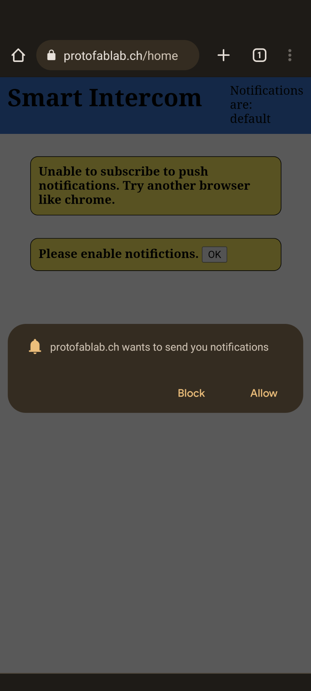

# Smart Intercom

_Turn an existing intercom into a smarter one._

---

When renting a flat or apartment, the pre-installed intercom system is often very basic and does not support any interesting features. Our `smart intercom` is a device that can be placed **on top of an existing intercom system** and add smart features to it.

The smart intercom device is able to detect the doorbell and will send a push notification to a registered browser application, that can also be used on a mobile phone. The user is then able to trigger the opening of the door in this application.


## Intercom System - ESP32 Feather

The smart intercom device itself is an `ESP32 Feather` equipped with a sound sensor, a servo motor and a battery. It is connected to a local Wi-Fi network to communicate with the server.

The doorbell detection algorithm runs on this device. If the ringing of the doorbell is detected, a message will be sent over MQTT to the server. The parameters of the algorithm can be configured to match different doorbells. The device listens for configuration changes on specific MQTT topics.

The smart intercom also listens for a command to open the door. In this case, the servo motor would be activated to press the button on the underlying intercom. This does not work in our prototype, since we were not able to integrate a working servo motor with the system.


The source code for the smart intercom device is located in the `arduino` subfolder.

Note that since we couldn't figure out how to make the servo motor work, there is no code that handles the pushing of the button, because we were not able to test it. Thus, the source code is mostly about **detecting the doorbell** and **handling MQTT messages**.

### Doorbell detection

We decided to detect the doorbell simply by detecting loud noises. This means we are not trying to recognize the waveform of the doorbell, so we must be careful not to detect random sounds, such as the door closing.

We faced multiple challenges when writing the detection algorithm. First, the input waveform has a variable [DC offset](https://en.wikipedia.org/wiki/DC_bias), depending on the gain. To overcome this, we compute the average amplitude over time, and we subtract this value from the amplitude. This makes the waveform centred around zero.


Another challenge: the sound is a waveform, but we can only read the current amplitude on each iteration. Because the input oscillates, we can't tell whether we are hearing a loud noise during a single iteration. Thus, we have to write an algorithm to detect the "maximum amplitude" over a short period of time, which gives us an approximation of the current **loudness level** of the sound.


We define 4 configurable parameters for our algorithm, so that it can be adjusted to work with different doorbells.

First, we have the **sample rate**, which specifies how many times we read the input every second. Then, the **bell amplitude** and **bell duration**, which define how loud and how long a sound should be to be considered as the doorbell sound. Finally, we have the **release time**, which specifies how fast we consider the loudness to decrease (this is called _drop rate_ in the web app).

This last parameter is helpful in cases where the doorbell sound isn't a steady sound, but rather multiple sounds with silences in between notes. By increasing the release time, we can make sure such doorbells get detected correctly.


### MQTT messages handling

We use MQTT to publish events and configure the device. The broker must be running on the Raspberry Pi (see next section) and be available in the local network area.

Right now, the only event published by the smart intercom device is the `bell_ringing` topic, which is set to `true` when the bell starts ringing and to `false` when it stops.

The device is subscribed to various topics that let the user configure the device and open the door remotely. These events are being published by the web API, which is also running on the Raspberry Pi.

| Topic           | Result                                                   | Possible values         |
| --------------- | -------------------------------------------------------- | ----------------------- |
| `door_action`   | Pushes the intercom button that opens the entrance door. | `open`                  |
| `sample_rate`   | Updates the bell duration (in Hz).                       | `1000`, `2000`, ...     |
| `bell_amp`      | Updates the bell amplitude (undefined units).            | `50`, `100`, `200`, ... |
| `bell_duration` | Updates the bell duration (in ms).                       | `500`, `1000`, ...      |
| `drop_rate`     | Updates the release time (amp/s).                        | `1000`, `2000`, ...     |

To make MQTT message handling easier, we wrote a wrapper class around the [Arduino MQTT client library](https://github.com/knolleary/pubsubclient), which automatically handles reconnections, and makes us able to subscribe to topics using lambda functions:

```cpp
mqtt.subscribe("bell_amp", [](char * val) { bellAmp = atof(val); });
mqtt.subscribe("bell_duration", [](char * val) { bellDuration = atof(val); });
```

### Setting up the device

To setup the smart intercom device, start by connecting the microphone module to the ESP32 Feather. In our case, we used the [MAX9814](https://www.adafruit.com/product/1713) module with the gain set to `Vdd` (40 dB), but other microphones and different gains should work just as well. The analog output must then be connected to the **A1** pin of the Arduino board.

Unfortunately, we were not able to connect and use the servo motor successfully, so we won't describe this step here.

In the `arduino` folder, open the `arduino.ino` file with Arduino IDE. Set the string constants at the beginning of the source file to your Wi-Fi and MQTT credentials (the ones that start with `WIFI_` and `MQTT_`). Then plug the ESP32 Feather to your computer and upload the code.

Once done, unplug the board from the computer and plug it to a portable battery. Set it up in such a way that the microphone is as close to doorbell speaker as possible. The device is now ready to operate.

## Server - Raspberry Pi

A `Raspberry Pi`, located in the same local network as the intercom, acts as the server. It hosts the web application and its database and also the MQTT broker to communicate with the intercom.

The different parts of the server are containerized. They are built and run using `docker-compose`. The following containers exist:

- Web API
  - A Node.js application providing a REST API for the web application using [koa.js](https://koajs.com/).
  - Communicates with the intercom over MQTT.
  - Sends push notifications to the web application using [Web Push](https://web.dev/notifications/).
  - Runs on local port `3000`.
- Database
  - A PostgreSQL database running on the local port `5432`. It is only being used by the API application.
- Nginx
  - Serves the pre-built angular web application on ports `80` and `443`.
  - Redirects requests to https://protofablab.ch/api to the web API application.
- MQTT
  - The MQTT broker running on port `1883`, available on the local network.
  - Used by intercom and web API application.
- Certbot
  - Is only used initially to generate the SSL certificate for the web application.

### Web API

The API application handles all the REST-requests from the web application running in the browser on a mobile phone or another computer. The following endpoints are provided:

| Endpoint              | Method | Description                                                                                                        |
| --------------------- | ------ | ------------------------------------------------------------------------------------------------------------------ |
| /api/ping             | GET    | Ping application to check availability Only used for debugging.                                                    |
| /api/pushsubscription | POST   | Save a PushSubscription for receiving Web Push notifications to the database.                                      |
| /api/notify           | POST   | Endpoint to send a message to all notification subscribers. Only used for debugging.                               |
| /api/doorbell         | GET    | Get the date of the last detected doorbell ringing. Returns with status code 404 if no such event occured.         |
| /api/door             | POST   | Send a door action to the smart intercom device. The smart intercom only supports the action `open` at the moment. |
| /api/sensorconfig     | GET    | Get the values of the current configuration of the doorbell detection algorithm.                                   |
| /api/sensorconfig     | POST   | Override the configuration of the doorbell detection algorithm.                                                    |

The application is subscribed to the MQTT topic `bell_ringing`. If it receives a message on this topic, the event is saved to the database and a notification is sent to each device with a valid notification subscription.

### Web application

The code for the web application is located in the `smart-intercom-ui` subfolder. The UI application itself is a very basic [Angular 12](https://angular.io/) app with only two different pages.

Angular uses the [Node Package Manager (NPM)](https://www.npmjs.com/) and has a lot of dependencies. The step `npm install`, which installs all the dependencies of the project takes a very long time on the Raspberry Pi. For this reason the application is pre-built in the folder `smart-intercom-ui/ui-dist`, so it does not have to be built directly on the Raspberry Pi.

### Installation

To install the smart intercom on the raspberry, first prepare the pi by following these chapters of the [Raspberry Pi Tutorial](../../topics/02_raspPI/README.md):

- Write Image to SD-Card
- Connect to your raspberry pi
- Port forwarding
- DNS setup

After that, follow [these steps](./PI_SETUP.md).

## Using the smart intercom

After setting up the smart intercom device and the Raspberry Pi, the web application can be accessed from your phone at https://protofablab.ch (or your chosen domain).

It was only tested using Chrome, but other browsers might also work. The most restricting factor for the choice of browser, is [support of the Web Push API](https://caniuse.com/push-api).

First, the permission to display notifications has to be granted. A pop-up to allow this should appear automatically when first visiting the site. If it does not, it might be necessary to reset the granted permissions for the website.



After giving the necessary permission to the web application. Your phone is now ready to receive a push notification, when the doorbell detection is triggered. This will look like this:


On the main screen of the application, it is now possible to trigger the door opening mechanis by pressing the `Open door` button.

It is also possible to configure the doorbell detection algorithm directly from the web application. The configuration menu can be accessed by pressing the `Configure` button.


## Current limitations

There are currently some limitations, that restrict the utility of the smart intercom.

### The servo motor isn't working

We were unable to get a working servo motor to push the door button. This might have been a problem with the `ESP32` or the motors themselves. Without this functionality the smart intercom is only able to notify us, when someone is at the door and we aren't home.

### Doorbell sound detection is not very accurate

Depending on the sound pattern of the doorbell, it might not be possible to configure the sound detection algorithm in satisfiable way. Also, loud noises near the smart intercom device might lead to false positives.

We could improve this by making the smart intercom device able to **recognise a recorded sound**, but this would surely be an even more challenging task.

### No authentication

Right now, the web application features no user authentication. This means, anybody could receive notifications when our doorbell rings and, far worse, would be able to open our front door, if a working servo motor would be installed.

This could be implemented in the web API, using basic authentication (username & password), or safer alternatives such as JSON web tokens. Clients should then sign in to be able to control the device remotely.

## Conclusion

Even though this project seemed easy enough to implement at first, we faced quite a few challenges, some of which we were unable to overcome. In fact, even things we supposed to be straightforward, such as using the servo motor, turned out to simply not work at all.

Detecting the doorbell successfully was also a time consuming task and required a lot of testing and graphing in order to understand what can be done with the (barely documented) microphone modules.

Fortunately, this was a project that was easy to build incrementally, which means we could quickly get a working prototype with minimal features at first, and slowly add more functionalities to it. In the end, even though we still could not open the door remotely, we still manage to setup a complex system, made up of many devices (Arduino board, Raspberry Pi, router, smartphone), that was able to operate over the Internet.
