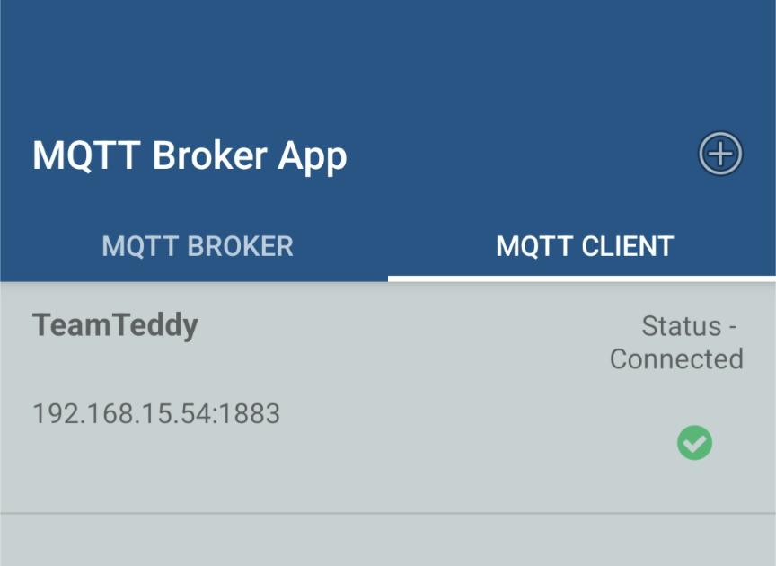
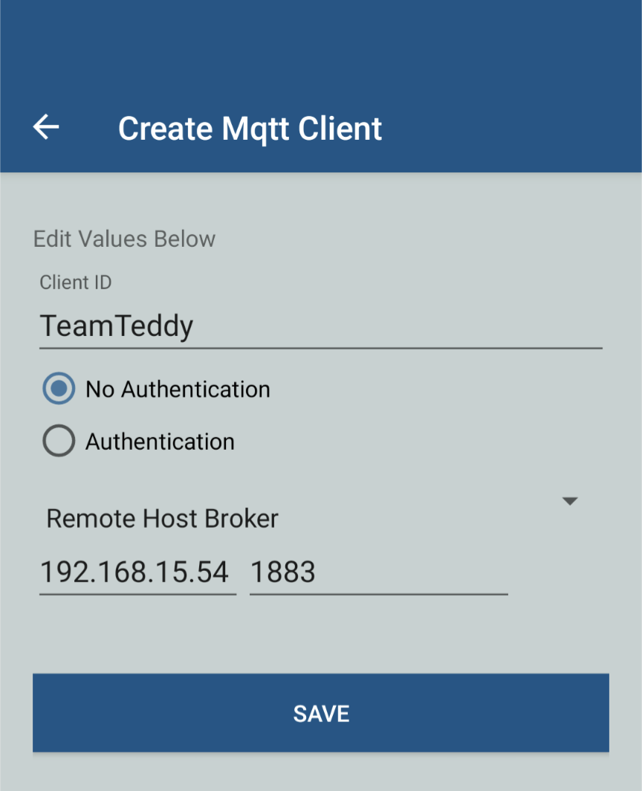
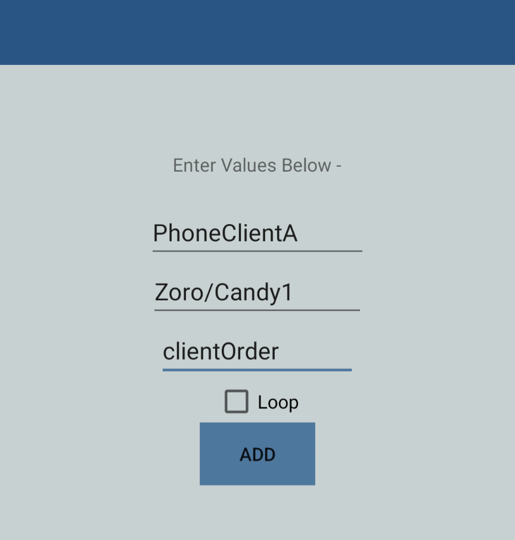
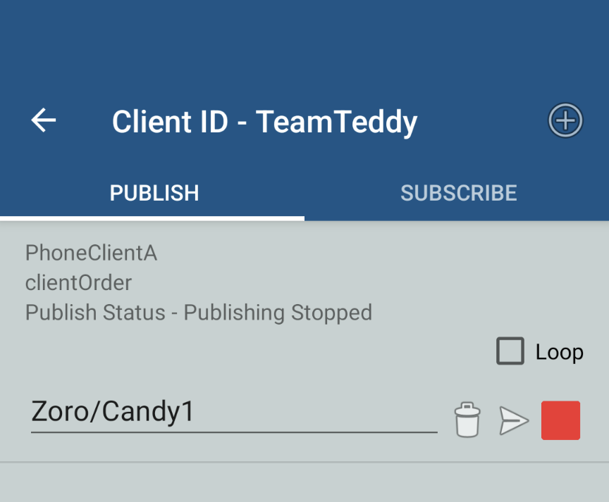

# Phone Communication with MQTT

Using the (MQTT Broker App)[https://play.google.com/store/apps/details?id=server.com.mqtt] v1.2 on a Google Pixle 4a, we use a prototype client interface to give a specific order from a given table.

Once the app is installed, we created an MQTT Client with IP and port of remote host broker:

	 
	<em>figure 1 : Android app's home page</em>
	 

	 
	<em>figure 2 : create client MQTT</em>
	 

Created the specific message to publish (value=Zoro/Candy1, topic=teddyCtrl):

	 
	<em>figure 3 : create publisher</em>
	 

	 
	<em>figure 4 : ready to publish</em>
	 

This prototype represents the skeleton needed for a real UI with buttons. This example helps to check if communication is established and how it works. The cosmetic of a real UI is left for future work.

