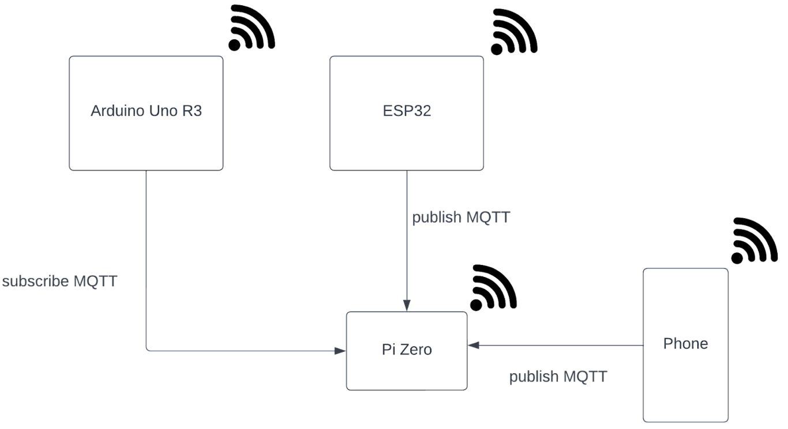
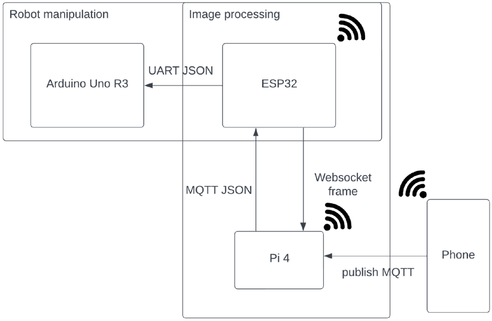
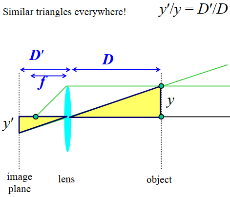
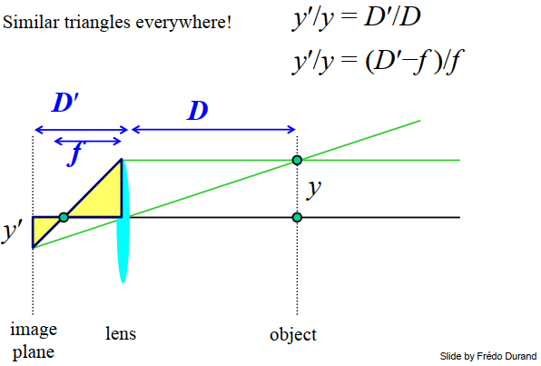
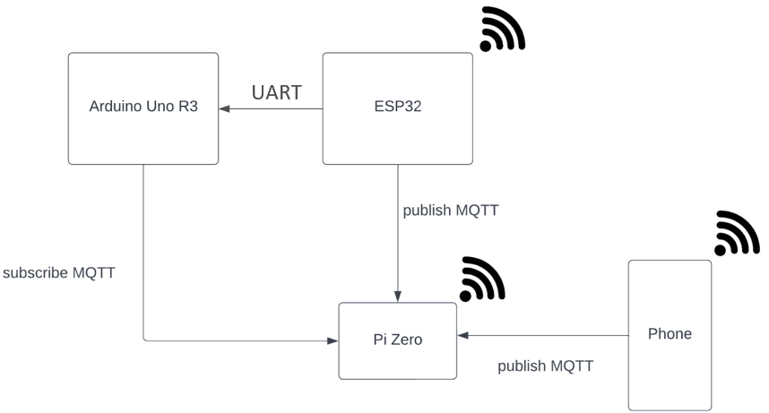

# Robot butler themed service
In this README page, we will go through the process and reflection of a 4-wheel robot project that introduces an initial automatisation of a waiter service in the particular context of a themed coffee.

## Idea behind the project
Our main idea would have been to have a butler robot that will move around thanks to black lines on the ground. There would be some gaps between the lines to indicate intersections in order to roam around and find its table.
For various reasons, we ended up with the following goal : a 4-wheeled motorized robot that will take from a dispenser a chosen snack from a customer and go find the table thanks to a face recognition algorithm.

We based our idea after having a robot kit that contained a camera. To explain a bit more our ideal use case : there will be 3 dispensers, 1 phone, 1 robot and 2 tables under the topic of a themed café. Via an MQTT publisher on their phone, a customer orders a snack and gives their table name, in this case, the name of the character that is assigned to the table. The robot handles the request, takes the food from the dispenser and goes to the table based on their camera and face recognition with the following mindset : it moves to a detection zone freely where we have assigned some error margin then moves its camera around to detect a face. Once the correct target is detected, the camera aims the face at its center of their field of view and then faces the target and moves towards it until a predefined distance. It will then indicate that it reached its target with some sound and will understand thanks to some sensor whether the snack was taken or not. It will then announce its leave and rollback to its initial place at an idle state if it has no pending commands. This will mean having to stack in queues the commands.

As we know, this is an idyllic goal for a 4 weeks project. Thus, we decided to go with incremental steps, by defining our wished big milestones we wanted to achieve: 
1. Make face recognition working
2. Handle communication protocols
3. Make phone command
4. Make robot moves (overall possibility to make it move)
5. Calculate target distance from center and target’s depth from robot
6. Make robot moves based on a certain command
7. Create robot’s states (idle:  wait to serve; serving: move to detection area, detect target, move to target, serve and wait ; finish serving: return to idle)
8. Create dispenser (only mechanical)
9. Create robot direction to dispenser and then go to the rest of the behavior to serve
10. Split choice for more than a dispenser
11. Create robot’s behavior based on table
12. Stacking orders
13. Sound effects
14. Sensor to wait until the food is taken

By doing so, we would have at least proven some steps were possible and achievable for the implementation of a motorized butler robot based on their camera direction. This will also help us to better define, whether this approach is a good idea or whether it should be redirected for an in-real life implementation.

Before the real implementation, we decided to make a small, representative scheme of our overall system. However, the actual implementation could result in a totally different one.

<p align="center">
	<br>
	<em>figure 1 : Schematic system's representation before implementation</em></p>

## Implementation
In this section, we will talk about how our idea was implemented and how far we were able to go from our initial goal.

Before digging into deeper details, it is relevant to mention our current components and kit in order to better grasp why some choices were redirected in a certain way. 
We decided to order a low-cost kit from [ELEGOO](https://www.elegoo.com/products/elegoo-smart-robot-car-kit-v-3-0-plus) which included an ESP32 WROVER and Arduino UNO R3 board. We also have in our possession a Raspberry Pi 4B. For each of these three boards, you can have more information on each if you click on the link that is located on their name:
- [Arduino UNO R3](./UNO/README.md): SmartRobotCar makes the robot move. It has an Arduino UNO R3 board, motors and sensors, no WIFI
- [ESP32](./ESP/README.md): ESP32 WROVER takes pictures. It has a camera, WIFI.
- [Pi](./Pi/README.md): Raspberry Pi 4B process data, communicates results back to ESP. It has WIFI

For this project, we also used a communication via MQTT on our phone and the details about it could be found under [its section](./Phone/README.md)

First and foremost, let us explain what we were able to implement at the end of our project. Once the global frame is settled, we will dig further into the two most important parts of the implementation process : the face recognition and communication protocols.

To begin with, we managed to sort out the Elegoo libraries and code to snippet the bits of the code that focused on only moving the DC motors and the servo motor. This gave us the overall possibility to make the robot moves however we would like it to without the need to use their implemented algorithm. 

We were then able to make a face recognition algorithm work via the WebCameraServer on the ESP32. However, the frame resolution needed to be really low and the frame quite small in order to have a fluid stream. We then shifted the computation to a PiZero with openCV and sent a continuous frame stream via a websocket. For bigger power, we shifted to a Pi4. The implementation of the face recognition as well as the websocket will be more deeply discussed here, but you can find more details for the Pi's use and concept under [its own section](./Pi).
Based on our initial scheme, we soon realized that more communication protocols would be established, such as an extra UART communication between the Arduino Uno R3 and the ESP32. Contrary to what we initially thought, this Arduino board actually does not have any wifi available. Those iterations resulted in the following scheme where we were able to handle all the communications quite stably.

<p align="center">
	<br>
	<em>figure 2 : Schematic system's representation after implementation</em></p>

We specified on the scheme that a JSON is being sent via MQTT and UART. It shows here where the packet is initially sent to and who is the real receiver. For this JSON, the ESP32 is being used as a middleware to communicate between the two boards. This scheme shows us that a phone was able to successfully connect itself to the broker that is being hosted by the Pi4 and is sending information, here the name of the target that defines the table where the customer is located. The JSON contains actually the depth between a recognized face and the camera, the name of the face and the offset on the x-axis based on the center of the frame and the center of the face. This JSON, that is sent to the Arduino, will actually trigger a method based on the name recognized, the one given by the customer and the offset value that will start to make the robot move its wheels or the camera.

Now that the overall system has been explained, we can focus on the 2 main parts of it.
### Face recognition
In order to compute facial recognition, we had the options between MediaPipe and OpenCV. We actually ended up prioritizing OpenCV as it is a lighter library that has less functionalities and possibilities rather than MediaPipe. However, we knew that having less features didn’t mean being easier to use, but it would have been easier for us to go through the documentation and the information. We also realized that a lot of documentation was available for OpenCV. This is why we leaned towards this option.
OpenCV is an Open Source Computer Vision library that will allow us to use already made methods and also pre-built configuration in order to compute our face recognition algorithm.
We won’t explain here the dependencies and installation process on the Pi, you can find it in [its section](./Pi). We also won’t be covering the exact algorithm explanation used with OpenCV as it goes outside the reach and needs of this project. However, their [documentation](https://docs.opencv.org/3.4/da/d60/tutorial_face_main.html) covers this topic well if wanted.
We decided to go for a pre-built version where we modified the face_recognition.py duplicata with our needs. We also looked at the [package documentation](https://face-recognition.readthedocs.io/en/latest/face_recognition.html) as well as the [api](https://face-recognition.readthedocs.io/en/latest/_modules/face_recognition/api.html) to have a better grasp of the methods’ meanings and use.
As we are continuously receiving a stream of frame from the ESP32, we actually didn’t need to capture any images. Rather, we needed to decode the received buffer into a suitable, working for the rest of the computation.

The method ```cv.imdecode()``` is actually [reading a image from a buffer](https://docs.opencv.org/3.4/d4/da8/group__imgcodecs.html).

Based on that, we took the data of our message in the decode method and assign it to a variable frame in order to use it for the rest of the computation : 
```python
frame = cv2.imdecode(np.frombuffer(msg.data, np.uint8), 1)
```

We then use two different computation on the frame : [face landmark](https://datagen.tech/guides/face-recognition/facial-landmarks/), to have facial feature locations in order to calculate the depth and the center of the face and face location and encodings : one to surround a face with a bounding box and the other to compute facial features distinctions in order to distinguish people’s faces.

```python
boxes = face_recognition.face_locations(frame)
```
```python
encodings = face_recognition.face_encodings(frame, boxes)
```
```python
face_landmarks_list = face_recognition.face_landmarks(frame)
```

Every one of those variables are actually an array of values, the more faces there will be in the frame, the greater the array.
#### Face landmark
To begin with the face landmark : we took inspiration on a [tutorial](https://www.youtube.com/watch?v=jsoe1M2AjFk) that explained how to compare the proportional difference between a fixed, in real life constant and the one in the frame. It explained that the eye offset is an almost constant feature on people’s face and it’s generally 62[mm] for women and 64[mm] for men. Thus, we decided to put this eye distance as 63[mm] as it’s the average. 
We do not need precise measurements as it won’t significantly impact the result.
In order to have the most accurate point for the center of each eye, we looked at the enumeration of the facial mesh points and decided to take the inner and outer corner of the eye. The center would be defined as the iris.

> *NB* :  we shouldn’t forget that the face_landmark is a dictionary. Thus we need to assign for each of the features their respective array.

```python
left_eye = np.array(face_landmark['left_eye'])
right_eye = np.array(face_landmark['right_eye'])
nose_bridge = np.array(face_landmark['nose_bridge'])
nose_tip = np.array(face_landmark['nose_tip'])
```

The computation for the center that will lead to two sets of coordinates of the left and right are is the following :
```python
midPoint_left_eye = ((left_eye[0][0]+left_eye[3][0])/2, (left_eye[0][1]+left_eye[3][1])/2)
midPoint_right_eye = ((right_eye[0][0]+right_eye[3][0])/2, (right_eye[0][1]+right_eye[3][1])/2)
```

Here, the corners have indexes that are specific to the list where they were contained in the dictionary. This is why their indexes don’t match with the numbers in the picture. However, you have more indication in the method that lets you interpret which point matches to which.

After having the two points that will serve as a depth calculator, we will also find the center of our face. Theoretically, we could only take the tip of the nose. But for a stronger algorithm and precision, we decided to average multiple points on the nose bridge : actually the whole column with the nose tip and corners.

> NB : we only took the value for the x axis as we only need to know the offset in x in order to center the face, so the offset will be a single variable and not a vector. It is also important to note that the layout information is based with the center of the coordinate system at the top left of the frame, we will need to recenter it by subtracting the width of the frame.

```python
## calculate averaging for nose that will be considered as center of the face. NB, only x is taken in account, no need to have Y centered
# to have as if the axis was in the middle, take frame width and subtract the position of nose
sumPosXY = nose_bridge.sum(axis = 0) + nose_tip[0] + nose_tip[2] + nose_tip[4]
totalElement = nose_bridge.shape[0] + 3
```
```python
xPos = frameWidth - sumPosXY[0]/totalElement
```

As we do not need to have too many decimals after the coma and also for computation length reasons, we rounded the two coordinates for the center of the eyes.

We then, based on the computation of the thin lens formula, we managed to isolate the required formula where $D$, the distance, is the variable that we are searching to compute : $D = \frac{f*(y’+y)}{y’}$

<p align="center">
	<br>
	<em>figure 3 : Thin Lens Formula triangles for equation n°1</em>
  <br><em>Source: computer vision course from Prof FAVARO lecture 2a on camera</p>
<p align="center">
	<br>
	<em>figure 4 : SThin Lens Formula triangles for equation n°2</em>
  <br><em>Source: computer vision course from Prof FAVARO lecture 2a on camera</p>

Here is the graphical explanation on how to determine the equalities between the multiples triangles that form each length. In our code, the $y’$ represent the  ```w```, the computed eye distance in the frame and  $y$ the  ```W```, the constant of the in real life eye distance. The D’ is the focus distance, the distance between the lens and where the image is reflected. The focal length f is the distance between the sensor and the lens. We assume knowing $y’$, $y$ and $f$. We want to find $D$ and need to substitute $D’$ with the known variables in order to have the final equation. Thus we computed the following formula : 

**Equation n°1**
$${\frac{y’}{y}} = {\frac{D’}{D}} \Leftrightarrow D = \frac{D’y}{y}$$
On the equation n°1, we wish to isolate the only occurrence of our depth $D$

**Equation n°2**
$${\frac{y’}{y}} = {\frac{D’-f}{f}} \Leftrightarrow  {\frac{y’f}{y}} = {D’-f} \Leftrightarrow D’ = {\frac{y’f}{y}+f}$$
On the equation n°2, our only unknown value is $D’$, this is why we try to isolate it in order to inject the equation n°2 in the n°1. It will give us a third equation : 
$$D = {\frac{{\frac{y’f}{y}+f}y}{y}} \Leftrightarrow D = {\frac{y’f+yf}{y’}} \Leftrightarrow D = {\frac{f(y’+y)f}{y’}}$$

We firstly assume to know the constant f in order to find the correct formula for our depth computation, however it is not the case with our ESP32 WROVER. For the first iteration, we locked the distance to a predefined D and measured the result of f that will come out when we isolate it from the equation n°3 as the following : $f = \frac{Dy’}{y’+y}$. We then hardcoded the f into our computation and put back the original formula in n°3., which means we have 
$$D = \frac{f(W+w)}{w}$$
#### Face encodings
For the face encodings, we actually haven’t done so much beside taking the pre-built file. Indeed, there is already a method called ```compare_faces()```, that checks if there are any matches between every face in the frame and the trained models in the datasets. If so, the label under the face’s name is changed to the name they belong to, otherwise, it stays “unknown”. 
We store all of the values to call them in the loop for the JSON string creation.

### Communication protocol
We describe in this section the three protocols used in our communication and give an overall code snippet in the end.

#### MQTT
In the context of a themed cafe, the client sends her order with her table location to the robot. For such light communications, we opted for the MQTT protocol. The broker is set up on the Pi4 using the mosquitto package and [paho-mqtt library](https://pypi.org/project/paho-mqtt/). The phone app is used to publish onto a given topic, say clientOrder, the table where the user is and which is the target toward which the robot will go. 

After receiving the frame from the ESP32 (c.f. WebSocket section below), the Pi4 analyzes the frame to 
1. Recognize face
2. Compute the depth at which the recognized face is
3. Compute an horizontal offset to know in which direction to move to arrive at its target. Then, the Pi4 publishes the result of faces recognized, onto a topic, say teddyCtrl, as a JSON-formatted string. 

The ESP32 on its end will have subscribed to the teddyCtrl topic to receive the JSON information. This back-and-forth communication between the Pi4 and ESP32 using WebSocket and MQTT comes from the Arduino’s limitation of having no WiFi.

#### Websocket
As the robot navigates toward its end goal, we want to send the frames captured by the camera of the ESP32 to the Pi4 for image processing, in constant communication. While we will use MQTT for lighter communication, WebSocket is ideal for this real-time purpose of image transfer. On the Pi4, the protocol is implemented using the [aiohttp library](https://docs.aiohttp.org/en/stable/). On the ESP32, [WebSocket](https://github.com/Links2004/arduinoWebSockets) is used.

#### UART
To overcome the missing WiFi on the Arduino, the EPS32 forwards the JSON to the Arduino via UART - a connection already wired in our robot kit. This JSON contains information that the Arduino will use to redirect the robot toward its target and adjust its course.
#### JSON construction and deserialization
The Pi creates a string in the form of a JSON and publishes it such that the ESP32 can receive it, transform it and transfer it further to the Arduino. Finally, the Arduino deserializes it and extracts the relevant information to instruct further behavior control onto the robot.
#### Code snippets
We regrouped the code snippets from the different boards to give an overall view of the communication:

```c++
// 1) Pi4 Creates a JSON-formatted string
stringJSON_data += "\""+ str(indexPerson) + "\":{\"xPos\":" + str(int(xPosList[indexPerson])) + ",\"depth\":" + str(int(depthList[indexPerson])) + ",\"name\":\"" + currentname + "\"},"

// 2) Pi4 Sends string via MQTT to ESP32
mqtt_return = clientMQTT.publish(mqttTopic, stringJSON_data)

// 3) ESP32 subscribe to the topic
client.subscribe(mqtt_topic);

// 4) ESP32 receives payload and format it for UART communication
void callback(char* topic, byte* payload, unsigned int length){
  String totalMessage = "";

  totalMessage += "{\"";
  totalMessage += topic;
  totalMessage += "\":";
  
  for (int i=0;i<length;i++) {
    char receivedChar = (char)payload[i];
    totalMessage += receivedChar;
  }
  totalMessage += "}";
  Set_MessageMQTT(totalMessage);  // setter for local variable
}

// 5) ESP32 sends data to Arduino via UART
Serial2.print(messageMQTT);

// 6) Arduino receives the data via UART
DeserializationError error = deserializeJson(doc, Serial, DeserializationOption::Filter(filter)); //Deserialize JSON data from the serial data buffer
```

## Technical issues and overcomings
Because of the project’s scope and its hardware, we faced many technical issues related to software and hardware. We don’t discuss all of them on this page. Thus, in this section we will focus on the problems related to the communication protocols and the face recognition as they are one of the cores of our project and those problems can be projected to a broader scope than this actual topic.
### MQTT communication
#### Problem
We had two main problems for the MQTT communication.
The first one was that the mosquitto server had a running problem : the process wouldn’t be killed properly, so when we launched it again, it would give us a handshake error saying that the server was already in use.
The second was that the response was really slow when we tried to subscribe, publish and use the PiZero as a broker.
#### Solution
It turns out, quite obviously, that our PiZero was overwhelmed with all the tasks. Thus, upgrading the board to a Pi 4B changed the whole thing. As the code often crashed on the Pi Zero due to a too high demand of computation power, the process wasn’t able to end properly and wouldn’t respond anymore. That goes the same for the pub/sub notification, as the whole process wasn’t responding anymore, the Pi Zero couldn’t handle any more requests nor couldn’t it update the pending pushes.
### Websocket communication
#### Problem
Our first problem in the websocket communication was the way to send our frame data from the ESP32. The packages were corrupted on arrival in the Pi, it had some overflow after 3 sendings, the handshake was often lost and even the ESP32 had some core error.
The second problem was on the Pi side : we weren’t able to properly unpack the buffer and transform the array into a readable frame again. It was again because of the corrupted package and then because it wasn’t a suitable type for the method ```cv.imread()```
#### Solution
To send data from an ESP32, we downloaded the WebSocket library and got inspiration on their [github](https://github.com/Links2004/arduinoWebSockets/blob/master/examples/esp32/WebSocketClient/WebSocketClient.ino) to implement it on our project. This is where we realized that there were three types of way to send data : by text, binary or ping. As we are continuously sending big data buffers, we opted for the binary way as it is [lighter](https://stackoverflow.com/questions/7730260/binary-vs-string-transfer-over-a-stream) and would reduce the runtime of our code.
We then encountered some handshake problems because the ESP32 was still launching in the background its method for the face recognition using a webpage. Thus, the port was already taken and wouldn’t connect to the Pi.
As we wanted to check what was being sent, we put multiple delays to reduce the time of sendings. This ended up causing the loss of the handshake and the overflow after three sendings. As the communication was disturbed, it led to the ESP32 sending some corrupted packages and some core error from the program panicking between the need to keep the communication up but the constraint of a delay under certain circumstances.

On the Pi side, once the corrupted packages problem was resolved, we realized that we could use a OpenCV method to transform our data into the type of array buffer needed as a parameter in the ```cv.imread()```. This method is called ```cv.decode``` where we directly inject the message data received from the websocket communication.

### UART communication
#### Problem
The Arduino Uno R3 only has one serial connection available that is the ```Tx0``` and ```Rx0```, but the ESP32 WROVER has two of them. We wanted to establish one UART communication on a channel that will be specifically meant for that. However, the hardware of the Arduino doesn’t allow us to do so. 
We decided to create a new serial connection on Arduino thanks to a library called SoftwareSerial, that will allow us to create virtual pins ```Tx1``` and ```Rx1```. However, two issues arrived from this method : 
The Arduino board has a shield with very specific branches and it seems like most of them are allocated. There isn’t any explanation about the shield’s schematic anywhere in the Elegoo library.
The library isn’t compatible with the ESP32 so we can create the other hand of the communication channel
#### Solution
To overcome this problem, we firstly looked in the code and searched for every pin connection and established a list of the used and unused pins in the Elegoo SmartCar project they gave as a base.
Here is the following list for the used pins : $\lbrace 1,3,5,6,9,10,11,13,14,17 \rbrace$, with the pin 13 being the built-in LED. The unused ones were : $\lbrace 2,4,7,8,12,15,16,18,19,20 \rbrace$. With this exhaustive list, we decide to use the pins 7 and 8 that are compatible to be transformed into Tx1 and Rx1 pins. Indeed, you need digital pins in order to use the SoftwareSerial library. You can check the type of the pin in the schematic of the board or directly on the physical component.
After making the setup for the Arduino side, we decided to send information from the ESP32. For that, we also needed to use the SoftwareSerial on it for the communication to happen. However, this library isn’t supported by the board.

We ended up finding how the Elegoo was already sending its data from the ESP32 to the Arduino on one of the examples and got inspired by it. It ends up as 
- ESP32 has 2 serial channels : 1 that will serve as UART communication to the Arduino and 1 to print on the serial.
- Arduino Uno R3 will directly print what it receives as it has only serial connection available.

### Face recognition
#### Problem
Our main problem with the face recognition was that the FPS were really low, the computation in itself took a while but wasn’t the main issue.
#### Solution
We firstly used the Espressif face recognition that is available on our ESP32 WROVER and realized that the FPS was low on high quality and would only work a bit faster on really low resolution. This is one of the reasons why our whole implementation switched to the Pi as the core to the computation. But even there, from the Pi Zero to the Pi4 nothing drastically changed with OpenCV. We tried to optimize the algorithm by reducing useless information, refactoring and clearing the most time taking processes but it improves from 2 fps to ~10-12 fps at max, which is more than the double, but not enough. We even tried the OpenCV code on a computer with a built-in camera and the fps weren’t high enough, they were around 20 fps. We then switched to MediaPipe on the computer and it went to around 30 fps. We had a bit more hope and put the MediaPipe code on the Pi 4B. It appears that the MediaPipe isn’t compatible with the latest version of the Pi 4B configuration (Bullseye) so we needed to flash a new image and downgrade the environment.
After adapting the code with MediaPipe, we ended up with a very unstable recognition that was also running around the same fps as our optimized version of OpenCV. However, the huge difference was the stability and strength of the code. Based on our own face landmark computation, we were able to create a strong recognition compared to the one in MediaPipe for a Pi 4.

We later realized that all of our efforts were in vain as it is due to the lack of GPU that the raspberrypi, of any version, couldn’t go past the 15 fps, even with optimization, as stated at the end of this [article](https://pyimagesearch.com/2018/06/25/raspberry-pi-face-recognition/). It appends that the default algorithm used in the method ```face_locations()``` that handles the face detection model is by default ```'hog'```, which is the less accurate one and the only model supported by a raspberryPi or a CPU. In the case of a computer that contains a GPU, it should rather use the ```'cnn'``` model as the process is accelerate by the GPU and it will also be more accurate.
As we haven’t tested out the process model with the cnn algorithm we cannot confirm that it will drastically change its fps. However, it does look like an option to dig further into.
## Project values

Besides the complexity of the project and the saddenning realization that the hardware was the main culprit for the lack of fluidity and improvement in our project, this prototype is nonetheless a good add value for multiple reasons : 
			     
Firstly, it shows how to decentralize and split tasks and computation while communicating between boards. As we know, the pi may have not been the best option due to the lack. However, the option to run it on a computer with a high computation power that has a good GPU could be a good alternative, but we need to specify that the model detection should be the one using the GPU to accelerate the process, otherwise it won’t drastically change the result as we could see above. 
> NB: The computer used as a server doesn’t need to stay in the room where the robot is located so it won’t be an extra physical constraint compared to the pi.


Secondly, as the raspberryPi decentralization doesn’t help much, we know that the ESP32 has a face recognition feature in its own api and would lead to an easier project’s schematic. The project would be self-contained and would be adequate for a very precise scope and range of the project.

> NB : It is nice to mention that the end implementation looks pretty much like the figure 1 that was displayed during the idea of the project. The only difference is that we have an extra UART communication to compensate for the lack of wifi on the Arduino board that we expected to have when we first checked the kit’s components.

<p align="center">
	<br>
	<em>figure 5 : Schematic system's representation minimal implementation</em></p>	
	
The following point may not be in correlation with prospective work, but this project really highlighted the importance of power supply, more precisely computational power.
If we want to talk about pursuing this project, we may want to adapt it to object recognition for instance, but this already helped us to better grasp the concepts and tools for the usage of computer vision  in robotics such as some base grounds on electronics and robotics itself.

Lastly, the key interactions between the communication, frame computation and face recognition that will trigger a mechanical interaction is a great project to apply in other options. A few examples where the reaction time may not be a problem and where this schematic could be applicable would be the followings:
If a camera detects that the sun is under a certain level of the horizon, trigger the action to roll down the blinds
If a camera in a shop doesn’t detect anyone anymore, turn off the lights.
Those use cases have practically the same ground as our project, the only difference would be that the UART communication could be through another protocol and would trigger another action than make some wheel moving. Moreover, those examples prove that a light implementation could still be useful as they don’t need to have a fast reaction to launch the action. Indeed, if the blinds are rolled down with a few minutes of latence, it won’t impact the users nor the project.

## Conclusion
To sum up this tutorial, if you wish to pursue the idea of an automatisation of a service by a 4 wheeled motorized robot that will roam around based on visual records, you may want to spend more time into crafting your robot from scratch and checking the dependencies and components needed. You also want to make sure that the computation power is high enough in order to realize what you are thriving for. Thus, the idea to decentralize tasks to a server would be nice if you have the capacity to have a qualitative one.
However, if you wish to use the link between a visual receptor to a mechanical interaction that doesn't need fast reactions, then you could definitely start the project on the base of this layout, with, instead of a robot, the intended action for your use case.

Overall, this project opens multiple exploratory studies on the robotic side such as the computer vision and communication side. It also raises important questions on real use and effectiveness of a project based on the time and components available.

