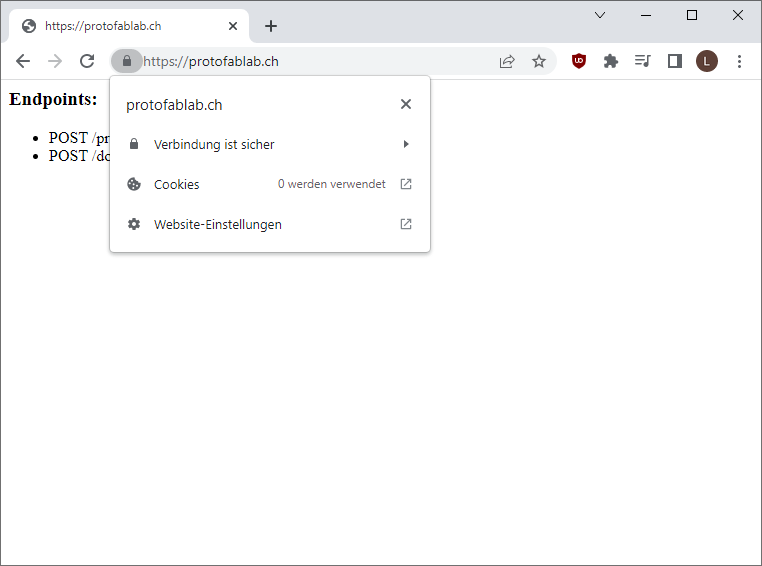

# Raspberry Pi Tutorial

TODO:

- [x] burning image to sd card and get ssh access (Lukas)
- [x] setup printer webserver (Loris)
- [x] nginx (Loris)
- [x] ssl certificate (Loris)
- [x] port forwarding / firewall (Lukas)

This tutorial will teach you, how to set up a web server on a `Raspberry Pi Zero W v1.1`.

## Write Image to SD-Card

Open the Raspberry Pi Images.

As an Operating System, select `Raspberry Pi OS Lite (32-Bit)`.

Select the SD-card in your card reader where the image will be installed.

> **WARNING**: Make sure to back up your SD-card, if you already have a Raspberry Pi installation or other data that you want to keep. This process is explained [here](https://raspberryexpert.com/how-to-backup-raspberry-pi/).


In the advanced options, you can enable ssh and configure wifi, so that the raspberry pi will automatically connect to your local network.

We also change the hostname to `pi-server` to differentiate it from other raspberry pi on the same network.

After making sure, that your configuration is correct, flash the image to your SD-card.

You are now ready to insert the SD-card into your raspberry pi and connect it to the power.

> **WARNING**: Make sure that the power supply is connected to `PWR IN` and not `USB`.

## Connect to your raspberry pi

If you are connected to the same wireless network that you configured for your raspberry pi, you should be able to detect your device if it had enough time to boot.

    ping pi-server

If you succeed in pinging the raspberry pi, you also see its ip address on the network. Note this address for later.

You can now connect to your raspberry pi from the command line and log in with your password.

    ssh pi@pi-server


Alternatively, if you are on Windows, you can use a tool like [PuTTY](https://www.putty.org/) to open an ssh connection to the raspberry pi. There it is also possible to save multiple connections and login credentials.

## Setting up the web API

Why a **web** API?

- A web API is easy to develop and provides an easy to trigger actions remotely.
- Built over HTTP, which is easy to integrate in clients.

On the PI:

```sh
# create a folder for the source code
cd ~ && mkdir web_api
```

On the PC, edit `web_api.service` and define the `RPI_USER` and `RPI_PASS` environment variables. Then run:

```sh
# copy the source code and the service to the pi
scp web_api.py web_api.service pi@pi-server:~/web_api/
```

On the PI:

```sh
# install the Flask framework
sudo apt install python3-flask

# create a service that runs the web API
sudo mv ~/web_api/web_api.service /etc/systemd/system/web_api.service

# start the service
sudo service web_api start
```

The web API is now accessible on port 5000 (e.g. `http://pi-server.local:5000`).

To read the logs from PC:

```sh
ssh pi@pi-server "journalctl -f -u web_api"
```

## Port forwarding

To access the web application from the internet outside your local network, you will need to enable port forwarding in your router settings.

First, determine the ip address of your raspberry pi in your local network.

    ifconfig


Then, log into your router. How exactly to do this depends on your internet service provider and your router.
Often the router is accessible on the ip address http://192.168.0.1/.

Enable port forwarding for the external port `80` (http) to the local port `5000`. This might look like this:


To check if this worked, first determine the public ip address of your raspberry pi. There are numerous ways to do this, but one of the easiest is just to call the website `icanhazip.com`.

    curl icanhazip.com

Call the ip address you receive in your web browser.
Now your API should be visible from the wider internet, but it would be nice to have an actual domain name.

## Buy a domain

There are many websites to buy a domain. A list of these domain name registrars can be found [here](https://domainnamestat.com/statistics/registrar/others).

For the purpose of this tutorial, we bought the domain `protofablab.ch`.

On your domain registry, locate the DNS settings and add a DNS-record for your public ip address:


The API is now available on the domain `protofablab.ch`:


## Setting up a web server with Nginx

Why?

- Host different websites on the Raspberry PI.
- Can handle certificates, CORS, load balancing, etc.

On the PC, edit `server.conf` and put your own domain name. Then run:

```sh
# copy the website configuration to the pi
scp server.conf pi@pi-server:~
```

On the pi:

```sh
# install Nginx
sudo apt install nginx

# create a new website called 'web-api'
sudo mv ~/server.conf /etc/nginx/sites-available/web-api

# enable this website by creating a symlink
sudo ln -s /etc/nginx/sites-available/web-api /etc/nginx/sites-enabled/

# restart Nginx to apply changes
sudo service nginx restart
```

The web API is now accessible on port `80`(http) on your local ip address (`http://pi-server`).
To make the server available through nginx from the internet, you have to change your port forwarding to forward the external port `80` to the local port `80`. The API is now available via the specified domain name (e.g. `http://protofablab.ch/`).

## Enabling secure connections with HTTPS

Why enabling HTTPS?

- Password is sent in plaintext in request -> unsafe.
- Client hosted on HTTPS can't send request to unsecure server.

On the PI:

```sh
# install certbot
sudo apt install certbot python3-certbot-nginx

# run certbot and request a certificate for the web API domain
sudo certbot
```

Add port forwarding for the external port `443` (https) to the local port `443`.
Then, change the API root to `https://protofablab.ch` in `web_client.html`.

The web API is now available securely on the domain `https://protofablab.ch`.


