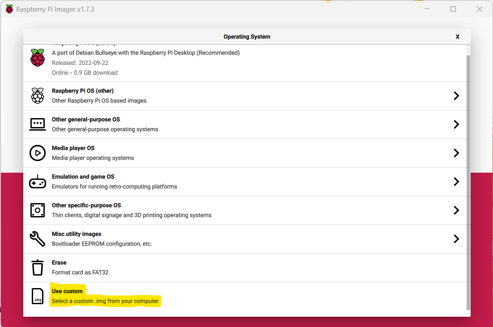

# Raspberry Pi Tutorial

TODO:
 - [] burning image to sd card and get ssh access (Lukas)
 - [] setup printer webserver (Loris)
 - [] nginx (Loris)
 - [] ssl certificate (Loris)
 - [] port forwarding / firewall (Lukas)

This tutorial will teach you, how to set up and use the `DietPi OS` on a `Raspberry Pi Zero W v1.1`.

## Get Image

Open the [Download Section](https://dietpi.com/#download) of the official DietPi Website. Select the Raspberry Pi in the device selection and download the `ARMv6 32-bit image`. 

Unzip the 7z archive using tool like [7-Zip](https://www.7-zip.org/download.html) to extract the .img file.

## Write Image to SD-Card

Open the Raspberry Pi Images.

As an Operating System, select `Use custom` and find your extracted .img file.

Select the SD-card in your card reader where the image will be installed. 

> **WARNING**: Make sure to back up your SD-card, if you already have a Raspberry Pi installation or other data that you want to keep. This process is explained [here](https://raspberryexpert.com/how-to-backup-raspberry-pi/).

Write the image to your SD-card. 

When this was done sucessfully, open the SD-card in your file explorer and find the configuration file `dietpi.txt`.

Change to following lines to enable wifi:

    AUTO_SETUP_NET_WIFI_ENABLED=1
    AUTO_SETUP_NET_WIFI_COUNTRY_CODE=CH

You also have to specify which wifi network to connect to. 
This is possible in the file `dietpi-wifi.txt`.

    aWIFI_SSID[0]='NameEuresWLANs'
    aWIFI_KEY[0]='Euer WLAN-Schlüssel'

You are now ready to insert the SD-card into your raspberry pi and connect it to the power.

> **WARNING**: Make sure that the power supply is connected to `PWR IN` and not `USB`.

## Connect to your raspberry pi

If you are connected to the same wireless network that you configured for your raspberry pi, you should be able to detect your device.