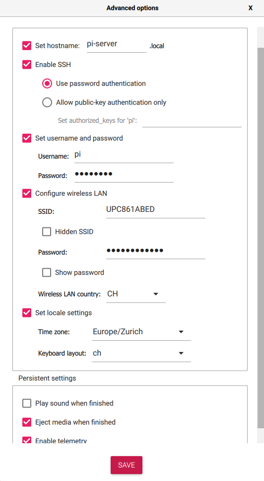

# Raspberry Pi Tutorial

TODO:
 - [] burning image to sd card and get ssh access (Lukas)
 - [] setup printer webserver (Loris)
 - [] nginx (Loris)
 - [] ssl certificate (Loris)
 - [] port forwarding / firewall (Lukas)

This tutorial will teach you, how to set up a web server on a `Raspberry Pi Zero W v1.1`.

## Write Image to SD-Card

Open the Raspberry Pi Images.

As an Operating System, select `Raspberry Pi OS Lite (32-Bit)`.

Select the SD-card in your card reader where the image will be installed. 

> **WARNING**: Make sure to back up your SD-card, if you already have a Raspberry Pi installation or other data that you want to keep. This process is explained [here](https://raspberryexpert.com/how-to-backup-raspberry-pi/).

In the advanced options, you can enable ssh and configure wifi, so that the raspberry pi will automatically connect to your local network.

We also change the hostname to `pi-server` to differentiate it from other raspberry pi on the same network.

After making sure, that your configuration is correct, flash the image to your SD-card. 

You are now ready to insert the SD-card into your raspberry pi and connect it to the power.

> **WARNING**: Make sure that the power supply is connected to `PWR IN` and not `USB`.

## Connect to your raspberry pi

If you are connected to the same wireless network that you configured for your raspberry pi, you should be able to detect your device if it had enough time to boot.

    ping pi-server

If you succeed in pinging the raspberry pi, you also see its ip address on the network. Note this address for later.

You can now connect to your raspberry pi from the command line and log in with your password.

    ssh pi@pi-server

Alternatively, if you are on Windows, you can use a tool like [PuTTY](https://www.putty.org/) to open an ssh connection to the raspberry pi. There it is also possible to save multiple connections and login credentials.