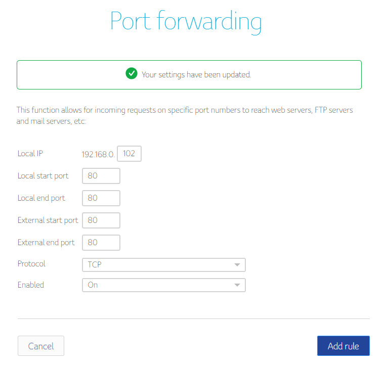
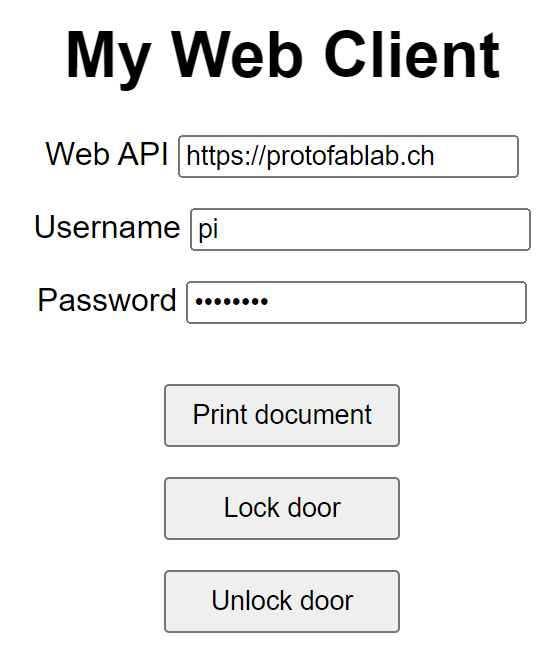

# Raspberry Pi Tutorial

This tutorial will teach you, how to set up a web API on a `Raspberry Pi Zero W v1.1` and access it through the Internet.

- [Write Image to SD-Card](#image)
- [Connect to your raspberry pi](#connection)
- [Setting up the web API](#webapi)
- [Setting up a web server with Nginx](#nginx)
- [Firewall](#firewall)
- [Port forwarding](#portforwarding)
- [DNS setup](#dns)
- [Enabling secure connections with HTTPS](#ssl)
- [Web client](#client)

<a name="image"></a>

## Write Image to SD-Card

Install and open the [Raspberry Pi Imager](https://www.raspberrypi.com/software/).

As an Operating System, select `Raspberry Pi OS Lite (32-Bit)`.

Select the SD-card in your card reader where the image will be installed.

> **WARNING**: Make sure to back up your SD-card, if you already have a Raspberry Pi installation or other data that you want to keep. This process is explained [here](https://raspberryexpert.com/how-to-backup-raspberry-pi/).


In the advanced options, you can enable SSH and configure Wi-Fi, so that the Raspberry Pi will automatically connect to your local network.

We also change the hostname to `pi-server` to differentiate it from other Raspberry Pi on the same network.

After making sure, that your configuration is correct, flash the image to your SD-card.

You are now ready to insert the SD-card into your Raspberry Pi and connect it to the power.

> **WARNING**: Make sure that the power supply is connected to `PWR IN` and not `USB`.

<a name="connection"></a>

## Connect to your Raspberry Pi

If you are connected to the same wireless network that you configured for your Raspberry Pi, you should be able to detect your device if it had enough time to boot.

    ping pi-server

If you succeed in pinging the Raspberry Pi, you also see its ip address on the network. Note this address for later.

You can now connect to your Raspberry Pi from the command line and log in with your password.

    ssh pi@pi-server


Alternatively, if you are on Windows, you can use a tool like [PuTTY](https://www.putty.org/) to open an SSH connection to the Raspberry Pi. There it is also possible to save multiple connections and login credentials.

<a name="webapi"></a>

## Setting up the web API

We will now set up a web API to communicate with our Raspberry Pi. A web API is an interface between a server and clients, which is built using web technologies, such as the **HTTP** protocol. The benefits of developing a web API are as follows:

- There exists many frameworks in different languages to develop a web API.
- We can easily define multiple **endpoints** to match different actions.
- Because it uses HTTP, it is easy to integrate in clients (e.g. in a web browser).


We don't want everybody to be able to access our Raspberry Pi from the Internet, so we have to set up some form of **authentication**. This can be done by providing information through the "Authorization" HTTP header with each request.

We provide an example using the Python framework [Flask](https://flask.palletsprojects.com/) to set up the web API, which is available in `web_api/web_api.py`. Authentication is done using [Basic Authentication](https://developer.mozilla.org/en-US/docs/Web/HTTP/Authentication#basic_authentication_scheme), and the default username and passwords are fetched from the environment variables `API_USER` and `API_PASS` (default values are `pi` and `protolab`).

To setup the example, we first create a folder on the Pi to store our source code:

```sh
# on the Pi
cd ~ && mkdir web_api
```

To transfer the web API to the Pi, run from the PC:

```sh
scp web_api.py web_api.service pi@pi-server:~/web_api/
```

If you want to change the default username and password, edit the `web_api.service` file and define the `API_USER` and `API_PASS` environment variables accordingly. This file contains the service configuration that will make our web API run in the background.

Then, run the following commands on the Pi:

```sh
# install the Flask framework
sudo apt install python3-flask

# create the service that runs the web API
sudo mv ~/web_api/web_api.service /etc/systemd/system/web_api.service

# start the service
sudo service web_api start
```

The web API is now accessible on port 5000 in the local network (e.g. http://pi-server.local:5000).

To debug the web API, we can use `journalctl` to read the logs. This can be done directly from the PC by running:

```sh
ssh pi@pi-server "journalctl -f -u web_api"
```

<a name="nginx"></a>

## Setting up a web server with Nginx

Our web API is running and working, but there's a few things that are still missing, notably:

- The [CORS headers](https://developer.mozilla.org/en-US/docs/Web/HTTP/CORS) are not defined, which could cause clients to fail to connect.
- The transferred data isn't secure, which means the password can be read by anyone who's able to sniff the traffic.
- The web API is accessible on the non-standard port 5000. Changing that to the standard 80/443 ports would make us unable to deploy another web application on the Pi.

Although possible, this shouldn't be managed by the web API itself. Instead, we can install a **web server**, which acts as a layer above our web API and helps us configure web applications properly. It provides the following benefits:

- Host different web applications/API/websites on the Raspberry PI.
- Link different hostnames to specific applications.
- Redirect traffic according to various rules.
- Define SSL certificates, CORS headers, etc.

We choose to use **Nginx**, as it is very popular and considered one of the fastest web servers.


Each web application deployed through Nginx must be [configured in a separate file](http://nginx.org/en/docs/beginners_guide.html#conf_structure). We provide a very basic configuration in the `web_api/server.conf` file. Note that we configured this file with **our own** domain name, so you should **edit** it and provide yours.

We have to configure Nginx to act as a **reverse proxy**, since our web API already runs as a web server. In our configuration file, we use the `proxy_pass` directive to tell Nginx to redirect all requests to the specified address (which matches our example web API).

Transfer the configuration file from the PC to the Pi:

```sh
scp server.conf pi@pi-server:~
```

Then, on the Pi:

```sh
# install Nginx
sudo apt install nginx

# create a new website called 'web-api'
sudo mv ~/server.conf /etc/nginx/sites-available/web-api

# enable this website by creating a symlink
sudo ln -s /etc/nginx/sites-available/web-api /etc/nginx/sites-enabled/

# restart Nginx to apply changes
sudo service nginx restart
```

Note that the `/etc/nginx/sites-available` folders will contain all the configurations files for all your future websites. To enable or disable these sites, you can simply create or remove symlinks in the `sites-enabled` folder, then restart Nginx each time.

To check whether Nginx started successfully, run:

```sh
service nginx status
```

The web API is now accessible through the standard port `80` (http) in the local network (e.g. http://pi-server.local), using the domain that you specified. If you try to access the Pi via its IP address (e.g. http://192.168.47.83), you'll get the default Nginx welcome page instead (defined in `sites-available/default`), because no website was configured to match this hostname.

<a name="firewall"></a>

## Firewall

This step is optional, but is highly recommended. Setting up a firewall will only let traffic come through a few ports, which increases security by reducing the attack surface. This can be done very easily with **UFW** (Uncomplicated FireWall).

On the pi:

```sh
# install UFW
sudo apt install ufw

# deny all incoming and allow all outgoing traffic by default
sudo ufw default deny incoming
sudo ufw default allow outgoing

# allow incoming traffic through ports 22 (SSH), 80 (HTTP) and 443 (HTTPS)
sudo ufw allow ssh
sudo ufw allow http
sudo ufw allow https

# enable the firewall
# WARNING: make sure incoming traffic to port 22 (SSH)
# is allowed, or you'll loose access to your device
sudo ufw enable
```

From now on, the web API is **not** accessible anymore through port 5000 in the local network. This forces the clients to use the regular ports 80/443 and pass through the web server.

This is great, but we still can't access the web API through the Internet.

<a name="portforwarding"></a>

## Port forwarding

To access the web application from the internet outside your local network, you will need to enable port forwarding in your router settings.
A great tutorial can be found [here](https://www.noip.com/support/knowledgebase/general-port-forwarding-guide/).

First, determine the IP address of your raspberry pi in your local network.

    ifconfig


Then, log into your router. How exactly to do this depends on your internet service provider and your router.

You can find the IP address of the router from your Pi with the following command:

    ip route | grep default

Often, the default gateway is http://192.168.0.1/.

Enable port forwarding for the external port `80` (http) to the local port `80` on your Raspberry Pi. This might look like this, if the IP address of your Pi is `192.168.0.108`:



To check if this worked, first determine the public IP address of your raspberry pi. There are numerous ways to do this, but one of the easiest is just to call the website `icanhazip.com` from your Pi:

    curl icanhazip.com

Call the IP address you receive with the port you just opened in your web browser.
An Nginx screen should be visible from the wider internet, but it won't redirect you to the actual web api application, because the IP address is not matching the configured domain-names in Nginx.

So the next step is to set up a memorable domain name, so that you don't have to remember your IP address.

<a name="dns"></a>

## DNS setup

The [Domain Name System](https://en.wikipedia.org/wiki/Domain_Name_System) (or DNS) is a system that translates readable names to IPv4 or IPv6 addresses.

To make use of this system, you must first own a domain name. There are many websites to buy a domain. A list of these domain name registrars can be found [here](https://domainnamestat.com/statistics/registrar/others). Alternatively there are also some free options like [No-IP](https://www.noip.com/).

Which DNS provider to choose also depends on your IP address. If you have a `static` public IP address, the IP address assigned to you by your ISP will never change and it will be much easier to set up DNS. If you have a `dynamic` IP address, your IP address might change over time. Some providers offer `Dynamic DNS Updates`, which will change your DNS entries, if an address change is detected. Dynamic and static IP addresses are also explained [here](https://www.avast.com/c-static-vs-dynamic-ip-addresses).

For the purpose of this tutorial, we will use the domain `protofablab.ch` and assume, that we have e static IP address.

On your domain registry, locate the DNS settings and add a DNS-record for your static public ip address. How to do this, depends on the registrar you have chosen. The registrar usually offers a good tutorial on how to do this.


The API is now available on the domain `protofablab.ch`:


<a name="ssl"></a>

## Enabling secure connections with HTTPS

HTTPS is basically HTTP with secure connections. All traffic send through HTTPS is encrypted and cannot be read or modified by a third-party, which highly increases the security.

Why is this step so important?

- Without HTTPS, passwords are sent in plaintext with the request.
- Clients hosted themselves on an HTTPS server are not allowed to send requests to an unsecure server.

To enable SSL, we need to:

1. Generate an SSL certificate for our domain name(s).
2. Reference this certificate in the Nginx configuration file.
3. Redirect incoming traffic from the `http://` scheme to `https://`.
4. Renew the certificate when it expires.

Luckily, this can all be done automatically by running a single command using a single tool: **Certbot**.

```sh
# install certbot
sudo apt install certbot python3-certbot-nginx

# let certbot handle everything
sudo certbot
```

If everything worked fine, the configuration file `sites-available/web-api` should have been modified to include new directives related to our certificate.

Finally, we need to configure our router to forward the external port `443` (HTTPS) to the local port `443`.

The web API is now available securely at https://protofablab.ch (or whatever your custom domain is).


<a name="client"></a>

## Web client

To test our web API, we developed a small client that runs in the browser. You can find it in `web_api/web_client.html` and run it locally in your browser, or access it from the cloud at https://protolab.vercel.app.

Note that the web API sometimes randomly returns a "failed" response to simulate a slightly more realistic environment (e.g. the printer has no more paper or ink).


