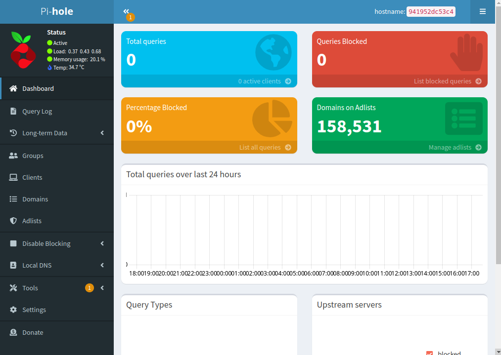
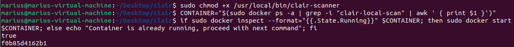
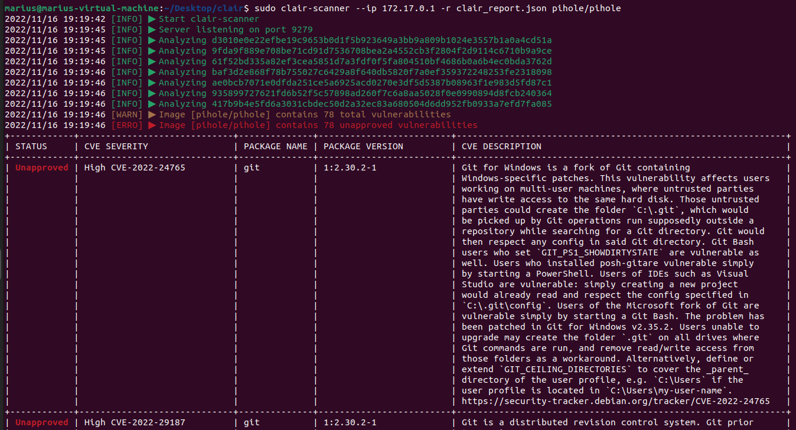
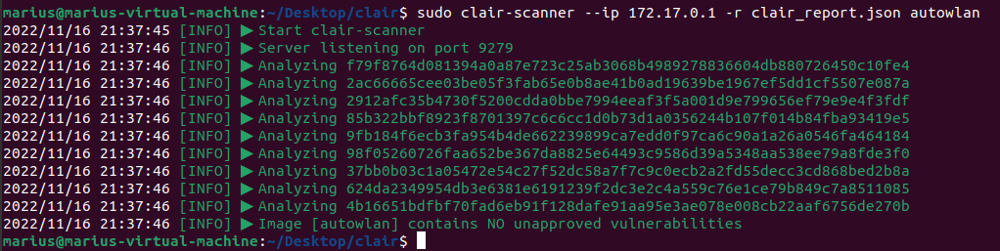

# Pi-hole project as a Docker demo

As a nice example of using an [OCI](https://opencontainers.org/) container we
demonstrate [Pi-hole](https://pi-hole.net/) for docker.
Pi-hole is a DNS system for network-wide ad blocking in private networks.
It acts as a DNS sinkhole, handing out non-routable addresses for a predefined list of domain names.
Adding new blacklists, or even whitelists is done very simply over Pi-hole's web server.

It offers various features like blocking of ads, trackers, even malicious servers, and can act as a DHCP server.
Due to Pi-hole working on the DNS level, it effectively blocks all previous mentioned unwanted traffic for all devices
in a network.
Be it computers, laptops, smartphones, smart TVs, smart home entities, or other unconventional devices, they will all
enjoy ad-free interactions with the web.

Pi-hole consists of multiple components like a DNS service, a web server, multiple databases, user management (for
devices), etc., and is therefore a good candidate to showcase the benefit of wrapping the whole application into
a [OCI](https://opencontainers.org/) container for easy management.

The following is an example project for Pi-hole to be run specifically as a Docker image.

## Installing Pi-hole as a docker container in DietPi on a Raspberry Pi

If you already have a clean DietPi (or Raspbian) image installed, or know how to install the system, you can skip ahead.
If not, we provide an in-depth tutorial [HERE](./tutorial-example-pi-hole/dietpi-install.md).

### Install `docker` and `docker-compose`

Connect to your Raspberry Pi via SSH.<br>
If you are using the standard Raspbian image, you can install them with

```shell
$ sudo apt install docker docker-compose
```

If you are on the DietPi image, you can do the same, but the preferred way is going through the `DietPi-Software`.
You can launch it with `sudo dietpi-software`


Now you select `Search Software` and search for `docker`.
This will give you multiple options, we want `docker` and `docker-compose`.
After selecting and confirming those two, we get back to the initial `DietPi-Software` screen and select `Install` to
install them.
Wait for it to finish.

### Get the Pi-hole docker image and run it

Pi-hole has on official entry on `dockerhub` which can be accessed
on [hub.docker.com/r/pihole/pihole](https://hub.docker.com/r/pihole/pihole).

The procedure is docker-like very simple.
First create a new folder `Pi-hole` and enter it:

```shell
$ mkdir Pi-hole
$ cd Pi-hole
```

Our Pi-hole `docker-compose` config can be found in [docker-compose.yml](./tutorial-example-pi-hole/docker-compose.yml).
Create the file and copy-paste the content into it.

You can now start the Pi-hole docker. The first start will take longer as it will get the necessary files.

```shell
$ docker-compose up -d
[+] Running 8/8
 ⠿ pihole Pulled
   ⠿ 0df644382ba7 Pull complete
   ⠿ b56a7e1057d3 Pull complete
   ⠿ 4f4fb700ef54 Pull complete
   ⠿ 9478f0dff914 Pull complete
   ⠿ 0fb940182a9c Pull complete
   ⠿ addde0c9a94d Pull complete
   ⠿ 95b565a8fade Pull complete
[+] Running 2/2
 ⠿ Network pi-hole_default  Created
 ⠿ Container pihole         Started
```

Your Pi-hole instance is now accessible via web browser at the IP address of your Raspberry Pi.


As can be seen in the `docker-compose.yml`, our admin password is `Pihole`.
You can log in into the admin panel and will be greeted with the dashboard.



Pi-hole offers a lot of customization, but we only change the following in the `Settings/DNS` tab:

- Upstream DNS Servers: we switch to Cloudflare
- Interface settings: we switch to `Permit all origins`


## Enable your Pi-hole as a DNS in your router settings

This requires you to enter your router settings and change the upstream DNS to your local Pi-hole instance at your
Raspberry Pi's IP address.

Sadly, not every router has this setting.

If you still want to try it out in this case, you can overwrite the DNS of your own devices.
On Linux, e.g., the file `/etc/resolv.conf` can be modified to contain the Raspberry Pi as the sole nameserver for
testing purposes.

## Results

You can now surf the web and enjoy webpages with much less advertisements and trackers.
Some might still not be blocked due to the default, conservative block list.
You are free to add more lists via the Pi-hole GUI, just be aware that some websites might break a bit if your lists are
too aggressive :-)

Running Pi-hole as a docker container gives you additional freedom to manage your Raspberry Pi without interfering with
system files.
E.g., you can still easily add other web servers running on the the Raspberry Pi without them clashing with same data
directories or config files.

# Security
When using such new and developing technology it is especially important to consider the security aspects.
Furthermore, the research conducted on containers paints a 
bleak picture. A [paper](https://dl.acm.org/doi/10.1145/3029806.3029832) 
from 2017 states that on average each container has 180 vulnerabilities. 
Since then new technology have arisen to improve the security of containers.


As described by themselves, [Clair](https://github.com/quay/clair) is an open 
source project for the static analysis of vulnerabilities in application containers. 
It performs this analysis by inspecting containers layer by layer for known security flaws. 
These flaws are all stored in an extensive database provided by Clair.
Using Clair does not make your containers safer per se, but knowing the
vulnerabilities helps immensely when trying to fix them. 

With this in mind we set out to analyze the PiHole container discussed above and also the
[autowlan](https://github.com/Harveg/autowlan) container provided during the lecture. 
We did so, as to find out if the security of containers had improved in recent years and as
to test how easy it was to use Clair.

## Hypothesis

We suspect that the autowlan container will have multiple vulnerabilities, 
while the PiHole container will have few to no vulnerabilities. We also 
expect both numbers to be smaller than 180.

Our logic is that autowlan was intended as a tutorial and has very little
development behind it. On the other hand PiHole has been downloaded more than
500 million times and is one of the most known containers. Also 5 years have
passed since 2017, so we expect there to be far less vulnerabilities in general.

## Running Clair

Clair's intended use case is inside a CI/CD pipeline, this stands for 
continuous integration/continuous development pipeline. For our project however, 
we did not intend on making any sort of pipeline. Furthermore, starting Clair 
from scratch takes about half an hour, since the database needs to be filled with all 
known vulnerabilities.

To solve these issues we instead needed a prefilled DB and a standalone scanner that used Clair. 
Thankfully [Armin Coralic](https://github.com/arminc) had developed solutions for both of our problems.

Firstly, we tried running the scanner on the PiZero. After all, containers are lightweight, 
quick to boot and can be run on any sort of hardware.
After downloading more than 1GB of data, running for 15+ minutes and having no end in sight, 
we instead opted to run the scanner on one of our PCs.

The following code takes inspiration from an existing 
[tutorial](https://infosecwriteups.com/quick-guide-for-running-clair-scanner-via-katacoda-a074bd256eff).
We assume that docker is installed and you are working on a linux based device.
Firstly, we set up the scanner and database with the following commands:
```shell
$ sudo docker run -d --name clair-db arminc/clair-db:latest
$ sudo docker run -p 6060:6060 --link clair-db:postgres -d --name clair arminc/clair-local-scan:v2.0.8_fe9b059d930314b54c78f75afe265955faf4fdc1
```

If the PiHole image has not been pulled to your device yet, enter:
```shell
$ sudo docker pull pihole/pihole
```

Next we set up the Clair scanner binary:
```shell
$ mkdir clair && cd clair
$ wget https://github.com/arminc/clair-scanner/releases/download/v12/clair-scanner_linux_386 -O /usr/local/bin/clair-scanner
$ sudo chmod +x /usr/local/bin/clair-scanner
```

We make sure that the scanner is running with the following code:
```shell
$ CONTAINER="$(sudo docker ps -a | grep -i "clair-local-scan" | awk ' { print $1 }')"
$ if sudo docker inspect --format="{{.State.Running}}" $CONTAINER; then sudo docker start $CONTAINER; else echo "Container is already running, proceed with next command"; fi
```

Your output at this point should look similar to the following image:


Lastly to scan PiHole we run:
```shell
$ sudo clair-scanner --ip 172.17.0.1 -r clair_report.json pihole/pihole
```

The results should appear shortly after, as seen below:



At the time of writing the PiHole image contained 78 vulnerabilities.
To see the full list, refer to the following [json](./tutorial-example-pi-hole/clair_report.json) file.
The vulnerabilities range from negligible to high severity. 
These results will be discussed later.

Now that everything was set up we were able to scan any image. 
We showed this by scanning the autowlan image from the lecture.
For this we needed to build the image on our machine first. 
This must be done, since it is not available on the Docker-Hub.
Firstly, you must clone the git repository locally:

```shell
$ git clone https://github.com/Harveg/autowlan.git
$ cd autowlan/
```

Next we had to change the image architecture from arm32 to amd64, since you can only build images 
that match the very basic architecture of your machine.
If your machine is running on a 32-Bit ARM architecture, then skip the next line.

We simply had to change the first line of the Dockerfile to: 
```shell
from amd64/alpine
```

Afterwards, the image was ready to build with the following command:
```shell
$ sudo docker build . --tag autowlan
```

Once an image is on your device you can use Clair to check it. You only have to swap pihole/pihole with autowlan.
```shell
$ sudo clair-scanner --ip 172.17.0.1 -r clair_report.json autowlan
```
The results should once again appear shortly after:



At the time of writing the autowlan image contained no vulnerabilities.

## Results

Our hypothesis was the exact opposite of what took place. We explain this with the fact that 
autowlan relies on very few containers. Only Alpine and a few minor packages to be exact. 
This provides very little attack surface and hence no vulnerabilities could be found. 
Furthermore, the packages and Alpine get constant updates, which explains how the container 
remains secure even after 2+ years.
On the other hand PiHole relies a plethora of packages and provides a much larger attack surface.

This also implies that containers at the very top, such as Alpine, contain no vulnerabilities. 
However, the further down you go in the inheritance tree the more vulnerabilities you collect.
We also saw that the number has somewhat improved from 180, but is still far too large.

Lastly, using Clair was more difficult than expected. 
But once everything is set up it is simple and extremely useful.
Now autowlan can be recommended to the next generation of students.
