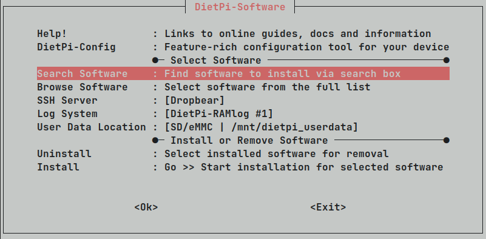
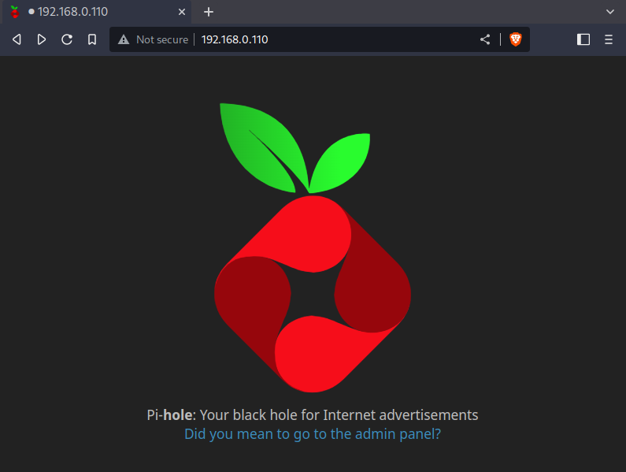
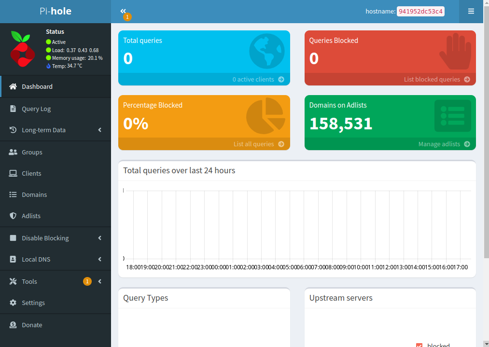

# Pi-hole project as a Docker demo

[Pi-hole](https://pi-hole.net/) is a DNS system for network-wide ad blocking in private networks.
It acts as a DNS sinkhole, handing out non-routable addresses for a predefined list of domain names.
Adding new blacklists, or even whitelists is done very simply over Pi-hole's web server.

It offers various features like blocking of ads, trackers, even malicious servers, and can act as a DHCP server.
Due to Pi-hole working on the DNS level, it effectively blocks all previous mentioned unwanted traffic for all devices
in a network.
Be it computers, laptops, smartphones, smart TVs, smart home entities, or other unconventional devices, they will all
enjoy ad-free interactions with the web.

Pi-hole consists of multiple components like a DNS service, a web server, multiple databases, user management (for
devices), etc., and is therefore a good candidate to showcase the benefit of wrapping the whole application into
a [OCI](https://opencontainers.org/) container for easy management.

The following is an example project for Pi-hole to be run specifically as a Docker image.

## Installing Pi-hole as a docker container in DietPi on a Raspberry Pi

If you already have a clean DietPi (or Raspbian) image installed, or know how to install the system, you can skip ahead.
If not, we provide an in-depth tutorial [HERE](./dietpi-install.md).

### Install `docker` and `docker-compose`

Connect to your Raspberry Pi via SSH.<br>
If you are using the standard Raspbian image, you can install them with

```shell
$ sudo apt install docker docker-compose
```

If you are on the DietPi image, you can do the same, but the preferred way is going through the `DietPi-Software`.
You can launch it with `sudo dietpi-software`



Now you select `Search Software` and search for `docker`.
This will give you multiple options, we want `docker` and `docker-compose`.
After selecting and confirming those two, we get back to the initial `DietPi-Software` screen and select `Install` to
install them.
Wait for it to finish.

### Get the Pi-hole docker image and run it

Pi-hole has on official entry on `dockerhub` which can be accessed
on [hub.docker.com/r/pihole/pihole](https://hub.docker.com/r/pihole/pihole).

The procedure is docker-like very simple.
First create a new folder `Pi-hole` and enter it:

```shell
$ mkdir Pi-hole
$ cd Pi-hole
```

Our Pi-hole `docker-compose` config can be found in [docker-compose.yml](./docker-compose.yml).
Create the file and copy-paste the content into it.

You can now start the Pi-hole docker. The first start will take longer as it will get the necessary files.

```shell
$ docker-compose up -d
[+] Running 8/8
 ⠿ pihole Pulled
   ⠿ 0df644382ba7 Pull complete
   ⠿ b56a7e1057d3 Pull complete
   ⠿ 4f4fb700ef54 Pull complete
   ⠿ 9478f0dff914 Pull complete
   ⠿ 0fb940182a9c Pull complete
   ⠿ addde0c9a94d Pull complete
   ⠿ 95b565a8fade Pull complete
[+] Running 2/2
 ⠿ Network pi-hole_default  Created
 ⠿ Container pihole         Started
```

Your Pi-hole instance is now accessible via web browser at the IP address of your Raspberry Pi.



As can be seen in the `docker-compose.yml`, our admin password is `Pihole`.
You can log in into the admin panel and will be greeted with the dashboard.



Pi-hole offers a lot of customization, but we only change the following in the `Settings/DNS` tab:

- Upstream DNS Servers: we switch to Cloudflare
- Interface settings: we switch to `Permit all origins`


## Enable your Pi-hole as a DNS in your router settings

This requires you to enter your router settings and change the upstream DNS to your local Pi-hole instance at your
Raspberry Pi's IP address.

Sadly, not every router has this setting.

If you still want to try it out in this case, you can overwrite the DNS of your own devices.
On Linux, e.g., the file `/etc/resolv.conf` can be modified to contain the Raspberry Pi as the sole nameserver for
testing purposes.

## Results

You can now surf the web and enjoy webpages with much less advertisements and trackers.
Some might still not be blocked due to the default, conservative block list.
You are free to add more lists via the Pi-hole GUI, just be aware that some websites might break a bit if your lists are
too aggressive :-)

Running Pi-hole as a docker container gives you additional freedom to manage your Raspberry Pi without interfering with
system files.
E.g., you can still easily add other web servers running on the the Raspberry Pi without them clashing with same data
directories or config files.