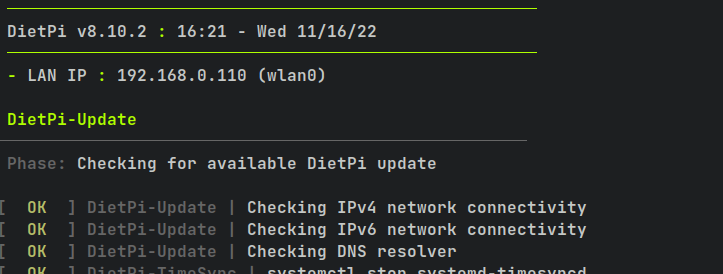
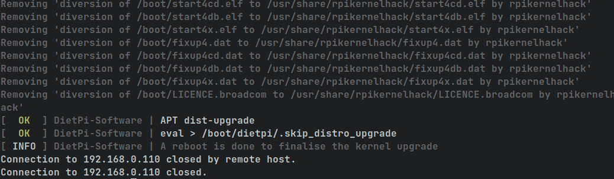
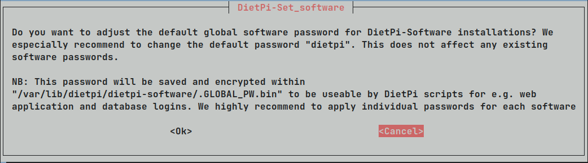
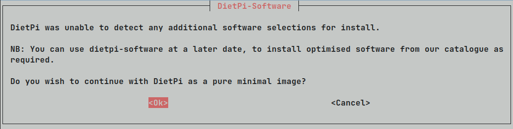

# Installing DietPi on a Raspberry Pi (on a Linux system)

## Get the image

You can read more about DiePi and download an image on their website [dietpi.com](https://dietpi.com/).

In our case we have a Raspberry Pi Zero W v1.1, which requires us to download the `ARMv6 32-bit image`.

After downloading you should see a `7z`-compressed file to where you downloaded the image:

```shell
$ ls
DietPi_RPi-ARMv6-Bullseye.7z
```

To extract it, simply run

```shell
$ 7z x ./DietPi_RPi-ARMv6-Bullseye.7z
```

Now you should have multiple files in the current directory

```shell
$ ls
DietPi_RPi-ARMv6-Bullseye.7z   hash.txt
DietPi_RPi-ARMv6-Bullseye.img  README.md
```

## Flash the image

Make sure that you have inserted the SD card in your card-reader and find out which device it is with

```shell
$ lsblk
NAME        MAJ:MIN RM   SIZE RO TYPE MOUNTPOINTS
mmcblk0     179:0    0  59.5G  0 disk
...
```

It _should_ be called `mmcblk0` or something similar.

Make sure you are not selecting a partition of your own system as we will flash the DietPi image now with

```shell
$ sudo dd if=./DietPi_RPi-ARMv6-Bullseye.img of=/dev/mmcblk0 status=progress bs=16k
54668+1 records in
54668+1 records out
895684608 bytes (896 MB, 854 MiB) copied, 17.844 s, 50.2 MB/s
```

Now you should see two partitions on the SD card, one for the `boot` partition of the Raspberry Pi, and one `root`
directory

```shell
$ lsblk
NAME        MAJ:MIN RM   SIZE RO TYPE MOUNTPOINTS
mmcblk0     179:0    0  59.5G  0 disk
├─mmcblk0p1 179:1    0   128M  0 part               # Boot partition
└─mmcblk0p2 179:2    0 722.1M  0 part               # Root partition
```

## Configure the DietPi installation

Before you plug the SD card and power plug back into the Raspberry Pi, you should setup its configuration files for the
first boot.
They can be found on the `boot` partition of the SD card (in our case `/dev/mmcblk0p1`). <br>
You have mount the partition with either your file manager or manually via terminal.

After mounting, you should first look at the `dietpi.txt` config file. <br>
Here you might like to change your locale, keyboard layout, or timezone to something that suits you.

If you can connect your Raspberry Pi to your router via Ethernet you won't have to change other settings.
However, if you need to connect it via WiFi, you have to enable it:

```shell
AUTO_SETUP_NET_WIFI_ENABLED=1
```

And you have to save which network to connect to inside the file `dietpi-wifi.txt`.
E.g., for a network called `Amazing WiFi` with WPA2 password `VerySecure` it would look like following:

```shell
#---------------------------------------------------------------
# Entry 0
# - WiFi SSID: required, case sensitive
aWIFI_SSID[0]='Amazing Wifi'
# - WiFi key: If no key/open, leave this blank
# - In case of WPA-PSK, alternatively enter the 64-digit hexadecimal key returned by wpa_passphrase
# - Please replace single quote characters ' in your key with '\''. No other escaping is required.
aWIFI_KEY[0]='VerySecure'
# - Key type: NONE (no key/open) | WPA-PSK | WEP | WPA-EAP (then use settings below)
aWIFI_KEYMGR[0]='WPA-PSK'
...
```

## First boot of DietPi

Now you can plug the SD card into the Raspberry Pi and boot it up.
This boot will take a while.

After waiting some time you can run `nmap` to see all devices on your network and discover the IP address of your
Raspberry Pi

```shell
$ sudo nmap -sn 192.168.0.0/24          # IP address depends on your network configuration
Starting Nmap 7.93 ( https://nmap.org ) at 2022-11-16 16:18 CET
...
Nmap scan report for 192.168.0.110
Host is up (3.1s latency).
MAC Address: B8:27:EB:9C:0C:BE (Raspberry Pi Foundation)
...
```

And you can connect to it as users `dietpi` or `root`. However, the first boot requires you to be `root`.
The default password at the beginning is `dietpi`.

```shell
$ ssh root@192.168.0.110
```

Now, DietPi will search for updates to any packages before you can continue the setup.
This might take a while, especially on low-powered hardware like the Raspberry Pi Zeros, so please be patient.



The update will end with a reboot and kicking you back to your terminal.



After the reboot, you can reconnect as root to continue setup.
It will now ask a couple things like changing passwords, disabling serial console, etc.



After finishing this initial setup, you will end up in the `DietPi-Software` screen, where you can change some behaviour
like the chosen SSH server, the log system, and you can install additional software.
You can just skip ahead with the `Install` option, where it will ask you for confirmation to continue as a minimal
DietPi image.



It will then finish setup and ask you one more question whether to opt in for survey data or not.

At the end of this process, you will be in the default terminal login screen and are ready to go!