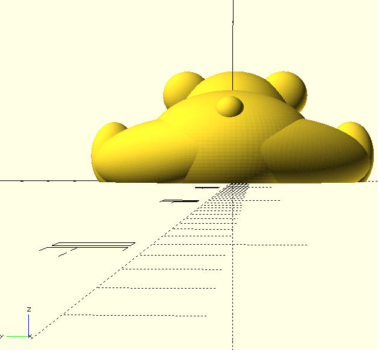

# Introduction
This topic is about the creation of three-dimensional (3D) object from a computer-aided design (CAD) model, so called 3D printing or additive manufacturing.

An [ISO standard](https://www.iso.org/standard/69669.html) lists 7 types of 3D printing processes (details on [ALL3DP](https://all3dp.com/1/types-of-3d-printers-3d-printing-technology/)):
 - Material extrusion
 - Vat polymerization
 - Powder Bed Fusion
 - Material Jetting
 - Binder Jetting
 - Direct Energy Deposition
 - Sheet Lamination

Each of the above 7 processes uses one or more 3D printing technology. Depending on your objectives (refined vs robust prototypes, production, etc.) and constraints (time, cost, material, etc.), one technology may be more appropriate.

In the context of this Autumn 2022 course, we have access to two 3D printing technologies:
- Fused Filament Fabrication (FFF) - with the material extrusion process
- Stereolithography (SLA) - with the vat polymerization process

And in the sections below, we focus on:
 - SLA: the technology, difference with FFF, when to use SLA and its limitation, and how to use the [Prusa 3D SL1S printer](https://www.prusa3d.com/category/original-prusa-sl1s-speed/)
 - Step-by-step example to create a CAD model using a script-based software

# SLA Printer 
## Definition 

A stereolithography printer creates 3D objects by hardening a liquid resin, layer by layer, using a UV laser.


<p align="center">
	<br>
	<em>figure 1 : Representation of Stereolithography</em>
	<br><em>Source: <a href=https://upload.wikimedia.org/wikipedia/commons/d/d6/Schematic_representation_of_Stereolithography.png>Wikipedia's Stereolithography page</a>, visited 15/10/2022.</em></p>

More specifically, the user pours the resin into the printer’s **tank** (part (b) in the picture above). A UV laser (a) will flash the bottom (c) of the tank in order to cure, i.e. harden, the liquid resin into hardened plastic (d). The 3D object is built in an inverted way, upside-down, on a **print platform** (e) that will move the hardened plastic up and let new liquid resin in at the bottom of the tank.

At the end of the process using the Prusa 3D SL1S printer, the printed object will be relatively soft and sticky. Therefore, after-print actions are recommended: wash, cure and dry the model (cf section How to use).

## Difference with string printer 

Fused filament fabrication (also called Fused Deposition Modeling, FDM, despite their [differences](https://www.xometry.com/resources/3d-printing/fdm-vs-fff-3d-printing/)) uses a filament that goes through a heated header to be melted and the 3D object is built layer-by-layer from bottom to top - i.e. not inverted as with the SLA.

<p align="center">
	<br>
	<em>figure 2 : Representation of Fused Filament</em>
	<br><em>Source: <a href=https://upload.wikimedia.org/wikipedia/commons/c/c8/Schematic_representation_of_Fused_Filament_Fabrication_01.png>Wikipedia’s Fused Filament Fabrication page</a>, visited 15/10/2022.</em></p>

FFF is favored for larger and more robust objects than the SLA. But the printed layers are usually more visible, and SLA offers smoother prints. To give some numbers, the height of the SLA’s layers is between 0.025-0.1 mm, while the height with the FFF is between 0.05 - 0.35 mm.  //(remark: different from x-y precision: 1nanometer for UV ,  while 1microm)

The SLA presented above uses resin which is more difficult to handle and requires more attention such as wearing gloves and after-print actions.

Different supported material:
- FFF: Wide range of thermoplastics, including PLA, PETG, ASA, ABS, PC (Polycarbonate), CPE, PVA/BVOH, PVB, HIPS, PP (Polypropylene), Flex, nGen, Nylon, Carbon filled, Woodfill and other filled materials.
- SLA: Supported materials UV sensitive liquid resin (405nm), long-exposure materials supported

For more information on the difference:
- [How to Choose a 3D Printer?](https://www.prusa3d.com/page/how-to-choose-a-3d-printer_229126/) (Prusa3D’s blog)

## When to use SLA and its limitations
You will want to favor the SLA printer when refined details are more important for your prototypes than robustness.

The extra care for handling the resin should not be a problem for you.

3D printing is preferred to prototype quickly and when approx. one hundred parts are needed at a maximum. For mass production, one may consider [injection moulding](https://www.twi-global.com/technical-knowledge/faqs/3d-printing-vs-injection-moulding).

Depending on your objective, choose your resin for the Prusa 3D SL1S printer:
 - Wavelength: choose a 405nm resin
 - Types available
     - Standard: smooth and detailed, but fragile and not suitable for mechanical parts
	 - Clear: semi-transparent, but can be nearly full transparent...
	 - Casting: detailed, little to no remnants
	 - Hard and resistant: similar to ABS/PP materials, suitable for mechanical parts, low resistance to high temperatures
	 - Heat-resistant: highly temperature-resistant, used for injection forms, but expensive
	 - Bio-compatible: non-toxic, suitable for dental objects, abrasion-resistant, but expensive
	 - Flexible: similar to rubber (70A hardness), but lower resolution

## How to use the [Prusa 3D SL1S printer](https://www.prusa3d.com/product/original-prusa-sl1s-speed-3d-printer/)

> **Warning** 
> - Refer to the [official manual](https://help.prusa3d.com/downloads/sl1/handbook) for detailed instructions and caution advices; never hesitate to ask questions! <!-- todo, turning on, configure, put file, type of file, adjustments, visualization, start machine-->
> - **FEP film**: at every use and before any print, it is important to check the FEP film. It is at the bottom of the tank and it must be transparent without any hole or scratch. You use a *plastic* spatula to clean the film.
> - **Resin**: Wear gloves to handle the resin, be in a ventilated space, keep it away from light.

Instructions in 7 steps:

1. Unpack and calibrate: the unpacking, first start and calibration of the printer have already been done - thanks to Yong-Joon Thoo. Calibration is a crucial part not only to print your object correctly but to avoid any damage to the printer. <!-- chapter 4.1, 4.2 of manual-->


2. Export CAD model: in your chosen modeling software, be creative or get inspired ([Printables](https://www.printables.com/)), and export your model in one of the [Supported file formats](https://help.prusa3d.com/article/supported-file-formats_1772): 3MF (preferred), STL (binary and ASCII supported), STEP (triangulated during import), OBJ (material/texture ignored during import)

3. Slice your model: import your CAD model in a [slicer software](https://www.prusa3d.com/page/prusaslicer_424/), slice ([Prusa3d's blog](https://blog.prusa3d.com/how-to-slice-3d-objects-for-the-original-prusa-sl1_30323/), [YouTube Tutorial](https://www.youtube.com/watch?v=_kIqMPNQNSw&ab_channel=3DRevolution)), and export as G-code file to SD card


4. Add resin: **wear gloves!** <!-- // chapter 4.7: add resin -->
   - Pour the correct amount
   - Close the lid

<p align="center">
	<br>
	<em>figure 3 : SLA printer tank filling</em>
	<br><em>Source: <a href=https://cdn.backend.prusa3d.com/wp-content/uploads/SL1S_web-18-800x533.jpg>Prusa3d.com</a>, visited 21/10/2022.</em></p>

5. Launch Print: select the model to print on your SD card, launch the print.

6. Remove the print: **wear gloves!** <!-- // chapter 4.9: first print,  4.10: removing the print -->
   - Once printing process is done, open the lid
   - Use the metal spatula to remove objects from the print platform, and clean

7. After-print actions <!-- // chapter 5: after-print checks and actions  -->: you can make use of the the Original Prusa CW1S makes it quicker and easier to finalize the print: wash, cure, and dry.


# Object to print
In this section, we present an alternative software OpenSCAD which uses script files, and a concrete object to print.
Here, you can see the different views of the final object under the software :
<div align="center">

<br><em>figure 4 : OpenScad teddy front view</em> | <br><em>figure 6 : OpenScad teddy top view</em> | <br><em>figure 5 : OpenScad teddy side view</em> | <br><em>figure 6 : OpenScad teddy top view</em> | <br><em>figure 7 : OpenScad teddy back view</em> | <br><em>figure 8 : OpenScad teddy lower view</em>
:---------------------------:|:-------------------------:|:-------------:|:-----:|:--------:|:----:

</div>

Here is the printed object made with a filament printer :

<div align="center">
	
<br><em>figure 9 : Filament teddy front view</em> | <br><em>figure 10 : Filament teddy side view</em> | <br><em>figure 11 : Filament teddy top view</em>
:---------------------------:|:-------------------------:|:-------------:

</div>

And here is the printed object made with a SLA printer :

//TODO pics SLA teddy 12, 13, 14

## OpenScad
### What is it
[OpenSCAD](https://openscad.org/about.html) is a free software for 3D modeling. It focuses on the CAD characteristics of 3D modeling. OpenSCAD reads a script file to render the 3D model. The software offers two main modeling techniques: constructive solid geometry (CSG) and extrusion of 2D outline.

SCAD refers to solide computer aided design, a file format to describe a 3D object, while STL refers to stereolithography, another file format to use with slicers for 3D printing. More information [here](https://all3dp.com/2/convert-scad-files-to-stls/).

What is it not: OpenSCAD is not an interactive modeler, and does not focus on the artistic side of 3D modeling like other softwares may do, e.g. [Blender](https://www.blender.org/).
### How to download 
1) Go to [OpenSCAD’s Downloads page](https://openscad.org/downloads.html).
2) Follow instructions for your respective operating system.


## Object
### Functionalities needed
Before starting to compute the object, here are all the methods that will be needed to achieve it. The list and explanations are ONLY for the teddy bear we will compute. There are a multitude of functionalities that we won’t cover, but feel free to explore them in the very well explained [manual of OpenScad](https://en.wikibooks.org/wiki/OpenSCAD_User_Manual/). They even offer some tutorials and a handy [cheat sheet](https://openscad.org/cheatsheet/)
### Shapes
The most basic method will be creating shapes such as [cubes](https://en.wikibooks.org/wiki/OpenSCAD_User_Manual/Primitive_Solids#cube) and spheres. In OpenScad, we go by the principle that a rectangle will be a cube with different dimensions and an eclipse a sphere that we will stretch.

Before that, we need to understand that each shape consists of triangles. Thus, a polygon won’t cause a lot of problems. However, for a curved surface, we will need to play with the triangle density (how many triangles we want on the sphere). This will help to create pyramids from [cylinders](https://en.wikibooks.org/wiki/OpenSCAD_User_Manual/Primitive_Solids#cylinder) for example. 
The smoother we want a [sphere](https://en.wikibooks.org/wiki/OpenSCAD_User_Manual/Primitive_Solids#sphere) to look like, the more triangles we will add. However, by adding more than necessary, we will have more content and the program will be too heavy and laggy.

`cube ([x,y,z]);` will instantiate a cube with the following dimension on the `x,y,z` axis 

`sphere(r=val, $fn=k);` : `val` is the radius of the sphere, `k` is the polygon density.
### Translate
The `translate([x,y,z]);` method will [move](https://en.wikibooks.org/wiki/OpenSCAD_User_Manual/Transformations#translate) on the `x,y,z` axis the object based on the values given. It needs to be called before the object instantiation.
The values are in mm, 1 == 1mm.
```sh
translate([-30,-10,-10])
cube([40,20,10]);
```
As you see, as long as you don't put `;` it means your line of code isn't done. That means that your can actually make break within and call or function without problems.
```sh
translate([-30,-10,-10])
cube([40,20,10]);
```
is the same as
```sh
translate([-30,-10,-10]) cube([40,20,10]);
```
and the same as
```sh
translate([-30,-10,-10])
cube([40,20
,10]);
```
As the code will only focus on the `;`
### Rotate
Like the translation, the [rotation](https://en.wikibooks.org/wiki/OpenSCAD_User_Manual/Transformations#rotate) needs to be called before the object instantiation. The method `rotate([x,y,z]);`
It will rotate in degrees around the `x,y,z` axis. A positive rotation is clockwise and a negative one is anti-clockwise.

<p align="center"><br><em>figure 15 : Scheme rotation axis</em></p>

```sh
rotate([90,45,0])
cube([40,20,10]);
```

### Scale
The method `scale([x,y,z])` will allow an object to be [streched](https://en.wikibooks.org/wiki/OpenSCAD_User_Manual/Transformations#scale) on the `x,y,z` axis. It will take the size value on the axis and multiply it by the value given in the method.
The scale method is called before the object instantiation.
```sh
scale([2,2.5,3])sphere(r=2, $fn=100);
```
Here, we will have an ellipse at the end, because the sphere will have the values `[2*2,2.5*2,3*2]` for the radius of each of its dimension.

### Union
The method :
```sh
union(){...} 
```
will take every element in the `{ }` and [merge](https://en.wikibooks.org/wiki/OpenSCAD_User_Manual/CSG_Modelling#union) them into 1 element. You can then operate on them as a single object. 
### Difference
The method :
```sh
difference(){...}
```
Will work as a [subtraction](https://en.wikibooks.org/wiki/OpenSCAD_User_Manual/CSG_Modelling#difference) of `A - B`. As we read the code per order, the first element we will encounter will be `A` and the second `B`.

E.g 
```sh
difference(){
	//our object A
	translate([-28.1,9,4])
	rotate([7.5,0,150])
	scale([1,2.5,1]) sphere(r=5, $fn=100);
	
	//the object B we want to subtract from A
	translate([-50,0,-10])
	cube([50,120,10]);
}
```
### Mirror
The [mirror](https://en.wikibooks.org/wiki/OpenSCAD_User_Manual/Transformations#mirror) function will reflect an object based on how you decide to place the plane. 

It will be called with x,y,z that will help to define the normal vector direction. A normal vector is the vector that points out of a plane in a perpendicular way.

<p align="center"><br><em>figure 16 : Mirror with normal pointing on x axis</em></p>

hand mirroring, source : https://en.wikibooks.org/wiki/OpenSCAD_User_Manual/Transformations#/media/File:Mirror-x.png 

Here we have a mirror with the normal `[1,0,0]` as the normal vector is along the `x` axis.

<p align="center"><br><em>figure 17 : Mirror with normal pointing in the middle of x and y axis</em></p>

Here for instance, we can see that the normal is `[1,1,0]` as the vector is pointing in the middle of those 2 axis without angles.

> **Warning**: If you don’t instantiate the object itself, you will only have it’s reflection. For example, if you decide to reflect a cube of size 2 at a place (4,0,0) with the mirror plane looking at the plane x at the center, then you will have only its reflection, which means a cube of size 2 at the place (-4,0,0)

Code-wise :
```sh
mirror([1,0,0]) translate([4,0,0]) cube([2,2,2]) ;
```
This will only show the reflected cube (the computed one). If you want the object and the reflection, you will need to call the cube, then its mirror
```sh
translate([4,0,0]) cube([2,2,2]);
mirror([1,0,0]) translate([4,0,0]) cube([2,2,2]) ;
```
The other way around works too
```sh
mirror([1,0,0]) translate([4,0,0]) cube([2,2,2]) ;
translate([4,0,0]) cube([2,2,2]);
```
### Minkowski
The `minkowski(){}` method will [round the edges of a shape](https://en.wikibooks.org/wiki/OpenSCAD_User_Manual/Transformations#minkowski). It will put together the size of the sphere and apply it to each of the corner of the shape.
```sh
minkowski(){
	cylinder(1.25,1.25,1.25,$fn=3);
	sphere(r=0.5, $fn=100);
}
```
As you know, if you don't give a lot of triangle for a cylinder, it can actually have another shape. As `$fn =3`, we see that the cylinder is actually a equilateral triangle with some thickness. Its height is the same as its side.
The triangle will actually have each of its corner merged with a sphere of 0.5 of radius, resulting to a triangle with rounded edges.
Indeed, the shape of the corners aren't taking the form of the sphere totally (no bump), it just rounds it as much as the sphere is. (Take the sphere as a circle).

> **NB**: As we have a 3D shape, it is not possible to use minkowski with a 2D circle. This is why we applied our 3D sphere.
### Module
A [module](https://en.wikibooks.org/wiki/OpenSCAD_User_Manual/User-Defined_Functions_and_Modules#Modules) is similar to what we will be the closest as a method in regular coding. It will help grouping objects and we will be able to call multiple times this object. 
To make short, like you are calling sphere();  to create a sphere, you will be able to create your own module and call it in the same way.

> **Warning**: If you decide to create a module, you HAVE to call it at least one in order for it to appear. 

Modules can have a parameter. This comes handy if you have a variable that wants to be changed either on the printer interface or right at the top of your code for easy access. (e.g a size factor that you will apply on multiple cases of your module).
Modules are written with the following form :

- No parameter : `nameOfYourModule(){...}`
- With parameter: `nameOfYourModule(param){...}`
## Code chunk
Now that we have everything needed for our teddy bear, let’s dig into the code !
We will proceed by computing every part of the teddy’s body independently. thus , we will have the following modules :
- Head
- Eye
- Nose
- Mouth
- Ear
- Body
- Arm
- Foot
- Butt
- Teddy
- Scaling
### Head
As our teddy is “laying down on a flat surface”, we want to have a sphere that is cropped when it’s under 0. We will then have :
```sh
module head(){
	difference(){

		//head
		translate([0,0,8])
		sphere(r = 10, $fn=150);

		//limit
		translate([-30,-10,-10])
		cube([40,20,10]);
	}
}
```
We are creating the module, in it, we have the difference between the head, placed to a desired location, and a cube that will only be used to have the difference. `Head - Cube = our cropped sphere`.

### Eye
For the eye, we will focus only on one side for the module. We chose the right one. 
Here, we see that the outer eye is a bit out of the head shape or the bear. We created a ellipse that we then inclined to match the tangeant of the head at the center of the ellipse.

As we wanted a crease for the inner eye, we then create an ellipse and played with its shape and angle to have it touch the other ellipse around its border and not in the center. 

By doing the difference, we then have the shape of the eye with its pupil.

<p align="center"><br><em>figure 18 : OpenScad eye teddy</em></p>

```sh
module eye(){
	difference(){
		//eye
		translate([9,-2.75,10])
		rotate([0,-9,-16])
		scale([0.5,1.5,2]) sphere(r=1.5, $fn=100);

		//inner eye
		translate([10,-2.75,8.5])
		rotate([0,-9,-16])
		scale([0.75,1.5,2]) sphere(r=0.75, $fn=100);
	}
}
```
As we did not know precisely the look we wanted, we just used the preview to check if the result was satisfying.
### Nose 
The nose will use exactly the example shown for the minkowski method. We will just call a translation and a rotation to match the rest of the piece.

<p align="center"><br><em>figure 19 : OpenScad nose teddy</em></p>

```sh
module nose(){
	//nose
	translate([10,0,5])
	rotate([0,90,0])

	minkowski(){
		cylinder(1.25,1.25,1.25,$fn=3);
		sphere(r=0.5, $fn=100);
	}
}
```
The result of the `minkowski(){}` function is considered as an instantiated object, it is why the `translate([])` and `rotate([])` are called before.
All of that is encapsulated in the `nose(){}` module.
### Mouth
The mouth is the extra ellipse that is a bit further than the teddy’s head. We won’t mind if the head and mouth are colliding.
```sh
module mouth(){
	difference(){
		//mouth part
		translate([7,0,4])
		rotate([90,45,0])
		scale([2,2.5,3])sphere(r=2, $fn=100);

		//limit
		translate([-30,-10,-10])
		cube([40,20,10]);
	}
}
```
It works just as the head, and we will create that under the module named mouth.
### Ear
Now we want to create its ears. But we will focus only on one side for the module. We chose the right one.
The point is to create a cease in an ellipse to create this outer ear and inner ear aspect.

<p align="center"><br><em>figure 20 : OpenScad ear teddy</em></p>

```sh
module ear(){
	difference(){
		//ear right
		translate([0,8,14])
		scale([0.75,1,1])sphere(r=4, $fn=100);

		//ear right hole
		translate([3,8,14])
		scale([0.75,1,1])sphere(r=2, $fn=100);
	}
}
```
We easily proceed by creating an ellipse that is a bit overlapping with another one and making a difference. So far, nothing new.
### Body
The trunk of the body behaves like the head of the teddy, expect that we have an ellipse and not the sphere.

```sh
module body(){
	difference(){
		//body
		translate([-18,0,3])
		rotate([0,9,0])
		scale([5,3,2.5])sphere(r=3.5, $fn=100);
    
		//limit
		translate([-40,-10,-10])
		cube([50,20,10]);    
	}
}
```
### Arm 
The arm actually has 2 parts : the arm in itself and the hand. Again, as it goes by pair, we decided to do only the right side.
The code works the same as the body : we are creating an ellipse, placing it on the right side with a certain angle and making the difference with a cube so that the teddy has a flat suface on the bottom.
We are doing the same for the hand.
The module encapsulate the 2 difference functions, one for the arm, the other for the hand.
```sh
module arm(){
	difference(){
		//right arm
		translate([-10,10,2])
		rotate([0,0,-70])
		scale([1,2.5,1]) sphere(r=4.5, $fn=100);
		//limit
		translate([-20,0,-10])
		cube([30,30,10]);

	}

	difference(){
		//right hand
		translate([-2,12,2])
		rotate([0,90,0])
		scale([1.25,1.5,2]) sphere(r=2.5, $fn=100);
    
		//limit
		translate([-20,0,-10])
		cube([30,30,10]);
	}
}
```
### Foot 
As the arm, the foot actually contains the leg and the foot of the teddy. We, again, chose the right side.
The leg is working the same way as the body part of the arm. The foot, however, is a bit different : it has the same properties as the hand, but have paws with it. 3 little ellipse for the toes and a big one for the palm.
We then have again, 2 `difference()` encapsulated in the module, one for the leg and one for the foot that will have the foot with the paws and cube subtracted.
```sh
module foot(){
	difference(){
		//right leg
		translate([-28.1,9,4])
		rotate([7.5,0,150])
		scale([1,2.5,1]) sphere(r=5, $fn=100);
		//limit
		translate([-50,0,-10])
		cube([50,120,10]);
	}

	difference(){
		//right foot
		translate([-22.75,17,3.75])
		rotate([0,10,9])
		scale([1.15,1.35,2]) sphere(r=2.5, $fn=100); 

		//limit
		translate([-50,0,-10])
		cube([50,80,10]);
    
		//paw round right
		translate([-20.5,19,3])
		rotate([0,7,30])
		scale([0.5,1.95,2]) sphere(r=1, $fn=100);
    
		//paw round right
		translate([-21.5,20,6])
		rotate([0,-7,15])
		scale([1,1.65,1.75]) sphere(r=0.5, $fn=100);

		//paw round right
		translate([-20.6,18.2,6.85])
		rotate([0,-7,10])
		scale([1,1.45,1.95]) sphere(r=0.5, $fn=100);

		//paw round right
		translate([-20,16.65,5.5])
		rotate([7,0,0])
		scale([1,1.45,1.95]) sphere(r=0.5, $fn=100);
	}
}
```
If you remember the `difference(){}` function, it works like `A-B`, with A being the first object instantiated and `B` the second one.
Well, you can actually do mutliple subtractions at once. It will work like : `A-B-C...`, so `A` will be the first object instantiate, `-B` the second one, `-C` the third, etc.
This is why we are able to create the foot with its paw and limit under one `difference(){}` function.

<p align="center"><br><em>figure 21 : OpenScad paw teddy</em></p>

### Butt 
The bottom part of the teddy has its butt and little tail.
It works just like the body trunk, with an extra sphere placed in the middle.
```sh
module butt(){
	difference(){
		//bottom
		translate([-26,0,5])
		scale([1.25,1.5,1]) sphere(r=8, $fn=100);
		//limit
		translate([-50,-10,-10])
		cube([50,20,10]);    
	}
	//pompom on the bottom
	translate([-33,0,9.75])
	sphere(r=2, $fn=100);
}
```
The little tail isn't placed in the difference method as we want it as an extra and not a part of the subtraction.
### Teddy 
The teddy is where all the parts will be instantiated. It will also be were the pairs will be doubled with the mirror() function
```sh
module teddy(){
	union(){
		mirror([0,1,0]) ear();
		ear();
		mouth();
		body();
		mirror([0,1,0]) foot();
		foot();
		butt();
		nose();
		mirror([0,1,0]) eye();
		eye();
		mirror([0,1,0]) arm();
		arm();
		head();
	}
}
```
As you see, every part where we need its pair has its mirror function. As explained, we also have instantiate the module itself to have the object and its mirrored version.

As everything is facing the `x` axis, we actually want our mirror to be along this one. It means that the plane is facing the `y` axis. Thus the normal vector would be `[0,1,0]`. This is why every object has the same mirror.

> **NB**: the object is centered in the middle. So the mirror is also in the middle and didn’t need to be translated.

We can see that a union method is encapsulating all of this instantiation. This is made so that all the parts are behaving like one and unique object.
Scaling
The scaling factor will instantiate the teddy but with translations and size. The `x` axis already has a little offset based on the teddy’s initial size
```sh
module scaling(size){
	union(){
		translate([15*size,0,0])
		scale([size,size,size]) teddy();
	}
}
```
### Instantiation
Finally, as the whole code is contained under the scaling module, we only need to instanciate this one with a sizing factor.
When the scaling is parameter is 1, then the teddy will be 50mm.

We will put 
```sh
scaling(0.25);
```
For a small piece
