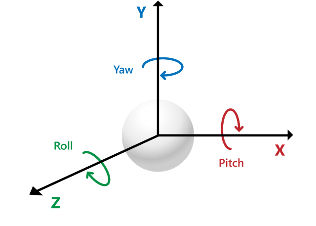
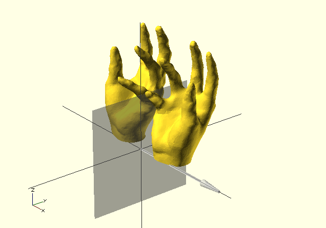

### Functionalities needed
Before starting to compute the object, here are all the methods that will be needed to achieve it. The list and explanations are ONLY for the teddy bear we will compute. There are a multitude of functionalities that we won’t cover, but feel free to explore them in the very well explained [manual of OpenScad](https://en.wikibooks.org/wiki/OpenSCAD_User_Manual/). They even offer some tutorials and a handy [cheat sheet](https://openscad.org/cheatsheet/)
### Shapes
The most basic method will be creating shapes such as [cubes](https://en.wikibooks.org/wiki/OpenSCAD_User_Manual/Primitive_Solids#cube) and spheres. In OpenScad, we go by the principle that a rectangle will be a cube with different dimensions and an eclipse a sphere that we will stretch.

Before that, we need to understand that each shape consists of triangles. Thus, a polygon won’t cause a lot of problems. However, for a curved surface, we will need to play with the triangle density (how many triangles we want on the sphere). This will help to create pyramids from [cylinders](https://en.wikibooks.org/wiki/OpenSCAD_User_Manual/Primitive_Solids#cylinder) for example. 
The smoother we want a [sphere](https://en.wikibooks.org/wiki/OpenSCAD_User_Manual/Primitive_Solids#sphere) to look like, the more triangles we will add. However, by adding more than necessary, we will have more content and the program will be too heavy and laggy.

`cube ([x,y,z]);` will instantiate a cube with the following dimension on the `x,y,z` axis 

`sphere(r=val, $fn=k);` : `val` is the radius of the sphere, `k` is the polygon density.
### Translate
The `translate([x,y,z]);` method will [move](https://en.wikibooks.org/wiki/OpenSCAD_User_Manual/Transformations#translate) on the `x,y,z` axis the object based on the values given. It needs to be called before the object instantiation.
The values are in mm, 1 == 1mm.
```sh
translate([-30,-10,-10])
cube([40,20,10]);
```
As you see, as long as you don't put `;` it means your line of code isn't done. That means that your can actually make break within and call or function without problems.
```sh
translate([-30,-10,-10])
cube([40,20,10]);
```
is the same as
```sh
translate([-30,-10,-10]) cube([40,20,10]);
```
and the same as
```sh
translate([-30,-10,-10])
cube([40,20
,10]);
```
As the code will only focus on the `;`
### Rotate
Like the translation, the [rotation](https://en.wikibooks.org/wiki/OpenSCAD_User_Manual/Transformations#rotate) needs to be called before the object instantiation. The method `rotate([x,y,z]);`
It will rotate in degrees around the `x,y,z` axis. A positive rotation is clockwise and a negative one is anti-clockwise.

<p align="center"><br><em>figure 15 : Scheme rotation axis</em></p>

```sh
rotate([90,45,0])
cube([40,20,10]);
```

### Scale
The method `scale([x,y,z])` will allow an object to be [streched](https://en.wikibooks.org/wiki/OpenSCAD_User_Manual/Transformations#scale) on the `x,y,z` axis. It will take the size value on the axis and multiply it by the value given in the method.
The scale method is called before the object instantiation.
```sh
scale([2,2.5,3])sphere(r=2, $fn=100);
```
Here, we will have an ellipse at the end, because the sphere will have the values `[2*2,2.5*2,3*2]` for the radius of each of its dimension.

### Union
The method :
```sh
union(){...} 
```
will take every element in the `{ }` and [merge](https://en.wikibooks.org/wiki/OpenSCAD_User_Manual/CSG_Modelling#union) them into 1 element. You can then operate on them as a single object. 
### Difference
The method :
```sh
difference(){...}
```
Will work as a [subtraction](https://en.wikibooks.org/wiki/OpenSCAD_User_Manual/CSG_Modelling#difference) of `A - B`. As we read the code per order, the first element we will encounter will be `A` and the second `B`.

E.g 
```sh
difference(){
	//our object A
	translate([-28.1,9,4])
	rotate([7.5,0,150])
	scale([1,2.5,1]) sphere(r=5, $fn=100);
	
	//the object B we want to subtract from A
	translate([-50,0,-10])
	cube([50,120,10]);
}
```
### Mirror
The [mirror](https://en.wikibooks.org/wiki/OpenSCAD_User_Manual/Transformations#mirror) function will reflect an object based on how you decide to place the plane. 

It will be called with x,y,z that will help to define the normal vector direction. A normal vector is the vector that points out of a plane in a perpendicular way.

<p align="center"><br><em>figure 16 : Mirror with normal pointing on x axis</em></p>

hand mirroring, source : https://en.wikibooks.org/wiki/OpenSCAD_User_Manual/Transformations#/media/File:Mirror-x.png 

Here we have a mirror with the normal `[1,0,0]` as the normal vector is along the `x` axis.

<p align="center"><br><em>figure 17 : Mirror with normal pointing in the middle of x and y axis</em></p>

Here for instance, we can see that the normal is `[1,1,0]` as the vector is pointing in the middle of those 2 axis without angles.

> **Warning**: If you don’t instantiate the object itself, you will only have it’s reflection. For example, if you decide to reflect a cube of size 2 at a place (4,0,0) with the mirror plane looking at the plane x at the center, then you will have only its reflection, which means a cube of size 2 at the place (-4,0,0)

Code-wise :
```sh
mirror([1,0,0]) translate([4,0,0]) cube([2,2,2]) ;
```
This will only show the reflected cube (the computed one). If you want the object and the reflection, you will need to call the cube, then its mirror
```sh
translate([4,0,0]) cube([2,2,2]);
mirror([1,0,0]) translate([4,0,0]) cube([2,2,2]) ;
```
The other way around works too
```sh
mirror([1,0,0]) translate([4,0,0]) cube([2,2,2]) ;
translate([4,0,0]) cube([2,2,2]);
```
### Minkowski
The `minkowski(){}` method will [round the edges of a shape](https://en.wikibooks.org/wiki/OpenSCAD_User_Manual/Transformations#minkowski). It will put together the size of the sphere and apply it to each of the corner of the shape.
```sh
minkowski(){
	cylinder(1.25,1.25,1.25,$fn=3);
	sphere(r=0.5, $fn=100);
}
```
As you know, if you don't give a lot of triangle for a cylinder, it can actually have another shape. As `$fn =3`, we see that the cylinder is actually a equilateral triangle with some thickness. Its height is the same as its side.
The triangle will actually have each of its corner merged with a sphere of 0.5 of radius, resulting to a triangle with rounded edges.
Indeed, the shape of the corners aren't taking the form of the sphere totally (no bump), it just rounds it as much as the sphere is. (Take the sphere as a circle).

> **Note** As we have a 3D shape, it is not possible to use minkowski with a 2D circle. This is why we applied our 3D sphere.
### Module
A [module](https://en.wikibooks.org/wiki/OpenSCAD_User_Manual/User-Defined_Functions_and_Modules#Modules) is similar to what we will be the closest as a method in regular coding. It will help grouping objects and we will be able to call multiple times this object. 
To make short, like you are calling sphere();  to create a sphere, you will be able to create your own module and call it in the same way.

> **Warning**: If you decide to create a module, you HAVE to call it at least one in order for it to appear. 

Modules can have a parameter. This comes handy if you have a variable that wants to be changed either on the printer interface or right at the top of your code for easy access. (e.g a size factor that you will apply on multiple cases of your module).
Modules are written with the following form :

- No parameter : `nameOfYourModule(){...}`
- With parameter: `nameOfYourModule(param){...}`
